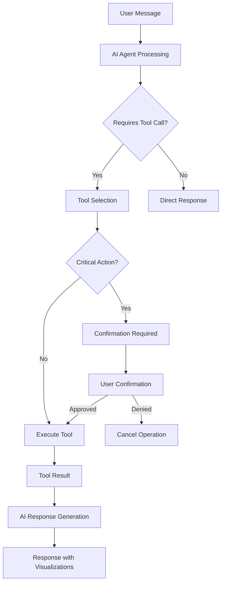

# 🤖 **AI Agent Tool Calling Patterns - Sprint 5 Implementation Guide**

## 📋 **Overview**

This document defines the comprehensive tool calling patterns for the Bubble Platform AI agent, enabling natural language control of all platform capabilities through Claude's function calling architecture.

## 🏗️ **Architecture**

### **Tool Calling Flow**


### **Tool Categories**

| Category | Tools | Risk Level | Confirmation Required |
|----------|-------|------------|---------------------|
| **Universe Management** | 5 tools | Low-Medium | No |
| **Strategy Development** | 5 tools | Medium | Backtests only |
| **Portfolio Management** | 5 tools | High | Yes (rebalancing) |
| **Market Analysis** | 5 tools | Low | No |
| **Execution Management** | 5 tools | Critical | Yes (all) |
| **Risk Management** | 5 tools | Medium-High | Limit changes only |

## 🛠️ **Tool Definitions**

### **Universe Management Tools**

#### **create_universe**
```python
{
    "name": "create_universe",
    "description": "Create new investment universe with specified assets",
    "parameters": {
        "type": "object",
        "properties": {
            "name": {"type": "string", "description": "Universe name"},
            "description": {"type": "string", "description": "Universe description"},
            "symbols": {
                "type": "array", 
                "items": {"type": "string"},
                "description": "List of asset symbols"
            },
            "screening_criteria": {
                "type": "object",
                "description": "Optional screening parameters"
            }
        },
        "required": ["name", "symbols"]
    },
    "examples": [
        {
            "user_input": "Create a tech universe with AAPL, GOOGL, MSFT",
            "tool_call": {
                "name": "Technology Leaders",
                "symbols": ["AAPL", "GOOGL", "MSFT"],
                "description": "Large-cap technology stocks"
            }
        }
    ]
}
```

#### **validate_asset_symbols**
```python
{
    "name": "validate_asset_symbols", 
    "description": "Validate and get metadata for asset symbols",
    "parameters": {
        "type": "object",
        "properties": {
            "symbols": {
                "type": "array",
                "items": {"type": "string"},
                "description": "Asset symbols to validate"
            },
            "include_metadata": {
                "type": "boolean", 
                "description": "Include sector, industry, market cap data",
                "default": true
            }
        },
        "required": ["symbols"]
    }
}
```

### **Strategy Development Tools**

#### **create_strategy**
```python
{
    "name": "create_strategy",
    "description": "Create investment strategy with indicators",
    "parameters": {
        "type": "object", 
        "properties": {
            "name": {"type": "string"},
            "universe_id": {"type": "string"},
            "indicators": {
                "type": "object",
                "properties": {
                    "rsi": {
                        "type": "object",
                        "properties": {
                            "enabled": {"type": "boolean", "default": false},
                            "period": {"type": "integer", "default": 14},
                            "overbought": {"type": "number", "default": 70},
                            "oversold": {"type": "number", "default": 30}
                        }
                    },
                    "macd": {
                        "type": "object", 
                        "properties": {
                            "enabled": {"type": "boolean", "default": false},
                            "fast": {"type": "integer", "default": 12},
                            "slow": {"type": "integer", "default": 26},
                            "signal": {"type": "integer", "default": 9}
                        }
                    },
                    "momentum": {
                        "type": "object",
                        "properties": {
                            "enabled": {"type": "boolean", "default": false}, 
                            "period": {"type": "integer", "default": 10},
                            "threshold": {"type": "number", "default": 0.02}
                        }
                    }
                }
            },
            "allocation_method": {
                "type": "string",
                "enum": ["equal_weight", "signal_weighted", "custom"],
                "default": "signal_weighted"
            }
        },
        "required": ["name", "universe_id", "indicators"]
    }
}
```

#### **run_backtest**
```python
{
    "name": "run_backtest",
    "description": "Execute strategy backtest over specified period", 
    "parameters": {
        "type": "object",
        "properties": {
            "strategy_id": {"type": "string"},
            "start_date": {"type": "string", "format": "date"},
            "end_date": {"type": "string", "format": "date"}, 
            "initial_capital": {"type": "number", "default": 100000},
            "rebalance_frequency": {
                "type": "string", 
                "enum": ["daily", "weekly", "monthly"],
                "default": "monthly"
            },
            "transaction_costs": {"type": "number", "default": 0.001}
        },
        "required": ["strategy_id", "start_date", "end_date"]
    }
}
```

### **Portfolio Management Tools**

#### **rebalance_portfolio** ⚠️ **CRITICAL ACTION**
```python
{
    "name": "rebalance_portfolio",
    "description": "Rebalance portfolio to target allocations",
    "parameters": {
        "type": "object",
        "properties": {
            "portfolio_id": {"type": "string"},
            "allocation_method": {
                "type": "string",
                "enum": ["risk_parity", "equal_weight", "current_targets"],
                "default": "risk_parity"
            },
            "max_position_size": {"type": "number", "default": 0.1},
            "min_trade_size": {"type": "number", "default": 100},
            "dry_run": {"type": "boolean", "default": false}
        },
        "required": ["portfolio_id"]
    },
    "requires_confirmation": true,
    "confirmation_data": [
        "current_positions",
        "target_allocations", 
        "required_orders",
        "estimated_costs",
        "market_impact"
    ]
}
```

#### **analyze_portfolio_risk**
```python
{
    "name": "analyze_portfolio_risk",
    "description": "Generate comprehensive portfolio risk analysis",
    "parameters": {
        "type": "object",
        "properties": {
            "portfolio_id": {"type": "string"},
            "analysis_period": {"type": "integer", "default": 252},
            "confidence_level": {"type": "number", "default": 0.95},
            "include_stress_tests": {"type": "boolean", "default": true}
        },
        "required": ["portfolio_id"]
    }
}
```

## 🔒 **Confirmation Patterns**

### **Critical Action Workflow**
```python
# Step 1: AI identifies critical action
tool_call = {
    "name": "rebalance_portfolio",
    "parameters": {"portfolio_id": "portfolio-123"},
    "requires_confirmation": True
}

# Step 2: Generate confirmation request
confirmation_request = {
    "action": "Portfolio Rebalancing",
    "summary": "Rebalance portfolio to risk parity allocation",
    "impact_analysis": {
        "positions_to_modify": 8,
        "estimated_cost": "$45.67",
        "largest_trade": "AAPL: $2,345 sell",
        "execution_time": "~5 minutes"
    },
    "risks": [
        "Market impact on large trades",
        "Execution during volatile periods"
    ]
}

# Step 3: User confirmation required
user_response = "Yes, proceed with rebalancing"

# Step 4: Execute with audit logging
execution_result = await execute_tool_with_confirmation(
    tool_call, 
    user_confirmed=True,
    audit_log=True
)
```

### **Confirmation Templates**
```python
CONFIRMATION_TEMPLATES = {
    "rebalance_portfolio": {
        "title": "Portfolio Rebalancing Confirmation",
        "message": "I'll rebalance your {portfolio_name} to {method} allocation.",
        "details": [
            "Current value: ${current_value:,.2f}",
            "Positions to modify: {position_count}",
            "Estimated cost: ${estimated_cost:.2f}",
            "Expected execution time: {execution_time}"
        ],
        "risks": [
            "Market impact during execution",
            "Price changes between analysis and execution"
        ]
    },
    "submit_orders": {
        "title": "Order Execution Confirmation", 
        "message": "I'll submit {order_count} orders for a total value of ${total_value:,.2f}",
        "details": [
            "Largest order: {largest_order}",
            "Broker: {broker_name}",
            "Account type: {account_type}"
        ]
    }
}
```

## 🎨 **Visualization Patterns**

### **AI-Generated Charts**
```python
# Portfolio allocation pie chart
{
    "type": "pie_chart",
    "title": "Current Portfolio Allocation",
    "data": {
        "labels": ["AAPL", "GOOGL", "MSFT", "TSLA"],
        "values": [0.3, 0.25, 0.25, 0.2],
        "colors": ["#1f77b4", "#ff7f0e", "#2ca02c", "#d62728"]
    },
    "config": {
        "show_percentages": true,
        "interactive": true
    }
}

# Performance comparison chart
{
    "type": "line_chart",
    "title": "Strategy Performance Comparison",
    "data": {
        "x": ["2023-01", "2023-02", "2023-03", ...],
        "series": [
            {"name": "Tech Strategy", "data": [100, 102, 105, ...]},
            {"name": "S&P 500", "data": [100, 101, 103, ...]}
        ]
    },
    "config": {
        "y_axis_label": "Normalized Return",
        "show_legend": true
    }
}
```

## 🔄 **Conversation Flow Examples**

### **Universe Creation Flow**
```
User: "Create a momentum universe with high-growth tech stocks"

AI: I'll help you create a momentum-focused tech universe. Let me search for high-growth technology stocks with strong momentum characteristics.

[Tool Call: search_assets with criteria: sector=technology, momentum_score>0.7]
[Tool Call: validate_asset_symbols for top candidates]

AI: I found 12 high-momentum tech stocks. Here's what I recommend:

**Proposed Universe: "High-Growth Tech Momentum"**
- NVDA (NVIDIA): +45% momentum, AI/semiconductors
- TSLA (Tesla): +32% momentum, EV/energy
- AMD (AMD): +28% momentum, semiconductors  
- [9 more stocks...]

Should I create this universe? I can also adjust the selection criteria if needed.

[Tool Call: create_universe if user confirms]
```

### **Strategy Development Flow**
```
User: "Build a strategy using this universe with RSI and MACD signals"

AI: I'll create a dual-indicator strategy combining RSI and MACD for your "High-Growth Tech Momentum" universe.

**Strategy Configuration:**
- RSI (14-period): Buy signals below 30, sell above 70
- MACD (12,26,9): Buy on bullish crossover, sell on bearish  
- Signal weighting: RSI 40%, MACD 60%
- Rebalancing: Monthly

[Tool Call: create_strategy with specified parameters]

AI: Strategy "Tech Momentum Dual-Signal" created! 

Would you like me to run a 2-year backtest to evaluate performance? I can show you:
- Historical returns vs benchmark
- Maximum drawdown analysis  
- Signal accuracy by market conditions

[Awaiting user confirmation for backtest]
```

### **Risk Analysis Flow**
```
User: "What's my portfolio risk exposure?"

AI: Let me analyze the risk profile of your current portfolio.

[Tool Call: analyze_portfolio_risk with comprehensive parameters]
[Tool Call: calculate_correlation_matrix]
[Tool Call: generate_var_analysis]

AI: **Portfolio Risk Analysis Summary**

📊 **Key Metrics:**
- Value at Risk (95%): -$2,340 daily
- Sharpe Ratio: 1.24
- Max Drawdown: -8.3%
- Portfolio Beta: 1.15

⚠️ **Risk Concentrations:**
- Technology sector: 45% (above recommended 35%)
- Single stock max: AAPL at 12% (within limits)

**Recommendations:**
1. Consider reducing tech exposure by 5-10%
2. Add defensive sectors (utilities, healthcare)
3. Current correlation risk is acceptable

Would you like me to suggest specific rebalancing adjustments?
```

## 🛡️ **Safety & Compliance**

### **Financial Safety Rules**
```python
FINANCIAL_SAFETY_RULES = {
    "maximum_single_trade": {
        "limit": 0.1,  # 10% of portfolio
        "message": "Single trade exceeds 10% portfolio limit"
    },
    "maximum_daily_volume": {
        "limit": 0.25,  # 25% of portfolio daily
        "message": "Daily trading volume exceeds risk limits"
    },
    "required_confirmations": [
        "Any trade > $1000",
        "Portfolio rebalancing",
        "Strategy deletion",
        "Risk limit changes"
    ],
    "audit_requirements": [
        "All tool calls logged with timestamps",
        "User confirmations recorded",
        "Trade execution tracked",
        "Performance attribution maintained"
    ]
}
```

### **Error Handling**
```python
# Graceful error handling with alternatives
if tool_execution_fails:
    ai_response = {
        "message": "I encountered an issue executing that operation. Here are some alternatives:",
        "error_summary": "Market data temporarily unavailable",
        "alternatives": [
            "Retry in 5 minutes when data refreshes",
            "Use cached data for preliminary analysis", 
            "Switch to manual portfolio review"
        ],
        "suggested_actions": ["retry_later", "use_cached_data", "manual_review"]
    }
```

## 🚀 **Implementation Roadmap**

### **Sprint 5 Priorities**
1. **Core Tool Framework** (Week 1)
   - Basic tool calling infrastructure
   - Confirmation system implementation
   - Audit logging setup

2. **Universe & Strategy Tools** (Week 2)
   - Universe management tools
   - Strategy development tools
   - Basic visualization generation

3. **Portfolio & Risk Tools** (Week 3)
   - Portfolio management with confirmations
   - Risk analysis capabilities
   - Advanced visualizations

4. **Execution & Integration** (Week 4)
   - Order management tools (paper trading)
   - End-to-end conversation flows
   - Safety system validation

### **Testing Strategy**
```python
# Comprehensive tool calling tests
class TestAIToolCalling:
    def test_tool_selection_accuracy(self):
        """Test AI selects appropriate tools for user intents"""
        
    def test_critical_action_confirmation(self):
        """Test confirmation workflow for critical actions"""
        
    def test_multi_step_workflows(self):
        """Test complex multi-tool conversations"""
        
    def test_error_recovery(self):
        """Test graceful error handling and alternatives"""
        
    def test_safety_limits(self):
        """Test financial safety rules enforcement"""
```

## 📚 **References**

- **Interface Definition**: `backend/app/services/interfaces/ai_agent.py`
- **Database Models**: `backend/app/models/chat.py`, `backend/app/models/conversation.py`
- **API Endpoints**: `backend/app/api/v1/chat.py` (Sprint 5)
- **Claude Integration**: Anthropic Claude 3.5 Sonnet with function calling
- **Security Framework**: Multi-tenant RLS + confirmation workflows

---

**This documentation provides the complete blueprint for implementing AI agent tool calling in Sprint 5, ensuring natural language control over all platform capabilities while maintaining financial safety and compliance standards.**