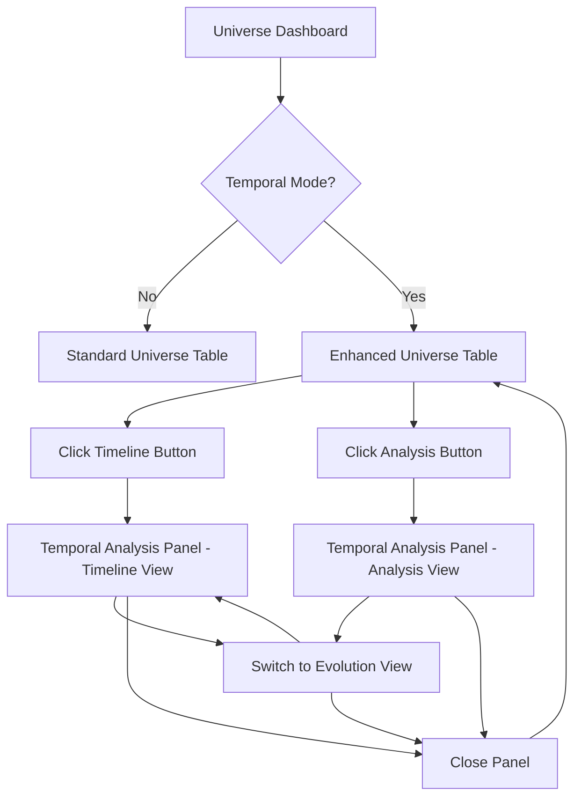

# Enhanced UniverseDashboard - Temporal Integration Guide

## Overview

The enhanced `UniverseDashboard` component provides seamless integration between standard universe management and advanced temporal analysis capabilities. Investment managers can now transition fluidly between viewing current universe states and exploring historical evolution patterns.

## Key Features

### 🕒 **Temporal Mode Toggle**
- **Master Control**: Single toggle to enable/disable all temporal features
- **Smart State Management**: Automatically enables temporal mode when accessing temporal views
- **Callback Integration**: Notifies parent components of mode changes for analytics/state sync

### 📊 **Flexible Panel Layouts**
Three responsive layout options for temporal analysis:

1. **Overlay Layout** (default): Panel appears below the universe table
2. **Sidebar Layout**: Side-by-side view with universe table and temporal panel  
3. **Modal Layout**: Full-screen modal for immersive temporal analysis

### 🎯 **Contextual Navigation**
- **Smart Banner**: Shows current analysis context and quick actions
- **View Switching**: Seamless transitions between Timeline, Evolution, and Analysis views
- **Breadcrumb Navigation**: Clear indication of current location and available actions

## Usage Examples

### Basic Implementation

```tsx
import React, { useState } from 'react';
import UniverseDashboard from './components/universe/UniverseDashboard';

const InvestmentApp: React.FC = () => {
  const [temporalMode, setTemporalMode] = useState(false);

  return (
    <UniverseDashboard
      enableTemporalMode={true}                    // Show temporal features
      defaultTemporalMode={false}                  // Start in standard mode
      onTemporalModeChange={setTemporalMode}       // Track mode changes
    />
  );
};
```

### Advanced Configuration

```tsx
const AdvancedInvestmentDashboard: React.FC = () => {
  const [temporalAnalytics, setTemporalAnalytics] = useState({
    sessionsStarted: 0,
    universesAnalyzed: new Set<string>(),
    averageSessionDuration: 0
  });

  const handleTemporalModeChange = useCallback((enabled: boolean) => {
    if (enabled) {
      setTemporalAnalytics(prev => ({
        ...prev,
        sessionsStarted: prev.sessionsStarted + 1,
        sessionStartTime: Date.now()
      }));
      
      // Analytics tracking
      analytics.track('temporal_mode_enabled', {
        timestamp: new Date().toISOString(),
        user_context: getCurrentUserContext()
      });
    } else {
      // Calculate session duration
      const sessionDuration = Date.now() - temporalAnalytics.sessionStartTime;
      setTemporalAnalytics(prev => ({
        ...prev,
        averageSessionDuration: (prev.averageSessionDuration + sessionDuration) / 2
      }));
    }
  }, [temporalAnalytics]);

  return (
    <UniverseDashboard
      enableTemporalMode={true}
      defaultTemporalMode={false}
      onTemporalModeChange={handleTemporalModeChange}
      // Chat integration
      chatMode={chatEnabled}
      onToggleChatMode={handleChatToggle}
    />
  );
};
```

## Component Architecture

### Enhanced Props Interface

```typescript
interface UniverseDashboardProps {
  // Legacy props
  chatMode?: boolean;
  onToggleChatMode?: () => void;
  
  // New temporal features
  enableTemporalMode?: boolean;                    // Feature flag
  defaultTemporalMode?: boolean;                   // Initial state
  onTemporalModeChange?: (enabled: boolean) => void; // Mode change callback
}
```

### State Management

The enhanced dashboard manages comprehensive temporal state:

```typescript
// Core temporal state
const [temporalMode, setTemporalMode] = useState(defaultTemporalMode ?? false);
const [selectedUniverseForTemporal, setSelectedUniverseForTemporal] = useState<Universe | null>(null);
const [temporalView, setTemporalView] = useState<'timeline' | 'evolution' | 'analysis' | null>(null);
const [temporalPanelLayout, setTemporalPanelLayout] = useState<'overlay' | 'sidebar' | 'modal'>('overlay');
```

### Navigation Flow



## TemporalAnalysisPanel Integration

### Component Features

```typescript
interface TemporalAnalysisPanelProps {
  universe: Universe;                              // Universe to analyze
  view: 'timeline' | 'evolution' | 'analysis' | null; // Current view
  onViewChange: (view: string) => void;           // View navigation
  onClose: () => void;                            // Close panel
  className?: string;                             // Custom styling
}
```

### Panel Components

1. **Header Section**
   - Universe name and context information
   - Navigation controls (previous/next view)
   - Layout toggle and close button

2. **Statistics Bar**
   - Quick metrics (total snapshots, avg turnover, trend direction)
   - Selected snapshot indicator
   - Loading states

3. **Content Area**
   - **Timeline View**: Interactive timeline chart + table
   - **Evolution View**: Composition change charts
   - **Analysis View**: Detailed turnover analysis and patterns

4. **Navigation Tabs**
   - Visual indicators for current view
   - Disabled states during loading
   - Quick switching between analysis types

## Responsive Design

### Layout Adaptation

```css
/* Desktop (lg+): Sidebar layout available */
@media (min-width: 1024px) {
  .temporal-sidebar-layout {
    display: grid;
    grid-template-columns: 2fr 1fr;
    gap: 1.5rem;
  }
}

/* Tablet: Stacked layout with collapsible panel */
@media (min-width: 768px) and (max-width: 1023px) {
  .temporal-panel {
    position: sticky;
    top: 1rem;
  }
}

/* Mobile: Modal-based temporal views */
@media (max-width: 767px) {
  .temporal-panel-modal {
    position: fixed;
    inset: 1rem;
    overflow-y: auto;
  }
}
```

### User Experience Guidelines

- **Desktop**: Side-by-side analysis with universe table
- **Tablet**: Stacked layout with smooth transitions
- **Mobile**: Full-screen modal for focused analysis

## Performance Considerations

### Optimization Strategies

1. **Lazy Loading**: Temporal components load only when first accessed
2. **Memoization**: Expensive calculations cached between view changes
3. **Cleanup**: State cleared when switching modes to prevent memory leaks
4. **Debouncing**: Real-time updates debounced for smooth interactions

```typescript
// Example optimization implementation
const memoizedTemporalData = useMemo(() => {
  if (!temporalMode || !selectedUniverseForTemporal) return null;
  
  return {
    universeId: selectedUniverseForTemporal.id,
    analysis: calculateTurnoverAnalysis(snapshots),
    timeline: processTimelineData(snapshots),
    statistics: computeStatistics(snapshots)
  };
}, [temporalMode, selectedUniverseForTemporal, snapshots]);

// Cleanup effect
useEffect(() => {
  return () => {
    if (!temporalMode) {
      // Clear temporal-specific caches and subscriptions
      clearTemporalCache();
      unsubscribeFromRealTimeUpdates();
    }
  };
}, [temporalMode]);
```

## Testing Strategy

### Test Coverage Areas

1. **Mode Switching**: Temporal mode toggle functionality
2. **State Coordination**: Proper state management between components  
3. **Panel Integration**: All three layout modes work correctly
4. **Navigation**: View switching and breadcrumb functionality
5. **Responsive Behavior**: Layout adaptation across screen sizes
6. **Error Handling**: Graceful degradation when APIs fail
7. **Performance**: Memory cleanup and optimization effectiveness

### Example Test Implementation

```typescript
describe('Temporal Dashboard Integration', () => {
  it('should coordinate state between table and panel', async () => {
    const { getByTestId, getByText } = render(
      <UniverseDashboard enableTemporalMode={true} />
    );

    // Enable temporal mode
    fireEvent.click(getByText('Temporal Analysis'));
    
    // Select universe from table
    fireEvent.click(getByTestId('table-analysis-button'));
    
    // Verify panel appears with correct universe
    expect(getByTestId('temporal-analysis-panel')).toBeInTheDocument();
    expect(getByText('Test Universe')).toBeInTheDocument();
  });
});
```

## Migration Guide

### From Legacy Dashboard

If upgrading from the previous dashboard implementation:

1. **Props Update**: Add temporal-specific props
2. **State Migration**: Update parent state management if needed
3. **Analytics Integration**: Add temporal mode tracking
4. **Testing Update**: Include temporal integration tests

### Backward Compatibility

The enhanced dashboard maintains full backward compatibility:

```typescript
// Legacy usage continues to work unchanged
<UniverseDashboard 
  chatMode={chatEnabled}
  onToggleChatMode={handleChatToggle}
/>

// New temporal features are opt-in
<UniverseDashboard 
  enableTemporalMode={true}  // Must be explicitly enabled
  chatMode={chatEnabled}
  onToggleChatMode={handleChatToggle}
/>
```

## Future Enhancements

### Planned Features

1. **Saved Analysis Views**: Bookmark specific temporal configurations
2. **Comparison Mode**: Side-by-side universe evolution comparison
3. **Export Functionality**: Generate temporal analysis reports
4. **Real-time Updates**: Live temporal data streaming
5. **Advanced Filtering**: Custom date ranges and criteria
6. **AI Integration**: Natural language temporal queries

### Architecture Extensibility

The component architecture supports easy extension:

```typescript
// Future enhancement example
interface ExtendedTemporalAnalysisPanelProps extends TemporalAnalysisPanelProps {
  comparisonUniverse?: Universe;        // Future comparison feature
  exportOptions?: ExportConfig;         // Future export feature
  realTimeUpdates?: boolean;            // Future streaming feature
  aiQueryInterface?: AIQueryConfig;     // Future AI integration
}
```

This enhanced dashboard integration provides a robust foundation for sophisticated temporal analysis while maintaining simplicity for basic use cases. The architecture supports both current requirements and future feature expansion.