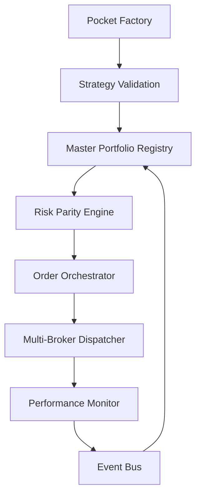

# 📋 Development Navigation

**📄 Documentation Structure:**
- **[spec.md](./spec.md)** - Original product specification and system requirements
- **[jira.md](./jira.md)** - User stories and acceptance criteria organized by epics
- **[roadmap.md](./roadmap.md)** - Version roadmap (MVP → V1 → V2) with epic distribution
- **[plan_overview.md](./plan_overview.md)** - High-level architecture vision and microservices overview  
- **[plan_phased.md](./plan_phased.md)** - Detailed implementation plan with file structure and development phases
- **[plan_detailed.md](./plan_detailed.md)** *(current)* - Complete technical specification with microservices architecture

---

# 📊 PLAN ARCHITECTURE BUBBLE - VERSION PROFESSIONNELLE

## 🎯 Vision Système Complet

**Bubble Platform** = Pocket Factory + Master Portfolio + Execution Engine



## 🏗️ Architecture Technique Professionnelle

### **Structure Microservices Modulaire - DÉTAILLÉE**

```
bubble-platform/
├── services/                                    # MICROSERVICES CORE
│   │
│   ├── auth-service/                           # 🔐 SERVICE D'AUTHENTIFICATION & UTILISATEURS
│   │   ├── app/                                # Application FastAPI principale
│   │   │   ├── main.py                         # • Point d'entrée FastAPI
│   │   │   │                                   # • INPUT: Authentication requests
│   │   │   │                                   # • OUTPUT: JWT tokens + User management
│   │   │   │                                   # • DEPS: FastAPI, SQLAlchemy, bcrypt, PyJWT
│   │   │   ├── models/                         # Modèles d'authentification
│   │   │   │   ├── __init__.py
│   │   │   │   ├── user.py                     # • Structure des utilisateurs
│   │   │   │   │                               # • INPUT: User registration/profile data
│   │   │   │   │                               # • OUTPUT: User entity
│   │   │   │   │                               # • EXEMPLE: {"id": "uuid", "email": "user@domain.com", "role": "user", "plan": "free"}
│   │   │   │   ├── session.py                  # • Gestion des sessions utilisateur
│   │   │   │   │                               # • INPUT: Login credentials
│   │   │   │   │                               # • OUTPUT: Session tokens
│   │   │   │   ├── permissions.py              # • Système de permissions
│   │   │   │   │                               # • INPUT: User role + resource
│   │   │   │   │                               # • OUTPUT: Permission granted/denied
│   │   │   │   └── tenant.py                   # • Multi-tenancy (un utilisateur = un tenant)
│   │   │   │                                   # • INPUT: User context
│   │   │   │                                   # • OUTPUT: Tenant isolation rules
│   │   │   ├── api/                            # Routes d'authentification
│   │   │   │   ├── __init__.py
│   │   │   │   ├── auth.py                     # • POST /auth/login, /auth/logout, /auth/refresh
│   │   │   │   │                               # • INPUT: {"email": "user@domain.com", "password": "secret"}
│   │   │   │   │                               # • OUTPUT: {"access_token": "jwt...", "user": {...}}
│   │   │   │   ├── users.py                    # • GET/PUT /users/profile, POST /users/register
│   │   │   │   │                               # • INPUT: User profile data
│   │   │   │   │                               # • OUTPUT: User management responses
│   │   │   │   ├── permissions.py              # • GET /users/{id}/permissions
│   │   │   │   │                               # • OUTPUT: User permissions matrix
│   │   │   │   └── admin.py                    # • Admin-only endpoints (user management)
│   │   │   │                                   # • GET/POST/DELETE /admin/users
│   │   │   ├── core/                           # Logique d'authentification
│   │   │   │   ├── __init__.py
│   │   │   │   ├── auth/                       # Mécanismes d'authentification
│   │   │   │   │   ├── __init__.py
│   │   │   │   │   ├── jwt_handler.py          # • Gestion des JWT tokens
│   │   │   │   │   │                           # • INPUT: User claims
│   │   │   │   │   │                           # • OUTPUT: Signed JWT tokens
│   │   │   │   │   ├── password.py             # • Hashing et vérification des mots de passe
│   │   │   │   │   │                           # • INPUT: Plain password
│   │   │   │   │   │                           # • OUTPUT: Bcrypt hashed password
│   │   │   │   │   ├── oauth.py                # • OAuth providers (Google, GitHub)
│   │   │   │   │   │                           # • INPUT: OAuth callback
│   │   │   │   │   │                           # • OUTPUT: User authenticated
│   │   │   │   │   └── two_factor.py           # • 2FA (TOTP)
│   │   │   │   │                               # • INPUT: TOTP code
│   │   │   │   │                               # • OUTPUT: 2FA verification
│   │   │   │   ├── permissions/                # Système de permissions
│   │   │   │   │   ├── __init__.py
│   │   │   │   │   ├── rbac.py                 # • Role-Based Access Control
│   │   │   │   │   │                           # • INPUT: User role + requested action
│   │   │   │   │   │                           # • OUTPUT: Access granted/denied
│   │   │   │   │   ├── decorators.py           # • Décorateurs pour protéger les endpoints
│   │   │   │   │   │                           # • USAGE: @require_permission("portfolio:read")
│   │   │   │   │   └── policies.py             # • Définition des politiques d'accès
│   │   │   │   │                               # • EXEMPLE: {"admin": ["*"], "user": ["portfolio:*"], "viewer": ["portfolio:read"]}
│   │   │   │   └── tenancy/                    # Multi-tenancy
│   │   │   │       ├── __init__.py
│   │   │   │       ├── isolation.py            # • Isolation des données par utilisateur
│   │   │   │       │                           # • INPUT: User context + database query
│   │   │   │       │                           # • OUTPUT: Query avec filtre user_id
│   │   │   │       └── context.py              # • Context utilisateur pour les requêtes
│   │   │   │                                   # • INPUT: JWT token
│   │   │   │                                   # • OUTPUT: User context object
│   │   │   ├── services/                       # Services d'authentification
│   │   │   │   ├── __init__.py
│   │   │   │   ├── user_service.py             # • CRUD operations utilisateurs
│   │   │   │   │                               # • INPUT: User data
│   │   │   │   │                               # • OUTPUT: User operations
│   │   │   │   ├── auth_service.py             # • Service d'authentification principal
│   │   │   │   │                               # • INPUT: Credentials
│   │   │   │   │                               # • OUTPUT: Authentication result
│   │   │   │   └── notification_service.py     # • Notifications auth (welcome, password reset)
│   │   │   │                                   # • INPUT: Auth events
│   │   │   │                                   # • OUTPUT: User notifications
│   │   │   ├── config/                         # Configuration auth
│   │   │   │   ├── __init__.py
│   │   │   │   ├── settings.py                 # • Configuration JWT, OAuth, etc.
│   │   │   │   │                               # • EXEMPLE: JWT_SECRET, TOKEN_EXPIRE_HOURS
│   │   │   │   └── permissions.py              # • Configuration des permissions par défaut
│   │   │   │                                   # • EXEMPLE: DEFAULT_USER_PERMISSIONS
│   │   │   └── utils/                          # Utilitaires auth
│   │   │       ├── __init__.py
│   │   │       ├── validators.py               # • Validation email, password strength
│   │   │       └── exceptions.py               # • Exceptions d'authentification
│   │   ├── requirements.txt                    # • Dépendances: PyJWT, bcrypt, python-multipart
│   │   ├── Dockerfile
│   │   └── tests/
│   │       ├── unit/
│   │       │   ├── test_auth.py                # • Tests d'authentification
│   │       │   ├── test_permissions.py         # • Tests de permissions
│   │       │   └── test_tenancy.py             # • Tests multi-tenancy
│   │       └── integration/
│   │           ├── test_auth_flow.py           # • Tests de flux d'authentification
│   │           └── test_user_management.py     # • Tests de gestion utilisateurs
│   │
│   ├── billing-service/                        # 💳 SERVICE DE FACTURATION & ABONNEMENTS
│   │   ├── app/                                # Application FastAPI principale
│   │   │   ├── main.py                         # • Point d'entrée FastAPI
│   │   │   │                                   # • INPUT: Billing operations requests
│   │   │   │                                   # • OUTPUT: Subscription & payment management
│   │   │   │                                   # • DEPS: FastAPI, stripe, sqlalchemy
│   │   │   ├── models/                         # Modèles de facturation
│   │   │   │   ├── __init__.py
│   │   │   │   ├── subscription.py             # • Structure des abonnements
│   │   │   │   │                               # • INPUT: User + plan selection
│   │   │   │   │                               # • OUTPUT: Subscription entity
│   │   │   │   │                               # • EXEMPLE: {"id": "uuid", "user_id": "uuid", "plan": "pro", "status": "active", "stripe_subscription_id": "sub_xxx"}
│   │   │   │   ├── plan.py                     # • Plans tarifaires
│   │   │   │   │                               # • INPUT: Plan configuration
│   │   │   │   │                               # • OUTPUT: Plan structure
│   │   │   │   │                               # • EXEMPLE: {"id": "pro", "name": "Pro Plan", "price": 29.99, "features": [...], "quotas": {...}}
│   │   │   │   ├── payment.py                  # • Historique des paiements
│   │   │   │   │                               # • INPUT: Payment transaction data
│   │   │   │   │                               # • OUTPUT: Payment record
│   │   │   │   ├── invoice.py                  # • Factures et reçus
│   │   │   │   │                               # • INPUT: Billing period data
│   │   │   │   │                               # • OUTPUT: Invoice entity
│   │   │   │   └── usage.py                    # • Suivi d'usage pour billing
│   │   │   │                                   # • INPUT: User activity metrics
│   │   │   │                                   # • OUTPUT: Usage tracking
│   │   │   ├── api/                            # Routes de facturation
│   │   │   │   ├── __init__.py
│   │   │   │   ├── subscriptions.py            # • POST/GET/PUT /subscriptions
│   │   │   │   │                               # • INPUT: {"plan_id": "pro", "payment_method": "pm_xxx"}
│   │   │   │   │                               # • OUTPUT: {"subscription_id": "uuid", "status": "active", "next_billing": "2024-02-01"}
│   │   │   │   ├── payments.py                 # • POST /payments, GET /payments/history
│   │   │   │   │                               # • INPUT: Payment intent data
│   │   │   │   │                               # • OUTPUT: Payment confirmation
│   │   │   │   ├── plans.py                    # • GET /plans, GET /plans/{id}
│   │   │   │   │                               # • OUTPUT: Available subscription plans
│   │   │   │   ├── invoices.py                 # • GET /invoices, GET /invoices/{id}/pdf
│   │   │   │   │                               # • OUTPUT: Invoice data and PDF generation
│   │   │   │   ├── webhooks.py                 # • POST /webhooks/stripe (Stripe events)
│   │   │   │   │                               # • INPUT: Stripe webhook payload
│   │   │   │   │                               # • OUTPUT: Webhook processing confirmation
│   │   │   │   └── usage.py                    # • GET /usage, POST /usage/track
│   │   │   │                                   # • INPUT: Usage metrics
│   │   │   │                                   # • OUTPUT: Usage reports
│   │   │   ├── core/                           # Logique de facturation
│   │   │   │   ├── __init__.py
│   │   │   │   ├── stripe/                     # Intégration Stripe
│   │   │   │   │   ├── __init__.py
│   │   │   │   │   ├── client.py               # • Client Stripe configuré
│   │   │   │   │   │                           # • INPUT: Stripe operations
│   │   │   │   │   │                           # • OUTPUT: Stripe API responses
│   │   │   │   │   ├── subscriptions.py        # • Gestion abonnements Stripe
│   │   │   │   │   │                           # • INPUT: User + plan
│   │   │   │   │   │                           # • OUTPUT: Stripe subscription created
│   │   │   │   │   ├── payments.py             # • Traitement paiements
│   │   │   │   │   │                           # • INPUT: Payment intent
│   │   │   │   │   │                           # • OUTPUT: Payment processed
│   │   │   │   │   ├── webhooks.py             # • Handlers webhooks Stripe
│   │   │   │   │   │                           # • INPUT: Stripe events
│   │   │   │   │   │                           # • OUTPUT: Business logic execution
│   │   │   │   │   └── customers.py            # • Gestion clients Stripe
│   │   │   │   │                               # • INPUT: User data
│   │   │   │   │                               # • OUTPUT: Stripe customer
│   │   │   │   ├── billing/                    # Logique de facturation
│   │   │   │   │   ├── __init__.py
│   │   │   │   │   ├── calculator.py           # • Calcul des montants
│   │   │   │   │   │                           # • INPUT: Usage + plan
│   │   │   │   │   │                           # • OUTPUT: Billing amount
│   │   │   │   │   ├── prorator.py             # • Proratisation
│   │   │   │   │   │                           # • INPUT: Plan change + timing
│   │   │   │   │   │                           # • OUTPUT: Prorated amount
│   │   │   │   │   ├── tax_calculator.py       # • Calcul des taxes
│   │   │   │   │   │                           # • INPUT: Amount + user location
│   │   │   │   │   │                           # • OUTPUT: Tax amount
│   │   │   │   │   └── discounts.py            # • Gestion des remises
│   │   │   │   │                               # • INPUT: Discount codes
│   │   │   │   │                               # • OUTPUT: Discount applied
│   │   │   │   ├── quotas/                     # Gestion des quotas
│   │   │   │   │   ├── __init__.py
│   │   │   │   │   ├── enforcer.py             # • Application des limites
│   │   │   │   │   │                           # • INPUT: User action + current usage
│   │   │   │   │   │                           # • OUTPUT: Action allowed/denied
│   │   │   │   │   ├── tracker.py              # • Suivi de l'usage
│   │   │   │   │   │                           # • INPUT: User activity
│   │   │   │   │   │                           # • OUTPUT: Usage metrics updated
│   │   │   │   │   └── reset.py                # • Reset périodique des quotas
│   │   │   │   │                               # • INPUT: Reset schedule
│   │   │   │   │                               # • OUTPUT: Quotas reset
│   │   │   │   └── notifications/              # Notifications de facturation
│   │   │   │       ├── __init__.py
│   │   │   │       ├── payment_failed.py       # • Notification échec paiement
│   │   │   │       ├── subscription_ended.py   # • Notification fin d'abonnement
│   │   │   │       ├── invoice_ready.py        # • Notification facture prête
│   │   │   │       └── usage_warning.py        # • Notification limite d'usage
│   │   │   ├── services/                       # Services de facturation
│   │   │   │   ├── __init__.py
│   │   │   │   ├── subscription_service.py     # • CRUD abonnements
│   │   │   │   │                               # • INPUT: Subscription operations
│   │   │   │   │                               # • OUTPUT: Subscription management
│   │   │   │   ├── payment_service.py          # • Service de paiement principal
│   │   │   │   │                               # • INPUT: Payment requests
│   │   │   │   │                               # • OUTPUT: Payment processing
│   │   │   │   ├── invoice_service.py          # • Génération de factures
│   │   │   │   │                               # • INPUT: Billing period
│   │   │   │   │                               # • OUTPUT: Invoice generated
│   │   │   │   ├── quota_service.py            # • Interface avec Auth Service pour quotas
│   │   │   │   │                               # • INPUT: User quota requests
│   │   │   │   │                               # • OUTPUT: Quota updates
│   │   │   │   └── analytics_service.py        # • Analytics de revenue
│   │   │   │                                   # • INPUT: Billing data
│   │   │   │                                   # • OUTPUT: Revenue analytics
│   │   │   ├── config/                         # Configuration billing
│   │   │   │   ├── __init__.py
│   │   │   │   ├── settings.py                 # • Configuration Stripe, plans, etc.
│   │   │   │   │                               # • EXEMPLE: STRIPE_SECRET_KEY, WEBHOOK_SECRET
│   │   │   │   ├── plans.py                    # • Définition des plans tarifaires
│   │   │   │   │                               # • EXEMPLE: Plans Free, Pro, Enterprise avec features
│   │   │   │   └── quotas.py                   # • Configuration des quotas par plan
│   │   │   │                                   # • EXEMPLE: {"free": {"strategies": 3}, "pro": {"strategies": 50}}
│   │   │   └── utils/                          # Utilitaires billing
│   │   │       ├── __init__.py
│   │   │       ├── formatters.py               # • Formatage des montants
│   │   │       ├── validators.py               # • Validation des données de paiement
│   │   │       └── exceptions.py               # • Exceptions de facturation
│   │   ├── requirements.txt                    # • Dépendances: stripe, reportlab (PDF)
│   │   ├── Dockerfile
│   │   └── tests/
│   │       ├── unit/
│   │       │   ├── test_stripe_integration.py  # • Tests intégration Stripe
│   │       │   ├── test_billing_logic.py       # • Tests logique de facturation
│   │       │   ├── test_quotas.py              # • Tests gestion quotas
│   │       │   └── test_webhooks.py            # • Tests webhooks Stripe
│   │       └── integration/
│   │           ├── test_subscription_flow.py   # • Tests flux d'abonnement complet
│   │           ├── test_payment_flow.py        # • Tests flux de paiement
│   │           └── test_upgrade_downgrade.py   # • Tests changements de plan
│   │
│   ├── pocket-factory-service/                 # 🏭 SERVICE DE CRÉATION DE STRATÉGIES
│   │   ├── app/                                # Application FastAPI principale
│   │   │   ├── main.py                         # • Point d'entrée FastAPI
│   │   │   │                                   # • INPUT: HTTP requests
│   │   │   │                                   # • OUTPUT: Strategy APIs
│   │   │   │                                   # • DEPS: FastAPI, uvicorn
│   │   │   ├── models/                         # Modèles de données Pydantic
│   │   │   │   ├── __init__.py
│   │   │   │   ├── universe.py                 # • Structure des univers d'assets
│   │   │   │   │                               # • INPUT: config.TRADING_SYMBOLS
│   │   │   │   │                               # • OUTPUT: Universe(id, symbols, correlations)
│   │   │   │   │                               # • EXEMPLE: {"id": "uuid", "symbols": ["SPY", "QQQ"], "correlation_matrix": [[1,0.8],[0.8,1]]}
│   │   │   │   ├── strategy.py                 # • Structure des stratégies
│   │   │   │   │                               # • INPUT: IndicatorConfig + Universe
│   │   │   │   │                               # • OUTPUT: Strategy(id, params, status)
│   │   │   │   │                               # • EXEMPLE: {"id": "uuid", "indicator_config": {"rsi_period": 14}, "status": "validated"}
│   │   │   │   ├── indicators.py               # • Configuration des indicateurs techniques
│   │   │   │   │                               # • INPUT: User parameters
│   │   │   │   │                               # • OUTPUT: IndicatorConfig validated
│   │   │   │   │                               # • EXEMPLE: {"rsi": {"period": 14}, "macd": {"fast": 12, "slow": 26}}
│   │   │   │   └── backtest.py                 # • Résultats de backtest
│   │   │   │                                   # • INPUT: Strategy + Historical data
│   │   │   │                                   # • OUTPUT: BacktestResults
│   │   │   │                                   # • EXEMPLE: {"sharpe_ratio": 1.2, "max_drawdown": -0.15, "total_return": 0.23}
│   │   │   ├── api/                            # Routes API REST
│   │   │   │   ├── __init__.py
│   │   │   │   ├── universe.py                 # • POST /universes, GET /universes/{id}
│   │   │   │   │                               # • INPUT: {"symbols": ["SPY", "QQQ"], "name": "US Large Cap"}
│   │   │   │   │                               # • OUTPUT: {"universe_id": "uuid", "correlation_score": 0.8}
│   │   │   │   ├── strategies.py               # • POST /strategies, GET /strategies/{id}
│   │   │   │   │                               # • INPUT: {"universe_id": "uuid", "indicator_config": {...}}
│   │   │   │   │                               # • OUTPUT: {"strategy_id": "uuid", "backtest_status": "running"}
│   │   │   │   ├── indicators.py               # • GET /indicators/default, POST /indicators/optimize
│   │   │   │   │                               # • INPUT: {"strategy_id": "uuid", "optimization_target": "sharpe"}
│   │   │   │   │                               # • OUTPUT: {"optimized_params": {...}, "improvement": 0.15}
│   │   │   │   └── backtests.py                # • GET /backtests/{id}, POST /backtests/run
│   │   │   │                                   # • INPUT: {"strategy_id": "uuid", "start_date": "2020-01-01"}
│   │   │   │                                   # • OUTPUT: {"backtest_id": "uuid", "performance": {...}}
│   │   │   ├── core/                           # Logique métier principale
│   │   │   │   ├── __init__.py
│   │   │   │   ├── indicators/                 # 🔄 RÉUTILISE indicators.py existant
│   │   │   │   │   ├── __init__.py
│   │   │   │   │   ├── factory.py              # • Factory pattern pour création d'indicateurs
│   │   │   │   │   │                           # • INPUT: indicator_name + params
│   │   │   │   │   │                           # • OUTPUT: Indicator instance
│   │   │   │   │   │                           # • DEPS: indicators.py (ton code existant)
│   │   │   │   │   ├── technical.py            # • RSI, MACD, Stochastic (depuis ton indicators.py)
│   │   │   │   │   │                           # • INPUT: OHLCV DataFrame
│   │   │   │   │   │                           # • OUTPUT: Signal Series (-1, 0, 1)
│   │   │   │   │   │                           # • EXEMPLE: calculate_rsi(data, period=14) → Series([0,0,1,-1,0...])
│   │   │   │   │   ├── composite.py            # • Composite indicator (depuis ton generate_signals)
│   │   │   │   │   │                           # • INPUT: Multiple indicators + weights
│   │   │   │   │   │                           # • OUTPUT: Combined signal
│   │   │   │   │   │                           # • DEPS: ton calculate_composite_indicator()
│   │   │   │   │   ├── alternative_data.py     # • Indicateurs basés sur données alternatives
│   │   │   │   │   │                           # • INPUT: Reddit sentiment, Twitter buzz, News scores
│   │   │   │   │   │                           # • OUTPUT: Alternative data signals
│   │   │   │   │   │                           # • EXEMPLE: reddit_sentiment_ma(window=7), twitter_buzz_spike()
│   │   │   │   │   ├── sentiment_indicators.py # • Indicateurs de sentiment spécialisés
│   │   │   │   │   │                           # • INPUT: Social data scores + price data
│   │   │   │   │   │                           # • OUTPUT: Hybrid sentiment-price signals
│   │   │   │   │   │                           # • EXEMPLE: sentiment_divergence(), social_momentum()
│   │   │   │   │   ├── custom_scoring.py       # • Scoring personnalisé multi-sources
│   │   │   │   │   │                           # • INPUT: Custom datasets + scoring rules
│   │   │   │   │   │                           # • OUTPUT: Proprietary scoring indicators
│   │   │   │   │   │                           # • EXEMPLE: popularity_score(), trend_strength()
│   │   │   │   │   └── optimization.py         # • Optimisation des paramètres
│   │   │   │   │                               # • INPUT: Historical data + objective function
│   │   │   │   │                               # • OUTPUT: Optimized parameters
│   │   │   │   │                               # • DEPS: ton optimization.py existant
│   │   │   │   ├── universe/                   # ⚡ GESTION DES UNIVERS DYNAMIQUES - SCREENING AVANCÉ
│   │   │   │   │   ├── __init__.py
│   │   │   │   │   ├── screeners/              # 🔍 Moteurs de screening multi-critères  
│   │   │   │   │   │   ├── __init__.py
│   │   │   │   │   │   ├── base_screener.py    # • Interface abstraite screener
│   │   │   │   │   │   │                       # • INPUT: Screening criteria + date
│   │   │   │   │   │   │                       # • OUTPUT: Filtered universe list
│   │   │   │   │   │   ├── fundamental_screener.py # 🎯 SCREENING FONDAMENTAL AVANCÉ
│   │   │   │   │   │   │                       # • INPUT: ROIC > sector median, P/E ratios, growth rates
│   │   │   │   │   │   │                       # • OUTPUT: Fundamentally filtered stocks
│   │   │   │   │   │   │                       # • EXEMPLE: screen_roic_leaders(date="2024-01", min_percentile=50)
│   │   │   │   │   │   │                       # • SOURCES: Financial APIs, analyst estimates
│   │   │   │   │   │   ├── quality_screener.py # • Screening qualité financière
│   │   │   │   │   │   │                       # • INPUT: Debt/Equity < 0.5, ROE > 15%, consistent margins
│   │   │   │   │   │   │                       # • OUTPUT: High-quality companies
│   │   │   │   │   │   │                       # • EXEMPLE: screen_quality_companies(min_roe=0.15, max_debt_ratio=0.5)
│   │   │   │   │   │   ├── momentum_screener.py # • Screening momentum & technical
│   │   │   │   │   │   │                       # • INPUT: Price momentum, earnings revisions, relative strength
│   │   │   │   │   │   │                       # • OUTPUT: High momentum stocks
│   │   │   │   │   │   │                       # • EXEMPLE: screen_momentum(lookback_months=6, min_return=0.1)
│   │   │   │   │   │   ├── value_screener.py   # • Screening value
│   │   │   │   │   │   │                       # • INPUT: P/E, P/B, EV/EBITDA relative to sector
│   │   │   │   │   │   │                       # • OUTPUT: Undervalued stocks
│   │   │   │   │   │   │                       # • EXEMPLE: screen_value_stocks(pe_percentile=25, pb_percentile=30)
│   │   │   │   │   │   ├── growth_screener.py  # • Screening croissance
│   │   │   │   │   │   │                       # • INPUT: Revenue growth, earnings growth, analyst upgrades
│   │   │   │   │   │   │                       # • OUTPUT: High growth potential stocks
│   │   │   │   │   │   │                       # • EXEMPLE: screen_growth_stocks(min_revenue_growth=0.15)
│   │   │   │   │   │   ├── liquidity_screener.py # • Screening liquidité & taille
│   │   │   │   │   │   │                       # • INPUT: Volume, market cap, bid-ask spread
│   │   │   │   │   │   │                       # • OUTPUT: Liquid, tradeable stocks
│   │   │   │   │   │   │                       # • EXEMPLE: screen_liquid_stocks(min_mcap=1e9, min_volume=1e6)
│   │   │   │   │   │   ├── sector_screener.py  # • Screening sectoriel  
│   │   │   │   │   │   │                       # • INPUT: Sector allocation limits, sector momentum
│   │   │   │   │   │   │                       # • OUTPUT: Sector-diversified universe
│   │   │   │   │   │   │                       # • EXEMPLE: screen_sector_leaders(sectors=["Technology", "Healthcare"])
│   │   │   │   │   │   ├── esg_screener.py     # • Screening ESG/sustainability
│   │   │   │   │   │   │                       # • INPUT: ESG scores, carbon footprint, controversies
│   │   │   │   │   │   │                       # • OUTPUT: ESG-compliant stocks
│   │   │   │   │   │   │                       # • EXEMPLE: screen_esg_leaders(min_esg_score=70, exclude_fossil=True)
│   │   │   │   │   │   ├── alternative_data_screener.py # • Screening données alternatives
│   │   │   │   │   │   │                       # • INPUT: Social sentiment, insider trading, satellite data
│   │   │   │   │   │   │                       # • OUTPUT: Alternative signal-based universe
│   │   │   │   │   │   │                       # • EXEMPLE: screen_social_momentum(reddit_sentiment>0.6, twitter_buzz>threshold)
│   │   │   │   │   │   ├── composite_screener.py # 🎯 SCREENER MULTI-CRITÈRES AVANCÉ
│   │   │   │   │   │   │                       # • INPUT: Combination of multiple screening rules + weights
│   │   │   │   │   │   │                       # • OUTPUT: Composite scored & ranked universe
│   │   │   │   │   │   │                       # • EXEMPLE: screen_composite(rules=[quality_30%, momentum_40%, value_30%])
│   │   │   │   │   │   └── custom_screener.py  # • Screener personnalisé utilisateur
│   │   │   │   │   │                           # • INPUT: User-defined criteria + scoring logic
│   │   │   │   │   │                           # • OUTPUT: Custom proprietary universe
│   │   │   │   │   ├── evolution/              # 📅 ÉVOLUTION TEMPORELLE DES UNIVERS
│   │   │   │   │   │   ├── __init__.py
│   │   │   │   │   │   ├── scheduler.py        # • Planification mises à jour univers
│   │   │   │   │   │   │                       # • INPUT: Update frequency (monthly, quarterly, weekly)
│   │   │   │   │   │   │                       # • OUTPUT: Scheduled universe refreshes
│   │   │   │   │   │   │                       # • EXEMPLE: schedule_universe_update(frequency="monthly", day=1)
│   │   │   │   │   │   ├── tracker.py          # • Suivi des changements d'univers
│   │   │   │   │   │   │                       # • INPUT: Universe snapshots over time
│   │   │   │   │   │   │                       # • OUTPUT: Addition/removal tracking + turnover metrics
│   │   │   │   │   │   │                       # • EXEMPLE: track_universe_changes(old_universe, new_universe)
│   │   │   │   │   │   ├── transition_manager.py # ⚖️ GESTION DES TRANSITIONS INTELLIGENTE
│   │   │   │   │   │   │                       # • INPUT: Old universe vs new universe + transition rules
│   │   │   │   │   │   │                       # • OUTPUT: Gradual transition strategy
│   │   │   │   │   │   │                       # • EXEMPLE: manage_transition(phase_out_period=30days, min_holding=7days)
│   │   │   │   │   │   ├── impact_analyzer.py  # • Analyse d'impact des changements
│   │   │   │   │   │   │                       # • INPUT: Universe changes + portfolio positions
│   │   │   │   │   │   │                       # • OUTPUT: Impact analysis & cost estimation
│   │   │   │   │   │   │                       # • EXEMPLE: analyze_rebalance_impact(turnover=0.3, transaction_costs=0.002)
│   │   │   │   │   │   └── performance_attribution.py # 📊 ATTRIBUTION DES CHANGEMENTS
│   │   │   │   │   │                           # • INPUT: Universe changes + strategy performance
│   │   │   │   │   │                           # • OUTPUT: Performance attribution to universe vs strategy
│   │   │   │   │   │                           # • EXEMPLE: attribute_performance(universe_effect=+2%, strategy_effect=+1%)
│   │   │   │   │   ├── data_sources/           # 💾 SOURCES DE DONNÉES POUR SCREENING
│   │   │   │   │   │   ├── __init__.py
│   │   │   │   │   │   ├── fundamental_data.py # • Provider données fondamentales
│   │   │   │   │   │   │                       # • INPUT: Financial APIs (FactSet, Refinitiv, Alpha Vantage)
│   │   │   │   │   │   │                       # • OUTPUT: ROIC, P/E, growth rates, margins by sector
│   │   │   │   │   │   │                       # • SOURCES: SEC filings, earnings reports, analyst estimates
│   │   │   │   │   │   ├── analyst_estimates.py # • Prévisions d'analystes consensus
│   │   │   │   │   │   │                       # • INPUT: Consensus estimate APIs
│   │   │   │   │   │   │                       # • OUTPUT: Forward ROIC, EPS growth, revenue forecasts
│   │   │   │   │   │   │                       # • EXEMPLE: get_consensus_roic_forecast(symbol="AAPL", period="FY1")
│   │   │   │   │   │   ├── sector_classification.py # 🏭 CLASSIFICATION SECTORIELLE AVANCÉE
│   │   │   │   │   │   │                       # • INPUT: GICS, ICB, Morningstar sector mappings
│   │   │   │   │   │   │                       # • OUTPUT: Sector mappings + median metrics by sector
│   │   │   │   │   │   │                       # • EXEMPLE: get_sector_median_roic(sector="Technology", date="2024-01")
│   │   │   │   │   │   ├── market_cap_data.py  # • Données de capitalisation & liquidité
│   │   │   │   │   │   │                       # • INPUT: Market cap, float, average volume
│   │   │   │   │   │   │                       # • OUTPUT: Size classifications & liquidity metrics
│   │   │   │   │   │   ├── technical_data.py   # • Données techniques pour screening
│   │   │   │   │   │   │                       # • INPUT: Price, volume, momentum indicators
│   │   │   │   │   │   │                       # • OUTPUT: Technical screening factors
│   │   │   │   │   │   ├── alternative_data.py # • Données alternatives pour screening
│   │   │   │   │   │   │                       # • INPUT: Social sentiment, satellite data, credit spreads
│   │   │   │   │   │   │                       # • OUTPUT: Alternative screening factors
│   │   │   │   │   │   └── esg_data.py         # • Données ESG
│   │   │   │   │   │                           # • INPUT: ESG providers (MSCI, Sustainalytics, Refinitiv)
│   │   │   │   │   │                           # • OUTPUT: ESG scores, carbon metrics, controversies
│   │   │   │   │   ├── builder.py              # 🏗️ CONSTRUCTION D'UNIVERS DYNAMIQUE
│   │   │   │   │   │                           # • INPUT: Screening criteria + target date + constraints
│   │   │   │   │   │                           # • OUTPUT: Time-stamped filtered universe
│   │   │   │   │   │                           # • EXEMPLE: build_universe(criteria=roic_screen, date="2024-01-01", max_stocks=50)
│   │   │   │   │   ├── validator.py            # ✅ VALIDATION DES UNIVERS DYNAMIQUES
│   │   │   │   │   │                           # • INPUT: Generated universe + quality constraints
│   │   │   │   │   │                           # • OUTPUT: Quality checks, warnings & compliance
│   │   │   │   │   │                           # • EXEMPLE: validate_universe_quality(min_diversification=0.8, max_sector_weight=0.3)
│   │   │   │   │   └── analyzer.py             # 📈 ANALYSE DE DIVERSIFICATION DYNAMIQUE
│   │   │   │   │                               # • INPUT: Time-varying universe + correlation matrix
│   │   │   │   │                               # • OUTPUT: Diversification evolution metrics
│   │   │   │   │                               # • EXEMPLE: analyze_correlation_stability(lookback_window=252days)
│   │   │   │   └── backtest/                   # Moteur de backtest
│   │   │   │       ├── __init__.py
│   │   │   │       ├── engines/                # 🚀 MOTEURS DE BACKTEST POUR UNIVERS DYNAMIQUES
│   │   │   │       │   ├── __init__.py
│   │   │   │       │   ├── dynamic_universe_engine.py # 🎯 MOTEUR UNIVERS DYNAMIQUE PRINCIPAL
│   │   │   │       │   │                       # • INPUT: Strategy + Time-varying universe definitions
│   │   │   │       │   │                       # • OUTPUT: Backtest with universe evolution tracking
│   │   │   │       │   │                       # • EXEMPLE: backtest_with_monthly_screening(strategy, roic_screen, start="2020-01-01")
│   │   │   │       │   │                       # • FEATURES: Universe turnover analysis, transition costs
│   │   │   │       │   ├── basic_engine.py     # 🔄 RÉUTILISE portfolio.py existant + ADAPTATION UNIVERS DYNAMIQUE
│   │   │   │       │   │                       # • INPUT: Strategy + Static OR Dynamic universe
│   │   │   │       │   │                       # • OUTPUT: Portfolio performance (enhanced with universe tracking)
│   │   │   │       │   │                       # • UPGRADE: Ton code existant + universe change handling
│   │   │   │       │   ├── vectorbt_engine.py  # • Moteur VectorBT + univers dynamique
│   │   │   │       │   │                       # • INPUT: Strategy parameters + universe evolution
│   │   │   │       │   │                       # • OUTPUT: VectorBT optimized backtest with universe tracking
│   │   │   │       │   ├── quantconnect_engine.py # • QuantConnect + universe screening
│   │   │   │       │   │                       # • INPUT: Strategy code + screening logic
│   │   │   │       │   │                       # • OUTPUT: QuantConnect backtest with dynamic universe
│   │   │   │       │   ├── zipline_engine.py   # • Zipline + univers évolutif
│   │   │   │       │   │                       # • INPUT: Strategy algorithm + universe scheduler
│   │   │   │       │   │                       # • OUTPUT: Zipline backtest with universe rebalancing
│   │   │   │       │   ├── custom_engine.py    # • Ton moteur custom + screening avancé
│   │   │   │       │   │                       # • INPUT: Advanced parameters + proprietary screening
│   │   │   │       │   │                       # • OUTPUT: Custom engine with universe intelligence
│   │   │   │       │   └── base_engine.py      # • Interface abstraite AVEC SUPPORT UNIVERS DYNAMIQUE
│   │   │   │       │                           # • TEMPLATE: Universe-aware backtest interface
│   │   │   │       ├── metrics.py              # • Calcul des métriques de performance
│   │   │   │       │                           # • INPUT: Trade history + returns
│   │   │   │       │                           # • OUTPUT: Sharpe, Sortino, MaxDD, etc.
│   │   │   │       │                           # • EXEMPLE: {"sharpe": 1.2, "calmar": 0.8, "sortino": 1.5}
│   │   │   │       └── simulator.py            # • Simulation de trading
│   │   │   │                                   # • INPUT: Signals + Market data
│   │   │   │                                   # • OUTPUT: Trade history + PnL
│   │   │   ├── services/                       # Services utilitaires
│   │   │   │   ├── __init__.py
│   │   │   │   ├── data_service.py             # • Récupération de données market
│   │   │   │   │                               # • INPUT: Symbol list + timeframe
│   │   │   │   │                               # • OUTPUT: OHLCV data
│   │   │   │   │                               # • DEPS: Data Service API calls
│   │   │   │   ├── cache_service.py            # • Cache des résultats de backtest
│   │   │   │   │                               # • INPUT: Backtest parameters hash
│   │   │   │   │                               # • OUTPUT: Cached results or None
│   │   │   │   │                               # • DEPS: Redis
│   │   │   │   └── validation_service.py       # • Validation des configurations
│   │   │   │                                   # • INPUT: Strategy config
│   │   │   │                                   # • OUTPUT: Validation errors or success
│   │   │   ├── config/                         # Configuration du service
│   │   │   │   ├── __init__.py
│   │   │   │   ├── settings.py                 # • Variables d'environnement
│   │   │   │   │                               # • EXEMPLE: DATABASE_URL, REDIS_URL, API_KEYS
│   │   │   │   └── parameters.py               # 🔄 RÉUTILISE get_default_params() existant
│   │   │   │                                   # • INPUT: Asset type
│   │   │   │                                   # • OUTPUT: Default indicator parameters
│   │   │   └── utils/                          # Utilitaires
│   │   │       ├── __init__.py
│   │   │       ├── helpers.py                  # • Fonctions utilitaires
│   │   │       └── exceptions.py               # • Exceptions custom
│   │   ├── requirements.txt                    # • Dépendances Python
│   │   │                                       # • fastapi, pandas, numpy, ta-lib, redis, postgresql
│   │   ├── Dockerfile                          # • Configuration Docker
│   │   └── tests/                              # Tests unitaires et d'intégration
│   │       ├── unit/
│   │       │   ├── test_indicators.py          # • Tests des indicateurs techniques
│   │       │   ├── test_backtest.py            # • Tests du moteur de backtest
│   │       │   └── test_universe.py            # • Tests de validation d'univers
│   │       └── integration/
│   │           ├── test_api.py                 # • Tests des endpoints API
│   │           └── test_workflows.py           # • Tests des workflows complets
│   │
│   ├── master-portfolio-service/               # 🏛️ SERVICE DE GESTION GLOBALE DU PORTFOLIO
│   │   ├── app/
│   │   │   ├── main.py                         # • Point d'entrée FastAPI
│   │   │   │                                   # • INPUT: HTTP requests
│   │   │   │                                   # • OUTPUT: Portfolio management APIs
│   │   │   ├── models/
│   │   │   │   ├── __init__.py
│   │   │   │   ├── portfolio.py                # • Structure du portfolio maître
│   │   │   │   │                               # • INPUT: Strategy list + allocations
│   │   │   │   │                               # • OUTPUT: MasterPortfolio object
│   │   │   │   │                               # • EXEMPLE: {"id": "uuid", "strategies": [...], "total_value": 100000}
│   │   │   │   ├── allocation.py               # • Modèle d'allocation de capital
│   │   │   │   │                               # • INPUT: Strategy performance data
│   │   │   │   │                               # • OUTPUT: Allocation weights
│   │   │   │   │                               # • EXEMPLE: {"strategy_1": 0.25, "strategy_2": 0.35, "cash": 0.40}
│   │   │   │   ├── rebalancing.py              # • Configuration de rééquilibrage
│   │   │   │   │                               # • INPUT: Rebalance triggers + thresholds
│   │   │   │   │                               # • OUTPUT: Rebalancing schedule
│   │   │   │   └── risk.py                     # • Modèles de risque
│   │   │   │                                   # • INPUT: Portfolio exposures
│   │   │   │                                   # • OUTPUT: Risk metrics
│   │   │   ├── api/
│   │   │   │   ├── __init__.py
│   │   │   │   ├── portfolios.py               # • CRUD operations sur portfolios
│   │   │   │   │                               # • GET /portfolios, POST /portfolios
│   │   │   │   │                               # • INPUT: {"name": "My Portfolio", "strategies": [...]}
│   │   │   │   │                               # • OUTPUT: {"portfolio_id": "uuid", "status": "created"}
│   │   │   │   ├── allocations.py              # • Gestion des allocations
│   │   │   │   │                               # • GET /portfolios/{id}/allocation
│   │   │   │   │                               # • OUTPUT: {"current_weights": {...}, "target_weights": {...}}
│   │   │   │   ├── rebalancing.py              # • Déclenchement des rééquilibrages
│   │   │   │   │                               # • POST /portfolios/{id}/rebalance
│   │   │   │   │                               # • INPUT: {"force": true, "dry_run": false}
│   │   │   │   │                               # • OUTPUT: {"orders": [...], "estimated_cost": 150.50}
│   │   │   │   ├── performance.py              # • Métriques de performance
│   │   │   │   │                               # • GET /portfolios/{id}/performance
│   │   │   │   │                               # • OUTPUT: {"returns": [...], "sharpe": 1.2, "drawdown": -0.08}
│   │   │   │   └── risk.py                     # • Monitoring du risque
│   │   │   │                                   # • GET /portfolios/{id}/risk
│   │   │   │                                   # • OUTPUT: {"var_95": 0.02, "expected_shortfall": 0.03}
│   │   │   ├── core/
│   │   │   │   ├── __init__.py
│   │   │   │   ├── allocators/                 # Stratégies d'allocation
│   │   │   │   │   ├── __init__.py
│   │   │   │   │   ├── base.py                 # • Interface abstraite pour allocateurs
│   │   │   │   │   ├── risk_parity.py          # 🔄 RÉUTILISE risk_parity_allocator.py existant
│   │   │   │   │   │                           # • INPUT: Strategy returns covariance matrix
│   │   │   │   │   │                           # • OUTPUT: Risk parity weights
│   │   │   │   │   │                           # • DEPS: ton calculate_risk_parity_allocation()
│   │   │   │   │   ├── equal_weight.py         # • Allocation équipondérée
│   │   │   │   │   │                           # • INPUT: Number of strategies
│   │   │   │   │   │                           # • OUTPUT: Equal weights (1/N)
│   │   │   │   │   ├── momentum.py             # • Allocation basée sur momentum
│   │   │   │   │   │                           # • INPUT: Recent performance
│   │   │   │   │   │                           # • OUTPUT: Momentum-based weights
│   │   │   │   │   ├── minimum_variance.py     # • Allocation minimum variance
│   │   │   │   │   │                           # • INPUT: Covariance matrix
│   │   │   │   │   │                           # • OUTPUT: Min variance weights
│   │   │   │   │   ├── black_litterman.py      # • Allocation Black-Litterman
│   │   │   │   │   │                           # • INPUT: Market views + uncertainty
│   │   │   │   │   │                           # • OUTPUT: View-adjusted weights
│   │   │   │   │   ├── machine_learning.py     # • Allocation ML-based
│   │   │   │   │   │                           # • INPUT: Features + returns history
│   │   │   │   │   │                           # • OUTPUT: ML-predicted weights
│   │   │   │   │   ├── factor_based.py         # • Allocation factor-based
│   │   │   │   │   │                           # • INPUT: Factor exposures + returns
│   │   │   │   │   │                           # • OUTPUT: Factor-optimized weights
│   │   │   │   │   ├── mean_reversion.py       # • Allocation mean reversion
│   │   │   │   │   │                           # • INPUT: Price deviations from mean
│   │   │   │   │   │                           # • OUTPUT: Mean-reversion weights
│   │   │   │   │   ├── sentiment_weighted.py   # • Allocation basée sur sentiment
│   │   │   │   │   │                           # • INPUT: Alternative data scores
│   │   │   │   │   │                           # • OUTPUT: Sentiment-adjusted weights
│   │   │   │   │   └── multi_objective.py      # • Allocation multi-objectifs
│   │   │   │   │                               # • INPUT: Multiple objectives (return, risk, ESG)
│   │   │   │   │                               # • OUTPUT: Pareto-optimized weights
│   │   │   │   ├── rebalancing/                # Logique de rééquilibrage
│   │   │   │   │   ├── __init__.py
│   │   │   │   │   ├── scheduler.py            # • Planification des rééquilibrages
│   │   │   │   │   │                           # • INPUT: Frequency (daily, weekly, monthly)
│   │   │   │   │   │                           # • OUTPUT: Next rebalance date
│   │   │   │   │   ├── calculator.py           # • Calcul des ordres de rééquilibrage
│   │   │   │   │   │                           # • INPUT: Current vs target allocations
│   │   │   │   │   │                           # • OUTPUT: Order instructions
│   │   │   │   │   ├── trigger.py              # • Déclencheurs de rééquilibrage
│   │   │   │   │   │                           # • INPUT: Portfolio drift threshold
│   │   │   │   │   │                           # • OUTPUT: Rebalance trigger signal
│   │   │   │   │   └── optimizer.py            # • Optimisation des ordres
│   │   │   │   │                               # • INPUT: Order list + transaction costs
│   │   │   │   │                               # • OUTPUT: Optimized execution sequence
│   │   │   │   ├── risk/                       # Gestion du risque
│   │   │   │   │   ├── __init__.py
│   │   │   │   │   ├── monitor.py              # • Monitoring des risques en temps réel
│   │   │   │   │   │                           # • INPUT: Portfolio positions + market data
│   │   │   │   │   │                           # • OUTPUT: Risk alerts
│   │   │   │   │   ├── metrics.py              # • Calcul des métriques de risque
│   │   │   │   │   │                           # • INPUT: Returns history
│   │   │   │   │   │                           # • OUTPUT: VaR, ES, correlation metrics
│   │   │   │   │   ├── limits.py               # • Gestion des limites d'exposition
│   │   │   │   │   │                           # • INPUT: Portfolio weights
│   │   │   │   │   │                           # • OUTPUT: Constraint violations
│   │   │   │   │   └── attribution.py          # • Attribution de performance
│   │   │   │   │                               # • INPUT: Strategy returns + weights
│   │   │   │   │                               # • OUTPUT: Performance attribution
│   │   │   │   └── performance/                # Calcul de performance
│   │   │   │       ├── __init__.py
│   │   │   │       ├── calculator.py           # • Calcul des returns du portfolio
│   │   │   │       │                           # • INPUT: Strategy returns + allocations
│   │   │   │       │                           # • OUTPUT: Portfolio returns
│   │   │   │       ├── analytics.py            # • Analytics avancées
│   │   │   │       │                           # • INPUT: Portfolio history
│   │   │   │       │                           # • OUTPUT: Advanced metrics
│   │   │   │       └── benchmarking.py         # • Comparaison avec benchmarks
│   │   │   │                                   # • INPUT: Portfolio returns + benchmark
│   │   │   │                                   # • OUTPUT: Relative performance
│   │   │   ├── services/
│   │   │   │   ├── __init__.py
│   │   │   │   ├── strategy_service.py         # • Interface avec Pocket Factory Service
│   │   │   │   │                               # • INPUT: Strategy IDs
│   │   │   │   │                               # • OUTPUT: Strategy performance data
│   │   │   │   ├── execution_service.py        # • Interface avec Execution Service
│   │   │   │   │                               # • INPUT: Order instructions
│   │   │   │   │                               # • OUTPUT: Execution confirmations
│   │   │   │   ├── data_service.py             # • Interface avec Data Service
│   │   │   │   │                               # • INPUT: Market data requests
│   │   │   │   │                               # • OUTPUT: Real-time market data
│   │   │   │   └── notification_service.py     # • Interface avec Notification Service
│   │   │   │                                   # • INPUT: Alert conditions
│   │   │   │                                   # • OUTPUT: Alert notifications
│   │   │   ├── config/
│   │   │   │   ├── __init__.py
│   │   │   │   ├── settings.py                 # • Configuration du service
│   │   │   │   └── constraints.py              # • Contraintes de portfolio
│   │   │   │                                   # • EXEMPLE: {"max_single_allocation": 0.4, "min_cash": 0.05}
│   │   │   └── utils/
│   │   │       ├── __init__.py
│   │   │       ├── math_utils.py               # • Utilitaires mathématiques
│   │   │       └── validation.py               # • Validation des inputs
│   │   ├── requirements.txt
│   │   ├── Dockerfile
│   │   └── tests/
│   │       ├── unit/
│   │       │   ├── test_allocators.py          # • Tests des allocateurs
│   │       │   ├── test_rebalancing.py         # • Tests de rééquilibrage
│   │       │   └── test_risk.py                # • Tests de gestion des risques
│   │       └── integration/
│   │           ├── test_portfolio_api.py       # • Tests API portfolio
│   │           └── test_rebalancing_flow.py    # • Tests de flux de rééquilibrage
│   │
│   ├── execution-service/                      # ⚡ SERVICE D'EXÉCUTION MULTI-BROKER
│   │   ├── app/
│   │   │   ├── main.py                         # • Point d'entrée FastAPI
│   │   │   ├── models/
│   │   │   │   ├── __init__.py
│   │   │   │   ├── order.py                    # • Structure des ordres
│   │   │   │   │                               # • INPUT: Order parameters
│   │   │   │   │                               # • OUTPUT: Order object
│   │   │   │   │                               # • EXEMPLE: {"symbol": "SPY", "qty": 100, "side": "buy", "broker": "alpaca"}
│   │   │   │   ├── position.py                 # • Structure des positions
│   │   │   │   │                               # • INPUT: Broker position data
│   │   │   │   │                               # • OUTPUT: Unified position
│   │   │   │   ├── execution.py                # • Résultats d'exécution
│   │   │   │   │                               # • INPUT: Order execution data
│   │   │   │   │                               # • OUTPUT: Execution report
│   │   │   │   └── broker.py                   # • Configuration des brokers
│   │   │   │                                   # • INPUT: Broker credentials
│   │   │   │                                   # • OUTPUT: Broker connection
│   │   │   ├── api/
│   │   │   │   ├── __init__.py
│   │   │   │   ├── orders.py                   # • Gestion des ordres
│   │   │   │   │                               # • POST /orders, GET /orders/{id}
│   │   │   │   │                               # • INPUT: {"orders": [...], "execution_mode": "live"}
│   │   │   │   │                               # • OUTPUT: {"execution_id": "uuid", "status": "submitted"}
│   │   │   │   ├── positions.py                # • Consultation des positions
│   │   │   │   │                               # • GET /positions, GET /positions/consolidated
│   │   │   │   │                               # • OUTPUT: {"positions": [...], "total_value": 150000}
│   │   │   │   ├── executions.py               # • Historique d'exécution
│   │   │   │   │                               # • GET /executions, GET /executions/{id}
│   │   │   │   │                               # • OUTPUT: {"executions": [...], "summary": {...}}
│   │   │   │   ├── brokers.py                  # • Gestion des brokers
│   │   │   │   │                               # • GET /brokers/status, POST /brokers/test
│   │   │   │   │                               # • OUTPUT: {"alpaca": "connected", "ib": "disconnected"}
│   │   │   │   └── accounts.py                 # • Information des comptes
│   │   │   │                                   # • GET /accounts/summary
│   │   │   │                                   # • OUTPUT: {"total_equity": 200000, "cash": 15000}
│   │   │   ├── core/
│   │   │   │   ├── __init__.py
│   │   │   │   ├── brokers/                    # Gestion multi-broker
│   │   │   │   │   ├── __init__.py
│   │   │   │   │   ├── unified.py              # 🔄 RÉUTILISE unified_broker_manager.py existant
│   │   │   │   │   │                           # • INPUT: Order + routing rules
│   │   │   │   │   │                           # • OUTPUT: Executed order
│   │   │   │   │   │                           # • DEPS: ton UnifiedBrokerManager
│   │   │   │   │   ├── alpaca.py               # • Interface Alpaca (depuis ton code)
│   │   │   │   │   │                           # • INPUT: Stock/ETF orders
│   │   │   │   │   │                           # • OUTPUT: Alpaca execution result
│   │   │   │   │   ├── interactive_brokers.py  # • Interface IB (depuis ton code)
│   │   │   │   │   │                           # • INPUT: Complex orders
│   │   │   │   │   │                           # • OUTPUT: IB execution result
│   │   │   │   │   ├── cryptocom.py            # • Interface Crypto.com (depuis ton code)
│   │   │   │   │   │                           # • INPUT: Crypto orders
│   │   │   │   │   │                           # • OUTPUT: Crypto execution result
│   │   │   │   │   └── base.py                 # • Interface abstraite broker
│   │   │   │   │                               # • Template pour nouveaux brokers
│   │   │   │   ├── routing/                    # Routage des ordres
│   │   │   │   │   ├── __init__.py
│   │   │   │   │   ├── classifier.py           # • Classification des assets
│   │   │   │   │   │                           # • INPUT: Symbol (ex: "SPY", "BTCUSD")
│   │   │   │   │   │                           # • OUTPUT: Asset type + recommended broker
│   │   │   │   │   │                           # • DEPS: ton _classify_asset_by_symbol()
│   │   │   │   │   ├── router.py               # • Routage basé sur pocket
│   │   │   │   │   │                           # • INPUT: Pocket filename
│   │   │   │   │   │                           # • OUTPUT: Broker assignment
│   │   │   │   │   │                           # • DEPS: config.get_broker_for_pocket()
│   │   │   │   │   └── balancer.py             # • Load balancing entre brokers
│   │   │   │   │                               # • INPUT: Order load
│   │   │   │   │                               # • OUTPUT: Optimal broker distribution
│   │   │   │   ├── execution/                  # Moteur d'exécution
│   │   │   │   │   ├── __init__.py
│   │   │   │   │   ├── engine.py               # • Moteur principal d'exécution
│   │   │   │   │   │                           # • INPUT: Order list + execution params
│   │   │   │   │   │                           # • OUTPUT: Execution results
│   │   │   │   │   ├── order_manager.py        # • Gestion du cycle de vie des ordres
│   │   │   │   │   │                           # • INPUT: Order submissions
│   │   │   │   │   │                           # • OUTPUT: Order status updates
│   │   │   │   │   ├── position_tracker.py     # • Suivi des positions en temps réel
│   │   │   │   │   │                           # • INPUT: Trade confirmations
│   │   │   │   │   │                           # • OUTPUT: Updated positions
│   │   │   │   │   └── reconciliation.py       # • Réconciliation entre brokers
│   │   │   │   │                               # • INPUT: Broker positions
│   │   │   │   │                               # • OUTPUT: Reconciliation report
│   │   │   │   └── risk/                       # Contrôle des risques
│   │   │   │       ├── __init__.py
│   │   │   │       ├── pre_trade.py            # • Vérifications pré-trade
│   │   │   │       │                           # • INPUT: Order details
│   │   │   │       │                           # • OUTPUT: Risk approval/rejection
│   │   │   │       ├── position_limits.py      # • Limites de position
│   │   │   │       │                           # • INPUT: Current positions + new order
│   │   │   │       │                           # • OUTPUT: Limit compliance check
│   │   │   │       └── exposure_monitor.py     # • Monitoring d'exposition
│   │   │   │                                   # • INPUT: Portfolio exposures
│   │   │   │                                   # • OUTPUT: Exposure alerts
│   │   │   ├── services/
│   │   │   │   ├── __init__.py
│   │   │   │   ├── order_service.py            # 🔄 RÉUTILISE order_calculator.py existant
│   │   │   │   │                               # • INPUT: Portfolio rebalancing needs
│   │   │   │   │                               # • OUTPUT: Calculated orders
│   │   │   │   │                               # • DEPS: ton calculate_order_table()
│   │   │   │   ├── position_service.py         # • Service de gestion des positions
│   │   │   │   │                               # • INPUT: Broker position feeds
│   │   │   │   │                               # • OUTPUT: Unified position view
│   │   │   │   ├── market_data_service.py      # • Interface vers Data Service
│   │   │   │   │                               # • INPUT: Symbol price requests
│   │   │   │   │                               # • OUTPUT: Real-time prices
│   │   │   │   └── notification_service.py     # • Notifications d'exécution
│   │   │   │                                   # • INPUT: Execution events
│   │   │   │                                   # • OUTPUT: Execution notifications
│   │   │   ├── config/
│   │   │   │   ├── __init__.py
│   │   │   │   ├── settings.py                 # • Configuration du service
│   │   │   │   ├── brokers.py                  # • Configuration des brokers
│   │   │   │   │                               # • EXEMPLE: {"alpaca": {"api_key": "...", "base_url": "..."}}
│   │   │   │   └── routing.py                  # • Règles de routage
│   │   │   │                                   # • EXEMPLE: {"crypto": "cryptocom", "stocks": "alpaca", "options": "ib"}
│   │   │   └── utils/
│   │   │       ├── __init__.py
│   │   │       ├── order_utils.py              # • Utilitaires pour ordres
│   │   │       └── broker_utils.py             # • Utilitaires broker
│   │   ├── requirements.txt
│   │   ├── Dockerfile
│   │   └── tests/
│   │       ├── unit/
│   │       │   ├── test_brokers.py             # • Tests des interfaces broker
│   │       │   ├── test_routing.py             # • Tests de routage
│   │       │   └── test_execution.py           # • Tests d'exécution
│   │       └── integration/
│   │           ├── test_order_flow.py          # • Tests de flux d'ordres
│   │           └── test_multi_broker.py        # • Tests multi-broker
│   │
│   ├── data-service/                           # 📡 SERVICE DE DONNÉES MARKET
│   │   ├── app/
│   │   │   ├── main.py                         # • Point d'entrée FastAPI
│   │   │   ├── models/
│   │   │   │   ├── __init__.py
│   │   │   │   ├── market_data.py              # • Structure des données market
│   │   │   │   │                               # • INPUT: Raw market data
│   │   │   │   │                               # • OUTPUT: Standardized OHLCV
│   │   │   │   │                               # • EXEMPLE: {"symbol": "SPY", "timestamp": "...", "open": 450.12, ...}
│   │   │   │   ├── cache.py                    # • Modèles de cache
│   │   │   │   │                               # • INPUT: Cache configuration
│   │   │   │   │                               # • OUTPUT: Cache metadata
│   │   │   │   └── subscription.py             # • Modèles d'abonnement
│   │   │   │                                   # • INPUT: Subscription requests
│   │   │   │                                   # • OUTPUT: Subscription management
│   │   │   ├── api/
│   │   │   │   ├── __init__.py
│   │   │   │   ├── market_data.py              # • Endpoints de données market
│   │   │   │   │                               # • GET /market-data/{symbol}
│   │   │   │   │                               # • INPUT: Symbol + timeframe + date range
│   │   │   │   │                               # • OUTPUT: OHLCV data array
│   │   │   │   ├── real_time.py                # • Données temps réel
│   │   │   │   │                               # • WebSocket /ws/market-data
│   │   │   │   │                               # • INPUT: Symbol subscriptions
│   │   │   │   │                               # • OUTPUT: Live price updates
│   │   │   │   ├── cache.py                    # • Gestion du cache
│   │   │   │   │                               # • GET /cache/stats, DELETE /cache/{key}
│   │   │   │   │                               # • OUTPUT: Cache statistics and management
│   │   │   │   └── health.py                   # • Health checks
│   │   │   │                                   # • GET /health
│   │   │   │                                   # • OUTPUT: Service health status
│   │   │   ├── core/
│   │   │   │   ├── __init__.py
│   │   │   │   ├── providers/                  # Fournisseurs de données
│   │   │   │   │   ├── __init__.py
│   │   │   │   │   ├── yahoo.py                # 🔄 RÉUTILISE fetch.py existant
│   │   │   │   │   │                           # • INPUT: Symbol + date range
│   │   │   │   │   │                           # • OUTPUT: Yahoo Finance data
│   │   │   │   │   │                           # • DEPS: ton code de fetch.py
│   │   │   │   │   ├── alpha_vantage.py        # • Fournisseur Alpha Vantage
│   │   │   │   │   │                           # • INPUT: API key + symbol
│   │   │   │   │   │                           # • OUTPUT: Alpha Vantage data
│   │   │   │   │   ├── polygon.py              # • Fournisseur Polygon.io
│   │   │   │   │   │                           # • INPUT: Symbol + subscription
│   │   │   │   │   │                           # • OUTPUT: Real-time data stream
│   │   │   │   │   ├── quandl.py               # • Fournisseur Quandl
│   │   │   │   │   │                           # • INPUT: Dataset codes
│   │   │   │   │   │                           # • OUTPUT: Economic data
│   │   │   │   │   ├── reddit_scraper.py       # • Alternative data - Reddit scraping
│   │   │   │   │   │                           # • INPUT: Subreddits, keywords, timeframe
│   │   │   │   │   │                           # • OUTPUT: Social sentiment scores by symbol
│   │   │   │   │   │                           # • EXEMPLE: {"SPY": {"sentiment": 0.7, "mentions": 145, "trending": true}}
│   │   │   │   │   ├── twitter_sentiment.py    # • Alternative data - Twitter sentiment
│   │   │   │   │   │                           # • INPUT: Twitter API, financial hashtags
│   │   │   │   │   │                           # • OUTPUT: Real-time sentiment indicators
│   │   │   │   │   ├── news_sentiment.py       # • Alternative data - News sentiment
│   │   │   │   │   │                           # • INPUT: News APIs, NLP processing
│   │   │   │   │   │                           # • OUTPUT: News-based sentiment scores
│   │   │   │   │   ├── custom_datasets.py      # • Custom datasets provider
│   │   │   │   │   │                           # • INPUT: User-defined data sources
│   │   │   │   │   │                           # • OUTPUT: Custom scoring/ranking data
│   │   │   │   │   │                           # • EXEMPLE: Proprietary research, internal signals
│   │   │   │   │   └── base.py                 # • Interface abstraite provider
│   │   │   │   │                               # • Template pour nouveaux providers
│   │   │   │   ├── cache/                      # Système de cache intelligent
│   │   │   │   │   ├── __init__.py
│   │   │   │   │   ├── redis.py                # • Cache Redis
│   │   │   │   │   │                           # • INPUT: Key-value pairs + TTL
│   │   │   │   │   │                           # • OUTPUT: Cached data retrieval
│   │   │   │   │   ├── strategies.py           # • Stratégies de cache
│   │   │   │   │   │                           # • INPUT: Data type + market hours
│   │   │   │   │   │                           # • OUTPUT: Optimal TTL strategy
│   │   │   │   │   │                           # • EXEMPLE: Market data → 5min pendant marché, 1h après fermeture
│   │   │   │   │   ├── invalidation.py         # • Invalidation intelligente
│   │   │   │   │   │                           # • INPUT: Market events
│   │   │   │   │   │                           # • OUTPUT: Cache invalidation triggers
│   │   │   │   │   └── warming.py              # • Pre-warming du cache
│   │   │   │   │                               # • INPUT: Popular symbols
│   │   │   │   │                               # • OUTPUT: Proactive cache population
│   │   │   │   ├── aggregation/                # Agrégation des données
│   │   │   │   │   ├── __init__.py
│   │   │   │   │   ├── ohlcv.py                # • Agrégation OHLCV
│   │   │   │   │   │                           # • INPUT: High-frequency data
│   │   │   │   │   │                           # • OUTPUT: Timeframe-specific OHLCV
│   │   │   │   │   ├── volume.py               # • Agrégation de volume
│   │   │   │   │   │                           # • INPUT: Trade data
│   │   │   │   │   │                           # • OUTPUT: Volume profiles
│   │   │   │   │   └── indicators.py           # • Pre-calcul d'indicateurs
│   │   │   │   │                               # • INPUT: OHLCV data
│   │   │   │   │                               # • OUTPUT: Pre-computed indicators
│   │   │   │   ├── validation/                 # Validation et nettoyage
│   │   │   │   │   ├── __init__.py
│   │   │   │   │   ├── checker.py              # • Validation de qualité
│   │   │   │   │   │                           # • INPUT: Raw market data
│   │   │   │   │   │                           # • OUTPUT: Quality score + issues
│   │   │   │   │   ├── cleaner.py              # • Nettoyage des données
│   │   │   │   │   │                           # • INPUT: Dirty market data
│   │   │   │   │   │                           # • OUTPUT: Clean market data
│   │   │   │   │   └── outlier_detection.py    # • Détection d'outliers
│   │   │   │   │                               # • INPUT: Time series data
│   │   │   │   │                               # • OUTPUT: Outlier flags
│   │   │   │   └── streaming/                  # Données en temps réel
│   │   │   │       ├── __init__.py
│   │   │   │       ├── websocket_manager.py    # • Gestion WebSocket
│   │   │   │       │                           # • INPUT: Client subscriptions
│   │   │   │       │                           # • OUTPUT: Real-time data streams
│   │   │   │       ├── subscription_manager.py # • Gestion des abonnements
│   │   │   │       │                           # • INPUT: Subscribe/unsubscribe requests
│   │   │   │       │                           # • OUTPUT: Subscription state
│   │   │   │       └── buffer.py               # • Buffer de données streaming
│   │   │   │                                   # • INPUT: High-frequency updates
│   │   │   │                                   # • OUTPUT: Buffered data batches
│   │   │   ├── services/
│   │   │   │   ├── __init__.py
│   │   │   │   ├── fetcher.py                  # • Service de récupération
│   │   │   │   │                               # • INPUT: Data requests
│   │   │   │   │                               # • OUTPUT: Fetched market data
│   │   │   │   ├── normalizer.py               # • Normalisation des données
│   │   │   │   │                               # • INPUT: Multi-format data
│   │   │   │   │                               # • OUTPUT: Standardized format
│   │   │   │   ├── scheduler.py                # • Planification de tâches
│   │   │   │   │                               # • INPUT: Schedule configuration
│   │   │   │   │                               # • OUTPUT: Scheduled data updates
│   │   │   │   └── quality_monitor.py          # • Monitoring de qualité
│   │   │   │                                   # • INPUT: Data streams
│   │   │   │                                   # • OUTPUT: Quality metrics
│   │   │   ├── config/
│   │   │   │   ├── __init__.py
│   │   │   │   ├── settings.py                 # • Configuration du service
│   │   │   │   ├── providers.py                # • Configuration des providers
│   │   │   │   │                               # • EXEMPLE: {"yahoo": {"rate_limit": 2000}, "alpha_vantage": {"api_key": "..."}}
│   │   │   │   └── symbols.py                  # 🔄 RÉUTILISE config.TRADING_SYMBOLS
│   │   │   │                                   # • INPUT: Symbol configurations
│   │   │   │                                   # • OUTPUT: Symbol metadata
│   │   │   └── utils/
│   │   │       ├── __init__.py
│   │   │       ├── time_utils.py               # • Utilitaires de temps
│   │   │       ├── data_utils.py               # • Utilitaires de données
│   │   │       └── rate_limiter.py             # • Rate limiting pour APIs
│   │   ├── requirements.txt
│   │   ├── Dockerfile
│   │   └── tests/
│   │       ├── unit/
│   │       │   ├── test_providers.py           # • Tests des providers
│   │       │   ├── test_cache.py               # • Tests du cache
│   │       │   └── test_validation.py          # • Tests de validation
│   │       └── integration/
│   │           ├── test_data_flow.py           # • Tests de flux de données
│   │           └── test_real_time.py           # • Tests temps réel
│   │
│   ├── notification-service/                   # 🔔 SERVICE DE NOTIFICATIONS & ALERTES
│   │   ├── app/
│   │   │   ├── main.py                         # • Point d'entrée FastAPI
│   │   │   ├── models/
│   │   │   │   ├── __init__.py
│   │   │   │   ├── alert.py                    # • Structure des alertes
│   │   │   │   │                               # • INPUT: Alert configuration
│   │   │   │   │                               # • OUTPUT: Alert object
│   │   │   │   │                               # • EXEMPLE: {"rule": "drawdown", "threshold": -0.15, "severity": "high"}
│   │   │   │   ├── notification.py             # • Structure des notifications
│   │   │   │   │                               # • INPUT: Alert trigger
│   │   │   │   │                               # • OUTPUT: Notification message
│   │   │   │   ├── channel.py                  # • Configuration des canaux
│   │   │   │   │                               # • INPUT: Channel settings
│   │   │   │   │                               # • OUTPUT: Channel configuration
│   │   │   │   │                               # • EXEMPLE: {"type": "telegram", "chat_id": "123", "enabled": true}
│   │   │   │   └── subscription.py             # • Abonnements utilisateur
│   │   │   │                                   # • INPUT: User preferences
│   │   │   │                                   # • OUTPUT: Subscription settings
│   │   │   ├── api/
│   │   │   │   ├── __init__.py
│   │   │   │   ├── alerts.py                   # • Gestion des alertes
│   │   │   │   │                               # • GET/POST /alerts, PUT /alerts/{id}
│   │   │   │   │                               # • INPUT: Alert rules configuration
│   │   │   │   │                               # • OUTPUT: Alert management responses
│   │   │   │   ├── notifications.py            # • Historique des notifications
│   │   │   │   │                               # • GET /notifications, GET /notifications/{id}
│   │   │   │   │                               # • OUTPUT: Notification history
│   │   │   │   ├── channels.py                 # • Configuration des canaux
│   │   │   │   │                               # • GET/POST /channels, PUT /channels/{id}
│   │   │   │   │                               # • INPUT: Channel configuration
│   │   │   │   │                               # • OUTPUT: Channel management
│   │   │   │   └── subscriptions.py            # • Gestion des abonnements
│   │   │   │                                   # • POST /subscribe, DELETE /unsubscribe
│   │   │   │                                   # • INPUT: Subscription preferences
│   │   │   │                                   # • OUTPUT: Subscription confirmations
│   │   │   ├── core/
│   │   │   │   ├── __init__.py
│   │   │   │   ├── channels/                   # Canaux de notification
│   │   │   │   │   ├── __init__.py
│   │   │   │   │   ├── telegram.py             # • Interface Telegram Bot
│   │   │   │   │   │                           # • INPUT: Message + chat_id
│   │   │   │   │   │                           # • OUTPUT: Telegram message sent
│   │   │   │   │   │                           # • DEPS: telegram-bot API
│   │   │   │   │   ├── email.py                # • Interface Email SMTP
│   │   │   │   │   │                           # • INPUT: Email content + recipients
│   │   │   │   │   │                           # • OUTPUT: Email sent confirmation
│   │   │   │   │   ├── slack.py                # • Interface Slack webhook
│   │   │   │   │   │                           # • INPUT: Slack message + webhook
│   │   │   │   │   │                           # • OUTPUT: Slack notification sent
│   │   │   │   │   ├── sms.py                  # • Interface SMS (Twilio)
│   │   │   │   │   │                           # • INPUT: SMS content + phone numbers
│   │   │   │   │   │                           # • OUTPUT: SMS sent confirmation
│   │   │   │   │   └── base.py                 # • Interface abstraite channel
│   │   │   │   │                               # • Template pour nouveaux canaux
│   │   │   │   ├── rules/                      # Règles d'alerte
│   │   │   │   │   ├── __init__.py
│   │   │   │   │   ├── performance.py          # • Règles de performance
│   │   │   │   │   │                           # • INPUT: Portfolio metrics
│   │   │   │   │   │                           # • OUTPUT: Performance alert triggers
│   │   │   │   │   │                           # • EXEMPLE: Daily loss > 5%, Sharpe < 0.5
│   │   │   │   │   ├── risk.py                 # • Règles de risque
│   │   │   │   │   │                           # • INPUT: Risk metrics
│   │   │   │   │   │                           # • OUTPUT: Risk alert triggers
│   │   │   │   │   │                           # • EXEMPLE: Max drawdown > 20%, VaR breach
│   │   │   │   │   ├── execution.py            # • Règles d'exécution
│   │   │   │   │   │                           # • INPUT: Order execution events
│   │   │   │   │   │                           # • OUTPUT: Execution alert triggers
│   │   │   │   │   │                           # • EXEMPLE: Order failure, broker disconnection
│   │   │   │   │   ├── system.py               # • Règles système
│   │   │   │   │   │                           # • INPUT: System health metrics
│   │   │   │   │   │                           # • OUTPUT: System alert triggers
│   │   │   │   │   │                           # • EXEMPLE: Service down, high latency
│   │   │   │   │   └── base.py                 # • Interface abstraite rule
│   │   │   │   │                               # • Template pour nouvelles règles
│   │   │   │   ├── engines/                    # Moteurs d'alerte
│   │   │   │   │   ├── __init__.py
│   │   │   │   │   ├── alert_engine.py         # • Moteur principal d'alerte
│   │   │   │   │   │                           # • INPUT: Events + rules
│   │   │   │   │   │                           # • OUTPUT: Alert decisions
│   │   │   │   │   ├── threshold_engine.py     # • Moteur de seuils
│   │   │   │   │   │                           # • INPUT: Metrics + thresholds
│   │   │   │   │   │                           # • OUTPUT: Threshold breaches
│   │   │   │   │   ├── escalation_engine.py    # • Moteur d'escalade
│   │   │   │   │   │                           # • INPUT: Alert severity + time
│   │   │   │   │   │                           # • OUTPUT: Escalation decisions
│   │   │   │   │   └── cooldown_engine.py      # • Moteur de cooldown
│   │   │   │   │                               # • INPUT: Alert history
│   │   │   │   │                               # • OUTPUT: Cooldown state
│   │   │   │   ├── templates/                  # Templates de messages
│   │   │   │   │   ├── __init__.py
│   │   │   │   │   ├── alerts.py               # • Templates d'alerte
│   │   │   │   │   │                           # • INPUT: Alert data
│   │   │   │   │   │                           # • OUTPUT: Formatted alert message
│   │   │   │   │   ├── reports.py              # • Templates de rapports
│   │   │   │   │   │                           # • INPUT: Portfolio data
│   │   │   │   │   │                           # • OUTPUT: Daily/weekly/monthly reports
│   │   │   │   │   ├── emails.py               # • Templates email HTML
│   │   │   │   │   │                           # • INPUT: Report data
│   │   │   │   │   │                           # • OUTPUT: HTML email content
│   │   │   │   │   └── notifications.py        # • Templates de notifications
│   │   │   │   │                               # • INPUT: Notification data
│   │   │   │   │                               # • OUTPUT: Channel-specific format
│   │   │   │   └── processors/                 # Processeurs d'événements
│   │   │   │       ├── __init__.py
│   │   │   │       ├── event_processor.py      # • Processeur d'événements principal
│   │   │   │       │                           # • INPUT: System events
│   │   │   │       │                           # • OUTPUT: Processed notifications
│   │   │   │       ├── batch_processor.py      # • Processeur de batch
│   │   │   │       │                           # • INPUT: Batch of events
│   │   │   │       │                           # • OUTPUT: Aggregated notifications
│   │   │   │       └── real_time_processor.py  # • Processeur temps réel
│   │   │   │                                   # • INPUT: Real-time events
│   │   │   │                                   # • OUTPUT: Immediate notifications
│   │   │   ├── services/
│   │   │   │   ├── __init__.py
│   │   │   │   ├── dispatcher.py               # • Service de distribution
│   │   │   │   │                               # • INPUT: Notifications + channel preferences
│   │   │   │   │                               # • OUTPUT: Multi-channel delivery
│   │   │   │   ├── scheduler.py                # • Service de planification
│   │   │   │   │                               # • INPUT: Scheduled notification rules
│   │   │   │   │                               # • OUTPUT: Scheduled notifications
│   │   │   │   ├── analytics.py                # • Analytics des notifications
│   │   │   │   │                               # • INPUT: Notification history
│   │   │   │   │                               # • OUTPUT: Delivery analytics
│   │   │   │   └── subscription_manager.py     # • Gestionnaire d'abonnements
│   │   │   │                                   # • INPUT: User subscription changes
│   │   │   │                                   # • OUTPUT: Updated subscription state
│   │   │   ├── config/
│   │   │   │   ├── __init__.py
│   │   │   │   ├── settings.py                 # • Configuration du service
│   │   │   │   ├── channels.py                 # • Configuration des canaux
│   │   │   │   │                               # • EXEMPLE: {"telegram": {"bot_token": "..."}, "smtp": {"server": "..."}}
│   │   │   │   └── rules.py                    # • Configuration des règles par défaut
│   │   │   │                                   # • EXEMPLE: {"performance": {"daily_loss": 0.05}, "risk": {"max_drawdown": 0.20}}
│   │   │   └── utils/
│   │   │       ├── __init__.py
│   │   │       ├── formatting.py               # • Utilitaires de formatage
│   │   │       ├── rate_limiting.py            # • Rate limiting pour notifications
│   │   │       └── encryption.py               # • Chiffrement des données sensibles
│   │   ├── requirements.txt
│   │   ├── Dockerfile
│   │   └── tests/
│   │       ├── unit/
│   │       │   ├── test_channels.py            # • Tests des canaux
│   │       │   ├── test_rules.py               # • Tests des règles
│   │       │   └── test_templates.py           # • Tests des templates
│   │       └── integration/
│   │           ├── test_notification_flow.py   # • Tests de flux complet
│   │           └── test_alerting.py            # • Tests d'alerte
│   │
│   └── ai-agent-service/                       # 🤖 SERVICE D'INTERFACE CONVERSATIONNELLE IA - ANTHROPIC CLAUDE
│       ├── app/                                # Application FastAPI principale
│       │   ├── main.py                         # • Point d'entrée FastAPI
│       │   │                                   # • INPUT: HTTP requests + WebSocket connections
│       │   │                                   # • OUTPUT: Claude Agent API + WebSocket chat
│       │   │                                   # • DEPS: FastAPI, anthropic, websockets, redis
│       │   ├── models/                         # Modèles de données agent
│       │   │   ├── __init__.py
│       │   │   ├── conversation.py             # • Structure des conversations
│       │   │   │                               # • INPUT: User messages + agent responses
│       │   │   │                               # • OUTPUT: Conversation object with history
│       │   │   │                               # • EXEMPLE: {"id": "uuid", "user_id": "uuid", "messages": [...], "context": {...}}
│       │   │   ├── message.py                  # • Structure des messages
│       │   │   │                               # • INPUT: Text content + metadata
│       │   │   │                               # • OUTPUT: Message entity with role + timestamps
│       │   │   │                               # • EXEMPLE: {"role": "user", "content": "Create portfolio", "timestamp": "...", "tools_used": [...]}
│       │   │   ├── tool_call.py                # • Structure des appels d'outils
│       │   │   │                               # • INPUT: Tool invocation data
│       │   │   │                               # • OUTPUT: ToolCall object
│       │   │   │                               # • EXEMPLE: {"tool_name": "create_universe", "input": {...}, "result": {...}, "status": "completed"}
│       │   │   ├── context.py                  # • Contexte de conversation
│       │   │   │                               # • INPUT: User state + conversation history
│       │   │   │                               # • OUTPUT: Context object for prompt enhancement
│       │   │   │                               # • EXEMPLE: {"current_portfolio": {...}, "preferences": {...}, "recent_actions": [...]}
│       │   │   └── visualization.py            # • Structure des visualisations
│       │   │                                   # • INPUT: Chart data + configuration
│       │   │                                   # • OUTPUT: Visualization object
│       │   │                                   # • EXEMPLE: {"type": "line_chart", "data": [...], "config": {...}, "rendered_url": "..."}
│       │   ├── api/                            # Routes API agent
│       │   │   ├── __init__.py
│       │   │   ├── chat.py                     # • Interface chat principale
│       │   │   │                               # • POST /chat/message - Envoi de message avec tool calling
│       │   │   │                               # • INPUT: {"message": "Backtest momentum strategy", "conversation_id": "uuid"}
│       │   │   │                               # • OUTPUT: {"response": "...", "tools_used": [...], "visualizations": [...]}
│       │   │   ├── conversations.py            # • Gestion des conversations
│       │   │   │                               # • GET/POST /conversations, GET /conversations/{id}/history
│       │   │   │                               # • INPUT: Conversation management requests
│       │   │   │                               # • OUTPUT: Conversation data + message history
│       │   │   ├── tools.py                    # • Configuration des outils disponibles
│       │   │   │                               # • GET /tools/available, GET /tools/{tool_name}/schema
│       │   │   │                               # • OUTPUT: Tool definitions + JSON schemas
│       │   │   ├── websocket.py                # • Interface WebSocket temps réel
│       │   │   │                               # • WebSocket /ws/chat/{conversation_id} - Chat temps réel
│       │   │   │                               # • INPUT: Real-time messages + tool calls
│       │   │   │                               # • OUTPUT: Streaming responses + tool execution updates
│       │   │   ├── context.py                  # • Gestion du contexte utilisateur
│       │   │   │                               # • GET/PUT /context - Contexte conversation
│       │   │   │                               # • INPUT: User context updates
│       │   │   │                               # • OUTPUT: Enhanced conversation context
│       │   │   └── visualizations.py           # • Génération de visualisations
│       │   │                                   # • POST /visualizations/generate - Chart generation
│       │   │                                   # • INPUT: Chart specifications + data
│       │   │                                   # • OUTPUT: Generated chart URLs + metadata
│       │   ├── core/                           # Logique métier agent
│       │   │   ├── __init__.py
│       │   │   ├── claude/                     # 🧠 INTÉGRATION CLAUDE API AVEC TOOL CALLING AVANCÉ
│       │   │   │   ├── __init__.py
│       │   │   │   ├── client.py               # • Client Claude API configuré
│       │   │   │   │                           # • INPUT: API key + model configuration
│       │   │   │   │                           # • OUTPUT: Configured Claude client
│       │   │   │   │                           # • DEPS: anthropic SDK, tool definitions
│       │   │   │   ├── tool_calling.py         # 🛠️ MOTEUR TOOL CALLING SUIVANT BEST PRACTICES ANTHROPIC
│       │   │   │   │                           # • INPUT: User message + available tools
│       │   │   │   │                           # • OUTPUT: Tool execution results + agent response
│       │   │   │   │                           # • FEATURES: Parallel tool calling, error handling, result aggregation
│       │   │   │   │                           # • EXEMPLE: process_tools_request(message="Rebalance portfolio", tools=[...])
│       │   │   │   ├── prompt_engineering.py   # • Optimisation des prompts
│       │   │   │   │                           # • INPUT: User intent + context + tool schemas
│       │   │   │   │                           # • OUTPUT: Optimized system prompt + user prompt
│       │   │   │   │                           # • FEATURES: Context injection, tool descriptions, extended thinking
│       │   │   │   ├── response_processing.py  # • Traitement des réponses Claude
│       │   │   │   │                           # • INPUT: Raw Claude response with tool_use blocks
│       │   │   │   │                           # • OUTPUT: Structured response + tool execution plan
│       │   │   │   ├── context_management.py   # • Gestion du contexte conversation
│       │   │   │   │                           # • INPUT: Conversation history + user state
│       │   │   │   │                           # • OUTPUT: Optimized context for Claude API
│       │   │   │   │                           # • FEATURES: Token optimization, context windowing, relevance scoring
│       │   │   │   ├── safety_layer.py         # 🔒 COUCHE DE SÉCURITÉ POUR ACTIONS CRITIQUES
│       │   │   │   │                           # • INPUT: Tool calls requiring confirmation
│       │   │   │   │                           # • OUTPUT: Safety checks + user confirmation requests
│       │   │   │   │                           # • FEATURES: Critical action detection, confirmation dialogs, rollback capability
│       │   │   │   └── error_handling.py       # • Gestion d'erreurs robuste
│       │   │   │                               # • INPUT: API errors + tool execution failures
│       │   │   │                               # • OUTPUT: User-friendly error messages + recovery suggestions
│       │   │   ├── tools/                      # 🛠️ ARSENAL D'OUTILS PLATFORM-SPECIFIC - ARCHITECTURE MODULAIRE
│       │   │   │   ├── __init__.py
│       │   │   │   ├── registry.py             # • Registre centralisé des outils
│       │   │   │   │                           # • INPUT: Tool registrations + permissions
│       │   │   │   │                           # • OUTPUT: Available tools by user role
│       │   │   │   │                           # • FEATURES: Dynamic tool loading, permission filtering, versioning
│       │   │   │   ├── base.py                 # • Interface abstraite pour outils
│       │   │   │   │                           # • TEMPLATE: Standard tool interface + error handling
│       │   │   │   │                           # • FEATURES: Input validation, output formatting, logging
│       │   │   │   ├── universe_tools.py       # 🌌 OUTILS GESTION D'UNIVERS
│       │   │   │   │                           # • Tool: create_universe(symbols, name, screening_criteria)
│       │   │   │   │                           # • Tool: screen_universe(criteria, date, max_stocks)
│       │   │   │   │                           # • Tool: analyze_universe_correlation(universe_id)
│       │   │   │   │                           # • Tool: compare_universes(universe_ids)
│       │   │   │   │                           # • EXEMPLE: screen_universe({"roic_threshold": "sector_median", "min_market_cap": 1e9})
│       │   │   │   ├── strategy_tools.py       # 📈 OUTILS CRÉATION & GESTION STRATÉGIES
│       │   │   │   │                           # • Tool: create_strategy(universe_id, indicator_config, name)
│       │   │   │   │                           # • Tool: optimize_strategy(strategy_id, optimization_target)
│       │   │   │   │                           # • Tool: run_backtest(strategy_id, start_date, end_date, benchmark)
│       │   │   │   │                           # • Tool: compare_strategies(strategy_ids, metrics)
│       │   │   │   │                           # • EXEMPLE: run_backtest("uuid", "2020-01-01", "2024-01-01", "SPY")
│       │   │   │   ├── portfolio_tools.py      # 🏛️ OUTILS GESTION PORTFOLIO MAÎTRE
│       │   │   │   │                           # • Tool: create_master_portfolio(strategy_ids, allocation_method)
│       │   │   │   │                           # • Tool: rebalance_portfolio(portfolio_id, force=False, dry_run=True)
│       │   │   │   │                           # • Tool: analyze_portfolio_risk(portfolio_id, risk_metrics)
│       │   │   │   │                           # • Tool: calculate_allocation_weights(portfolio_id, method)
│       │   │   │   │                           # • EXEMPLE: rebalance_portfolio("uuid", force=False, dry_run=True)
│       │   │   │   ├── execution_tools.py      # ⚡ OUTILS EXÉCUTION & ORDRES
│       │   │   │   │                           # • Tool: place_orders(orders, execution_mode="paper")
│       │   │   │   │                           # • Tool: check_order_status(order_ids)
│       │   │   │   │                           # • Tool: get_positions_summary(broker="all")
│       │   │   │   │                           # • Tool: calculate_order_impact(orders, market_conditions)
│       │   │   │   │                           # • EXEMPLE: place_orders([{"symbol": "SPY", "qty": 100, "side": "buy"}])
│       │   │   │   ├── data_tools.py           # 📊 OUTILS DONNÉES & ANALYSIS
│       │   │   │   │                           # • Tool: get_market_data(symbols, timeframe, start_date, end_date)
│       │   │   │   │                           # • Tool: calculate_indicators(symbol, indicators, parameters)
│       │   │   │   │                           # • Tool: get_fundamental_data(symbols, metrics)
│       │   │   │   │                           # • Tool: fetch_alternative_data(symbols, data_type)
│       │   │   │   │                           # • EXEMPLE: get_market_data(["SPY", "QQQ"], "1d", "2024-01-01", "2024-12-31")
│       │   │   │   ├── visualization_tools.py  # 📈 OUTILS GÉNÉRATION GRAPHIQUES
│       │   │   │   │                           # • Tool: create_performance_chart(data, chart_type, title)
│       │   │   │   │                           # • Tool: create_allocation_chart(weights, chart_type)
│       │   │   │   │                           # • Tool: create_correlation_heatmap(correlation_matrix, labels)
│       │   │   │   │                           # • Tool: create_drawdown_chart(returns, title)
│       │   │   │   │                           # • EXEMPLE: create_performance_chart(backtest_data, "line", "Strategy Performance")
│       │   │   │   ├── analytics_tools.py      # 🔍 OUTILS ANALYTICS AVANCÉES
│       │   │   │   │                           # • Tool: calculate_performance_metrics(returns, benchmark)
│       │   │   │   │                           # • Tool: perform_attribution_analysis(portfolio_id, period)
│       │   │   │   │                           # • Tool: analyze_risk_exposure(portfolio_id, risk_factors)
│       │   │   │   │                           # • Tool: generate_performance_report(portfolio_id, period)
│       │   │   │   │                           # • EXEMPLE: calculate_performance_metrics(strategy_returns, "SPY")
│       │   │   │   ├── notification_tools.py   # 🔔 OUTILS ALERTES & NOTIFICATIONS
│       │   │   │   │                           # • Tool: create_alert(rule_type, threshold, notification_channels)
│       │   │   │   │                           # • Tool: send_notification(message, channels, priority)
│       │   │   │   │                           # • Tool: get_alert_history(user_id, date_range)
│       │   │   │   │                           # • EXEMPLE: create_alert("drawdown", -0.15, ["email", "telegram"])
│       │   │   │   ├── billing_tools.py        # 💳 OUTILS GESTION ABONNEMENT
│       │   │   │   │                           # • Tool: get_subscription_status(user_id)
│       │   │   │   │                           # • Tool: check_usage_quotas(user_id, resource_type)
│       │   │   │   │                           # • Tool: upgrade_subscription(user_id, plan_id)
│       │   │   │   │                           # • EXEMPLE: check_usage_quotas("uuid", "strategies")
│       │   │   │   └── workflow_tools.py       # 🔄 OUTILS WORKFLOWS COMPLEXES
│       │   │   │                               # • Tool: execute_strategy_creation_workflow(full_config)
│       │   │   │                               # • Tool: execute_portfolio_optimization_workflow(portfolio_id)
│       │   │   │                               # • Tool: execute_risk_management_workflow(portfolio_id)
│       │   │   │                               # • EXEMPLE: Workflows multi-étapes combinant plusieurs outils
│       │   │   ├── processors/                 # 🔄 PROCESSEURS DE RÉPONSES
│       │   │   │   ├── __init__.py
│       │   │   │   ├── message_processor.py    # • Traitement des messages entrants
│       │   │   │   │                           # • INPUT: Raw user message + context
│       │   │   │   │                           # • OUTPUT: Processed message + intent detection
│       │   │   │   │                           # • FEATURES: Intent classification, entity extraction, context enrichment
│       │   │   │   ├── tool_result_processor.py # • Traitement des résultats d'outils
│       │   │   │   │                           # • INPUT: Tool execution results
│       │   │   │   │                           # • OUTPUT: Formatted results + visualizations
│       │   │   │   │                           # • FEATURES: Data formatting, chart generation, summary creation
│       │   │   │   ├── response_formatter.py   # • Formatage des réponses finales
│       │   │   │   │                           # • INPUT: Agent response + tool results + visualizations
│       │   │   │   │                           # • OUTPUT: Multi-modal formatted response
│       │   │   │   │                           # • FEATURES: Markdown formatting, chart embedding, action buttons
│       │   │   │   ├── streaming_processor.py  # • Processeur streaming pour WebSocket
│       │   │   │   │                           # • INPUT: Streaming Claude response
│       │   │   │   │                           # • OUTPUT: Real-time formatted chunks
│       │   │   │   └── error_processor.py      # • Traitement des erreurs utilisateur
│       │   │   │                               # • INPUT: Error conditions + context
│       │   │   │                               # • OUTPUT: User-friendly error explanations + recovery suggestions
│       │   │   ├── memory/                     # 🧠 SYSTÈME DE MÉMOIRE CONVERSATIONNELLE
│       │   │   │   ├── __init__.py
│       │   │   │   ├── conversation_memory.py  # • Mémoire de conversation
│       │   │   │   │                           # • INPUT: Conversation history + context updates
│       │   │   │   │                           # • OUTPUT: Optimized memory for Claude context
│       │   │   │   │                           # • FEATURES: Token-aware windowing, relevance scoring, context compression
│       │   │   │   ├── user_preferences.py     # • Préférences utilisateur persistantes
│       │   │   │   │                           # • INPUT: User interaction patterns + explicit preferences
│       │   │   │   │                           # • OUTPUT: Personalized context enrichment
│       │   │   │   │                           # • EXEMPLE: Preferred visualization types, risk tolerance, trading style
│       │   │   │   ├── session_manager.py      # • Gestion des sessions conversation
│       │   │   │   │                           # • INPUT: Session lifecycle events
│       │   │   │   │                           # • OUTPUT: Session state management
│       │   │   │   │                           # • FEATURES: Session persistence, cleanup, context migration
│       │   │   │   └── context_optimizer.py    # • Optimiseur de contexte pour Claude
│       │   │   │                               # • INPUT: Full conversation context
│       │   │   │                               # • OUTPUT: Token-optimized context for API calls
│       │   │   │                               # • FEATURES: Smart truncation, importance weighting, compression
│       │   │   ├── security/                   # 🔒 COUCHE SÉCURITÉ AGENT
│       │   │   │   ├── __init__.py
│       │   │   │   ├── action_validator.py     # • Validation des actions critiques
│       │   │   │   │                           # • INPUT: Requested tool calls + user permissions
│       │   │   │   │                           # • OUTPUT: Action approval/rejection + confirmation requirements
│       │   │   │   │                           # • FEATURES: Critical action detection, permission checking, approval flows
│       │   │   │   ├── confirmation_manager.py # • Gestion des confirmations utilisateur
│       │   │   │   │                           # • INPUT: Critical actions requiring confirmation
│       │   │   │   │                           # • OUTPUT: Confirmation dialogs + execution gates
│       │   │   │   │                           # • EXEMPLE: "Execute $15K rebalancing? [Confirm/Cancel]"
│       │   │   │   ├── permission_checker.py   # • Vérification des permissions
│       │   │   │   │                           # • INPUT: User role + requested tool + action
│       │   │   │   │                           # • OUTPUT: Permission granted/denied
│       │   │   │   │                           # • FEATURES: RBAC integration, quota checking, tool-level permissions
│       │   │   │   ├── audit_logger.py         # • Audit trail des actions agent
│       │   │   │   │                           # • INPUT: All agent actions + tool calls
│       │   │   │   │                           # • OUTPUT: Comprehensive audit logs
│       │   │   │   │                           # • FEATURES: Action logging, user attribution, compliance tracking
│       │   │   │   └── rate_limiter.py         # • Rate limiting intelligent
│       │   │   │                               # • INPUT: User requests + API usage
│       │   │   │                               # • OUTPUT: Rate limiting decisions
│       │   │   │                               # • FEATURES: Per-user limits, burst handling, quota management
│       │   │   └── workflows/                  # 🔄 WORKFLOWS INTELLIGENTS MULTI-ÉTAPES
│       │   │       ├── __init__.py
│       │   │       ├── strategy_creation.py    # • Workflow création stratégie complète
│       │   │       │                           # • INPUT: High-level user intent
│       │   │       │                           # • OUTPUT: End-to-end strategy creation
│       │   │       │                           # • STEPS: Universe screening → Indicator optimization → Backtesting → Validation
│       │   │       ├── portfolio_management.py # • Workflow gestion portfolio
│       │   │       │                           # • INPUT: Portfolio management requests
│       │   │       │                           # • OUTPUT: Complete portfolio operations
│       │   │       │                           # • STEPS: Analysis → Optimization → Rebalancing → Execution → Monitoring
│       │   │       ├── risk_monitoring.py      # • Workflow monitoring des risques
│       │   │       │                           # • INPUT: Risk assessment triggers
│       │   │       │                           # • OUTPUT: Risk analysis + mitigation actions
│       │   │       │                           # • STEPS: Risk calculation → Alert generation → Mitigation suggestions
│       │   │       └── research_assistant.py   # • Workflow assistant de recherche
│       │   │                                   # • INPUT: Research queries
│       │   │                                   # • OUTPUT: Comprehensive research reports
│       │   │                                   # • STEPS: Data gathering → Analysis → Visualization → Report generation
│       │   ├── services/                       # Services agent
│       │   │   ├── __init__.py
│       │   │   ├── conversation_service.py     # • Service de gestion des conversations
│       │   │   │                               # • INPUT: Conversation operations
│       │   │   │                               # • OUTPUT: Conversation management
│       │   │   ├── tool_execution_service.py   # • Service d'exécution d'outils
│       │   │   │                               # • INPUT: Tool calls from Claude
│       │   │   │                               # • OUTPUT: Tool execution results
│       │   │   ├── visualization_service.py    # • Service de génération de visualisations
│       │   │   │                               # • INPUT: Chart requests + data
│       │   │   │                               # • OUTPUT: Generated visualizations
│       │   │   ├── context_service.py          # • Service de gestion du contexte
│       │   │   │                               # • INPUT: Context management requests
│       │   │   │                               # • OUTPUT: Optimized conversation context
│       │   │   └── integration_service.py      # • Service d'intégration avec autres services
│       │   │                                   # • INPUT: Cross-service operations
│       │   │                                   # • OUTPUT: Unified service interactions
│       │   ├── config/                         # Configuration agent
│       │   │   ├── __init__.py
│       │   │   ├── settings.py                 # • Configuration Claude API
│       │   │   │                               # • EXEMPLE: ANTHROPIC_API_KEY, MODEL_NAME, MAX_TOKENS
│       │   │   ├── tools.py                    # • Configuration des outils disponibles
│       │   │   │                               # • EXEMPLE: Tool permissions par rôle, tool schemas
│       │   │   ├── prompts.py                  # • Prompts système optimisés
│       │   │   │                               # • EXEMPLE: System prompts, tool descriptions, safety instructions
│       │   │   ├── permissions.py              # • Configuration des permissions agent
│       │   │   │                               # • EXEMPLE: Critical actions, confirmation requirements
│       │   │   └── visualization.py            # • Configuration des visualisations
│       │   │                                   # • EXEMPLE: Chart templates, styling, rendering options
│       │   └── utils/                          # Utilitaires agent
│       │       ├── __init__.py
│       │       ├── text_processing.py          # • Traitement de texte avancé
│       │       │                               # • EXEMPLE: Intent detection, entity extraction, sentiment analysis
│       │       ├── token_management.py         # • Gestion des tokens Claude
│       │       │                               # • EXEMPLE: Token counting, context optimization, cost management
│       │       ├── chart_generation.py         # • Génération de graphiques
│       │       │                               # • EXEMPLE: Chart creation, styling, export
│       │       ├── data_formatting.py          # • Formatage de données
│       │       │                               # • EXEMPLE: Data transformation, table formatting, export
│       │       └── validation.py               # • Validation des inputs agent
│       │                                       # • EXEMPLE: Tool parameter validation, user input sanitization
│       ├── requirements.txt                    # • Dépendances: anthropic, fastapi, websockets, redis, matplotlib
│       ├── Dockerfile
│       └── tests/
│           ├── unit/
│           │   ├── test_claude_integration.py  # • Tests intégration Claude API
│           │   ├── test_tool_calling.py        # • Tests tool calling
│           │   ├── test_tools/                 # • Tests des outils individuels
│           │   │   ├── test_universe_tools.py
│           │   │   ├── test_strategy_tools.py
│           │   │   ├── test_portfolio_tools.py
│           │   │   └── test_visualization_tools.py
│           │   ├── test_security.py            # • Tests couche sécurité
│           │   ├── test_workflows.py           # • Tests workflows
│           │   └── test_memory.py              # • Tests système mémoire
│           └── integration/
│               ├── test_agent_api.py           # • Tests API agent
│               ├── test_websocket_chat.py      # • Tests chat WebSocket
│               ├── test_tool_integration.py    # • Tests intégration outils
│               ├── test_multi_modal.py         # • Tests réponses multi-modales
│               └── test_conversation_flow.py   # • Tests flux conversation complet
│
├── shared/                                      # 🔗 COMPOSANTS PARTAGÉS
│   ├── core/                                   # Logique métier réutilisée
│   │   ├── __init__.py
│   │   ├── domain/                             # Modèles du domaine métier
│   │   │   ├── __init__.py
│   │   │   ├── universe.py                     # • Entité Universe
│   │   │   │                                   # • INPUT: Symbol list + metadata
│   │   │   │                                   # • OUTPUT: Universe domain object
│   │   │   ├── strategy.py                     # • Entité Strategy
│   │   │   │                                   # • INPUT: Indicator config + universe
│   │   │   │                                   # • OUTPUT: Strategy domain object
│   │   │   ├── portfolio.py                    # • Entité Portfolio
│   │   │   │                                   # • INPUT: Strategy allocations
│   │   │   │                                   # • OUTPUT: Portfolio domain object
│   │   │   ├── order.py                        # • Entité Order
│   │   │   │                                   # • INPUT: Trade instructions
│   │   │   │                                   # • OUTPUT: Order domain object
│   │   │   └── position.py                     # • Entité Position
│   │   │                                       # • INPUT: Asset holdings
│   │   │                                       # • OUTPUT: Position domain object
│   │   ├── interfaces/                         # Interfaces & contracts
│   │   │   ├── __init__.py
│   │   │   ├── repositories.py                 # • Repository interfaces
│   │   │   │                                   # • Interface pour persistence
│   │   │   ├── services.py                     # • Service interfaces
│   │   │   │                                   # • Interface pour services externes
│   │   │   └── events.py                       # • Event interfaces
│   │   │                                       # • Interface pour événements
│   │   ├── exceptions/                         # Exceptions métier
│   │   │   ├── __init__.py
│   │   │   ├── domain.py                       # • Exceptions du domaine
│   │   │   ├── validation.py                   # • Exceptions de validation
│   │   │   └── business.py                     # • Exceptions business
│   │   └── utils/                              # Utilitaires partagés
│   │       ├── __init__.py
│   │       ├── math.py                         # • Fonctions mathématiques
│   │       │                                   # • EXEMPLE: risk_parity_weights, sharpe_ratio
│   │       ├── finance.py                      # • Fonctions financières
│   │       │                                   # • EXEMPLE: calculate_returns, volatility
│   │       ├── date_time.py                    # • Utilitaires de date/heure
│   │       │                                   # • EXEMPLE: market_hours, business_days
│   │       └── validation.py                   # • Validation partagée
│   │                                           # • EXEMPLE: validate_symbol, validate_allocation
│   ├── events/                                 # Architecture événementielle
│   │   ├── __init__.py
│   │   ├── event_system.py                     # 🔄 RÉUTILISE pattern du plan.md existant
│   │   │                                       # • INPUT: Event definitions
│   │   │                                       # • OUTPUT: Event bus functionality
│   │   ├── types.py                            # • Types d'événements
│   │   │                                       # • EXEMPLE: STRATEGY_CREATED, ORDER_FILLED
│   │   ├── handlers.py                         # • Gestionnaires d'événements
│   │   │                                       # • INPUT: Events
│   │   │                                       # • OUTPUT: Event processing
│   │   ├── publishers.py                       # • Publication d'événements
│   │   │                                       # • INPUT: Event objects
│   │   │                                       # • OUTPUT: Published events
│   │   ├── subscribers.py                      # • Souscription aux événements
│   │   │                                       # • INPUT: Event subscriptions
│   │   │                                       # • OUTPUT: Event delivery
│   │   └── middleware.py                       # • Middleware d'événements
│   │                                           # • INPUT: Raw events
│   │                                           # • OUTPUT: Processed events
│   ├── database/                               # Modèles et migrations de BDD
│   │   ├── __init__.py
│   │   ├── models/                             # Modèles SQLAlchemy
│   │   │   ├── __init__.py
│   │   │   ├── base.py                         # • Modèle de base
│   │   │   ├── universe.py                     # • Table universes
│   │   │   │                                   # • MAPPING: Plan.md schema universes
│   │   │   ├── strategy.py                     # • Table strategies
│   │   │   │                                   # • MAPPING: Plan.md schema strategies
│   │   │   ├── portfolio.py                    # • Table master_portfolios
│   │   │   │                                   # • MAPPING: Plan.md schema master_portfolios
│   │   │   ├── order.py                        # • Table orders
│   │   │   │                                   # • MAPPING: Plan.md schema orders
│   │   │   ├── allocation.py                   # • Table pocket_allocations
│   │   │   │                                   # • MAPPING: Plan.md schema pocket_allocations
│   │   │   └── performance.py                  # • Table performance_snapshots
│   │   │                                       # • MAPPING: Plan.md schema performance_snapshots
│   │   ├── migrations/                         # Migrations Alembic
│   │   │   ├── env.py                          # • Configuration Alembic
│   │   │   ├── script.py.mako                  # • Template de migration
│   │   │   └── versions/                       # • Fichiers de migration
│   │   │       ├── 001_initial_schema.py       # • Migration initiale
│   │   │       ├── 002_add_performance.py      # • Ajout des tables de performance
│   │   │       └── 003_add_risk_metrics.py     # • Ajout des métriques de risque
│   │   ├── repositories/                       # Couche d'accès aux données
│   │   │   ├── __init__.py
│   │   │   ├── base.py                         # • Repository de base
│   │   │   ├── universe_repository.py          # • Repository Universe
│   │   │   │                                   # • INPUT: Universe domain objects
│   │   │   │                                   # • OUTPUT: Persistence operations
│   │   │   ├── strategy_repository.py          # • Repository Strategy
│   │   │   │                                   # • INPUT: Strategy domain objects
│   │   │   │                                   # • OUTPUT: Persistence operations
│   │   │   ├── portfolio_repository.py         # • Repository Portfolio
│   │   │   │                                   # • INPUT: Portfolio domain objects
│   │   │   │                                   # • OUTPUT: Persistence operations
│   │   │   └── order_repository.py             # • Repository Order
│   │   │                                       # • INPUT: Order domain objects
│   │   │                                       # • OUTPUT: Persistence operations
│   │   ├── connection.py                       # • Gestionnaire de connexion DB
│   │   │                                       # • INPUT: Database configuration
│   │   │                                       # • OUTPUT: Database connections
│   │   └── session.py                          # • Gestion des sessions DB
│   │                                           # • INPUT: Database operations
│   │                                           # • OUTPUT: Managed DB sessions
│   └── monitoring/                             # Métriques et observabilité
│       ├── __init__.py
│       ├── metrics/                            # Métriques custom
│       │   ├── __init__.py
│       │   ├── business.py                     # • Métriques business
│       │   │                                   # • EXEMPLE: strategies_created, portfolios_rebalanced
│       │   ├── performance.py                  # • Métriques de performance
│       │   │                                   # • EXEMPLE: sharpe_ratio_gauge, max_drawdown_gauge
│       │   ├── technical.py                    # • Métriques techniques
│       │   │                                   # • EXEMPLE: api_latency, cache_hit_rate
│       │   └── financial.py                    # • Métriques financières
│       │                                       # • EXEMPLE: portfolio_value_gauge, order_fill_rate
│       ├── logging/                            # Configuration des logs
│       │   ├── __init__.py
│       │   ├── formatters.py                   # • Formatage des logs
│       │   │                                   # • INPUT: Log records
│       │   │                                   # • OUTPUT: Formatted log strings
│       │   ├── handlers.py                     # • Gestionnaires de logs
│       │   │                                   # • INPUT: Log messages
│       │   │                                   # • OUTPUT: Log destinations
│       │   └── config.py                       # • Configuration logging
│       │                                       # • EXEMPLE: Log levels, output formats
│       ├── tracing/                            # Distributed tracing
│       │   ├── __init__.py
│       │   ├── opentelemetry.py                # • Configuration OpenTelemetry
│       │   │                                   # • INPUT: Trace configuration
│       │   │                                   # • OUTPUT: Distributed traces
│       │   └── decorators.py                   # • Décorateurs de tracing
│       │                                       # • USAGE: @trace_function
│       ├── health/                             # Health checks
│       │   ├── __init__.py
│       │   ├── checks.py                       # • Health check implementations
│       │   │                                   # • INPUT: Service dependencies
│       │   │                                   # • OUTPUT: Health status
│       │   └── endpoints.py                    # • Health check endpoints
│       │                                       # • EXEMPLE: /health, /ready, /live
│       └── dashboards/                         # Dashboards de monitoring
│           ├── grafana/                        # • Dashboards Grafana
│           │   ├── business_metrics.json       # • Dashboard métriques business
│           │   ├── technical_metrics.json      # • Dashboard métriques techniques
│           │   └── financial_overview.json     # • Dashboard overview financier
│           └── prometheus/                     # • Configuration Prometheus
│               ├── rules.yml                   # • Règles d'alerte Prometheus
│               └── targets.yml                 # • Targets de scraping
│
├── web/                                        # 🌐 APPLICATIONS FRONTEND
│   ├── pocket-factory-ui/                     # Interface de création de stratégies
│   │   ├── public/
│   │   │   ├── index.html                      # • Page HTML principale
│   │   │   ├── favicon.ico                     # • Icône du site
│   │   │   └── manifest.json                   # • Manifest PWA
│   │   ├── src/
│   │   │   ├── index.tsx                       # • Point d'entrée React
│   │   │   ├── App.tsx                         # • Composant principal
│   │   │   ├── components/                     # Composants UI
│   │   │   │   ├── UniverseSelector/          # 🔍 ÉTAPE 1: SCREENING & SÉLECTION D'UNIVERS DYNAMIQUE
│   │   │   │   │   ├── index.tsx              # • Composant principal - choix Static vs Dynamic
│   │   │   │   │   ├── UniverseTypeSelector.tsx # • Sélecteur type d'univers
│   │   │   │   │   │                          # • INPUT: Static ETF list vs Dynamic screening
│   │   │   │   │   │                          # • OUTPUT: Universe type selection
│   │   │   │   │   ├── StaticUniverse/        # • Univers statique (ETFs)
│   │   │   │   │   │   ├── AssetGrid.tsx      # • Grille des ETFs
│   │   │   │   │   │   │                      # • INPUT: config.TRADING_SYMBOLS
│   │   │   │   │   │   │                      # • OUTPUT: Selected ETFs array
│   │   │   │   │   │   ├── CategoryFilter.tsx # • Filtre par catégorie ETF
│   │   │   │   │   │   └── CorrelationMatrix.tsx # • Matrice corrélation ETFs
│   │   │   │   │   ├── DynamicUniverse/       # 🎯 SCREENER DYNAMIQUE AVANCÉ
│   │   │   │   │   │   ├── ScreeningBuilder.tsx # • Constructeur de critères
│   │   │   │   │   │   │                      # • INPUT: Multiple screening criteria
│   │   │   │   │   │   │                      # • OUTPUT: Composite screening configuration
│   │   │   │   │   │   ├── FundamentalScreen.tsx # • Screening fondamental
│   │   │   │   │   │   │                      # • INPUT: ROIC > sector median, P/E < percentile
│   │   │   │   │   │   │                      # • OUTPUT: Fundamental filtering criteria
│   │   │   │   │   │   ├── QualityScreen.tsx  # • Screening qualité
│   │   │   │   │   │   │                      # • INPUT: ROE, Debt/Equity, margin stability
│   │   │   │   │   │   │                      # • OUTPUT: Quality filtering criteria
│   │   │   │   │   │   ├── MomentumScreen.tsx # • Screening momentum
│   │   │   │   │   │   │                      # • INPUT: Price momentum, earnings revisions
│   │   │   │   │   │   │                      # • OUTPUT: Momentum filtering criteria
│   │   │   │   │   │   ├── ValueScreen.tsx    # • Screening value
│   │   │   │   │   │   │                      # • INPUT: P/E, P/B relative to sector
│   │   │   │   │   │   │                      # • OUTPUT: Value filtering criteria
│   │   │   │   │   │   ├── LiquidityScreen.tsx # • Screening liquidité
│   │   │   │   │   │   │                      # • INPUT: Market cap, volume, bid-ask spread
│   │   │   │   │   │   │                      # • OUTPUT: Liquidity filtering criteria
│   │   │   │   │   │   ├── SectorScreen.tsx   # • Screening sectoriel
│   │   │   │   │   │   │                      # • INPUT: Sector constraints, diversification
│   │   │   │   │   │   │                      # • OUTPUT: Sector filtering criteria
│   │   │   │   │   │   ├── ESGScreen.tsx      # • Screening ESG
│   │   │   │   │   │   │                      # • INPUT: ESG scores, sustainability
│   │   │   │   │   │   │                      # • OUTPUT: ESG filtering criteria
│   │   │   │   │   │   ├── ScreenPreview.tsx  # • Aperçu du screening temps réel
│   │   │   │   │   │   │                      # • INPUT: All screening criteria + current date
│   │   │   │   │   │   │                      # • OUTPUT: Live filtered universe preview + count + metrics
│   │   │   │   │   │   ├── ScreenResults/     # 📊 RÉSULTATS DÉTAILLÉS DU SCREENING
│   │   │   │   │   │   │   ├── index.tsx      # • Composant principal résultats
│   │   │   │   │   │   │   ├── PeriodSelector.tsx # • Sélecteur de période
│   │   │   │   │   │   │   │                  # • INPUT: Date range picker
│   │   │   │   │   │   │   │                  # • OUTPUT: Selected analysis period
│   │   │   │   │   │   │   ├── UniverseTable.tsx # 📋 TABLE DES ACTIONS RETENUES
│   │   │   │   │   │   │   │                  # • INPUT: Screened stocks + period + criteria scores
│   │   │   │   │   │   │   │                  # • OUTPUT: Detailed stock table with metrics
│   │   │   │   │   │   │   │                  # • COLONNES: Symbol, Name, Sector, ROIC, Sector Median, Score, Entry Date, Exit Date
│   │   │   │   │   │   │   ├── PeriodMetrics.tsx # 📈 MÉTRIQUES PAR PÉRIODE
│   │   │   │   │   │   │   │                  # • INPUT: Period start/end + universe composition
│   │   │   │   │   │   │   │                  # • OUTPUT: Period-specific metrics dashboard
│   │   │   │   │   │   │   │                  # • MÉTRIQUES: Universe size, turnover %, sector distribution, avg ROIC
│   │   │   │   │   │   │   ├── TurnoverAnalysis.tsx # 🔄 ANALYSE TURNOVER
│   │   │   │   │   │   │   │                  # • INPUT: Universe changes between periods
│   │   │   │   │   │   │   │                  # • OUTPUT: Turnover breakdown + cost estimation
│   │   │   │   │   │   │   │                  # • FEATURES: Additions, removals, stability metrics
│   │   │   │   │   │   │   ├── SectorBreakdown.tsx # 🏭 RÉPARTITION SECTORIELLE
│   │   │   │   │   │   │   │                  # • INPUT: Universe composition by sector
│   │   │   │   │   │   │   │                  # • OUTPUT: Pie chart + table of sector weights
│   │   │   │   │   │   │   ├── CriteriaImpact.tsx # ⚖️ IMPACT DES CRITÈRES
│   │   │   │   │   │   │   │                  # • INPUT: Individual screening criteria contribution
│   │   │   │   │   │   │   │                  # • OUTPUT: Criteria effectiveness analysis
│   │   │   │   │   │   │   │                  # • EXEMPLE: ROIC filter removed 60%, Quality added 12%
│   │   │   │   │   │   │   ├── PerformancePreview.tsx # 📊 APERÇU PERFORMANCE
│   │   │   │   │   │   │   │                  # • INPUT: Universe composition + historical returns
│   │   │   │   │   │   │   │                  # • OUTPUT: Expected portfolio metrics preview
│   │   │   │   │   │   │   │                  # • MÉTRIQUES: Expected return, volatility, Sharpe estimate
│   │   │   │   │   │   │   ├── TimelineView.tsx # 📅 VUE CHRONOLOGIQUE
│   │   │   │   │   │   │   │                  # • INPUT: Historical universe snapshots
│   │   │   │   │   │   │   │                  # • OUTPUT: Timeline with universe evolution
│   │   │   │   │   │   │   │                  # • FEATURES: Zoom periods, highlight major changes
│   │   │   │   │   │   │   └── ExportTools.tsx # 💾 OUTILS D'EXPORT
│   │   │   │   │   │   │                      # • INPUT: Screening results + selected period
│   │   │   │   │   │   │                      # • OUTPUT: CSV/Excel export + API endpoints
│   │   │   │   │   │   ├── UniverseEvolution.tsx # • Évolution de l'univers (synthèse)
│   │   │   │   │   │   │                      # • INPUT: Historical universe snapshots
│   │   │   │   │   │   │                      # • OUTPUT: High-level turnover visualization + timeline
│   │   │   │   │   │   ├── SchedulingConfig.tsx # • Configuration planning MAJ
│   │   │   │   │   │   │                      # • INPUT: Update frequency (monthly, quarterly)
│   │   │   │   │   │   │                      # • OUTPUT: Universe refresh schedule
│   │   │   │   │   │   └── ScreeningOptimizer.tsx # 🎯 OPTIMISEUR DE CRITÈRES
│   │   │   │   │   │                          # • INPUT: Historical performance + screening criteria
│   │   │   │   │   │                          # • OUTPUT: Optimized screening parameters
│   │   │   │   │   │                          # • FEATURES: Backtest different criteria, suggest improvements
│   │   │   │   │   ├── UniverseComparison.tsx # • Comparaison d'univers
│   │   │   │   │   │                          # • INPUT: Multiple universe configurations
│   │   │   │   │   │                          # • OUTPUT: Side-by-side comparison
│   │   │   │   │   └── UniverseBacktest.tsx   # • Backtest de l'univers seul
│   │   │   │   │                              # • INPUT: Universe definition + time period
│   │   │   │   │                              # • OUTPUT: Universe-only performance metrics
│   │   │   │   ├── IndicatorConfig/           # 🔧 ÉTAPE 2: Configuration indicateurs
│   │   │   │   │   ├── index.tsx              # • Composant principal
│   │   │   │   │   ├── ParameterSliders.tsx   # • Sliders de paramètres
│   │   │   │   │   │                          # • INPUT: Default parameters
│   │   │   │   │   │                          # • OUTPUT: Custom parameters
│   │   │   │   │   ├── SignalPreview.tsx      # • Aperçu des signaux
│   │   │   │   │   │                          # • INPUT: Indicator configuration
│   │   │   │   │   │                          # • OUTPUT: Signal visualization
│   │   │   │   │   ├── OptimizationPanel.tsx  # • Panel d'optimisation
│   │   │   │   │   │                          # • INPUT: Optimization target
│   │   │   │   │   │                          # • OUTPUT: Optimized parameters
│   │   │   │   │   ├── WeightAdjuster.tsx     # • Ajustement des poids
│   │   │   │   │   │                          # • INPUT: Indicator weights
│   │   │   │   │   │                          # • OUTPUT: Balanced weights
│   │   │   │   │   └── IndicatorChart.tsx     # • Graphique d'indicateur
│   │   │   │   │                              # • INPUT: Indicator data
│   │   │   │   │                              # • OUTPUT: Technical chart
│   │   │   │   ├── BacktestResults/           # 📈 ÉTAPE 3: Backtest et validation
│   │   │   │   │   ├── index.tsx              # • Composant principal
│   │   │   │   │   ├── PerformanceChart.tsx   # • Graphique de performance
│   │   │   │   │   │                          # • INPUT: Backtest results
│   │   │   │   │   │                          # • OUTPUT: Performance line chart
│   │   │   │   │   ├── MetricsTable.tsx       # • Table des métriques
│   │   │   │   │   │                          # • INPUT: Performance metrics
│   │   │   │   │   │                          # • OUTPUT: Metrics display table
│   │   │   │   │   ├── TradesList.tsx         # • Liste des trades
│   │   │   │   │   │                          # • INPUT: Trade history
│   │   │   │   │   │                          # • OUTPUT: Trade history table
│   │   │   │   │   ├── DrawdownChart.tsx      # • Graphique de drawdown
│   │   │   │   │   │                          # • INPUT: Drawdown data
│   │   │   │   │   │                          # • OUTPUT: Drawdown visualization
│   │   │   │   │   ├── ValidationPanel.tsx    # • Panel de validation
│   │   │   │   │   │                          # • INPUT: Strategy criteria
│   │   │   │   │   │                          # • OUTPUT: Validation status
│   │   │   │   │   └── ExportOptions.tsx      # • Options d'export
│   │   │   │   │                              # • INPUT: Backtest data
│   │   │   │   │                              # • OUTPUT: Export functions
│   │   │   │   ├── StrategyBuilder/           # Navigation et état global
│   │   │   │   │   ├── index.tsx              # • Composant principal
│   │   │   │   │   ├── StepIndicator.tsx      # • Indicateur d'étapes
│   │   │   │   │   │                          # • INPUT: Current step
│   │   │   │   │   │                          # • OUTPUT: Progress indicator
│   │   │   │   │   ├── NavigationButtons.tsx  # • Boutons de navigation
│   │   │   │   │   │                          # • INPUT: Step state
│   │   │   │   │   │                          # • OUTPUT: Navigation controls
│   │   │   │   │   └── ProgressSaver.tsx      # • Sauvegarde automatique
│   │   │   │   │                              # • INPUT: Strategy state
│   │   │   │   │                              # • OUTPUT: Auto-save functionality
│   │   │   │   ├── AIChat/                    # 🤖 INTERFACE CHAT IA - INTÉGRATION CLAUDE AGENT
│   │   │   │   │   ├── index.tsx              # • Composant principal chat
│   │   │   │   │   ├── ChatInterface.tsx      # • Interface chat complète
│   │   │   │   │   │                          # • INPUT: User messages + conversation context
│   │   │   │   │   │                          # • OUTPUT: Multi-modal AI responses + tool execution results
│   │   │   │   │   │                          # • FEATURES: WebSocket real-time, tool calling, chart rendering
│   │   │   │   │   ├── MessageBubble.tsx      # • Bulle de message
│   │   │   │   │   │                          # • INPUT: Message content + metadata
│   │   │   │   │   │                          # • OUTPUT: Styled message display
│   │   │   │   │   │                          # • FEATURES: Role-based styling, timestamp, tool indicators
│   │   │   │   │   ├── ChatInput.tsx          # • Zone de saisie message
│   │   │   │   │   │                          # • INPUT: User typing + send actions
│   │   │   │   │   │                          # • OUTPUT: Message submission + typing indicators
│   │   │   │   │   │                          # • FEATURES: Auto-complete, multi-line, file attachment
│   │   │   │   │   ├── ToolExecution/         # 🛠️ COMPOSANTS EXÉCUTION D'OUTILS
│   │   │   │   │   │   ├── ToolCallDisplay.tsx # • Affichage appel d'outil
│   │   │   │   │   │   │                      # • INPUT: Tool call data + execution status
│   │   │   │   │   │   │                      # • OUTPUT: Tool call visualization
│   │   │   │   │   │   │                      # • FEATURES: Progress indicators, parameters display, results
│   │   │   │   │   │   ├── ToolResults.tsx    # • Affichage résultats outils
│   │   │   │   │   │   │                      # • INPUT: Tool execution results
│   │   │   │   │   │   │                      # • OUTPUT: Formatted results display
│   │   │   │   │   │   │                      # • FEATURES: Data tables, charts, download links
│   │   │   │   │   │   ├── ConfirmationDialog.tsx # • Dialog de confirmation actions critiques
│   │   │   │   │   │   │                      # • INPUT: Critical action details
│   │   │   │   │   │   │                      # • OUTPUT: User confirmation/rejection
│   │   │   │   │   │   │                      # • EXEMPLE: "Execute $15K rebalancing? [Confirm/Cancel]"
│   │   │   │   │   │   └── ToolProgress.tsx   # • Indicateur progression outils
│   │   │   │   │   │                          # • INPUT: Tool execution progress
│   │   │   │   │   │                          # • OUTPUT: Real-time progress visualization
│   │   │   │   │   ├── Visualizations/        # 📊 COMPOSANTS VISUALISATION INTÉGRÉS
│   │   │   │   │   │   ├── ChartRenderer.tsx  # • Rendu de graphiques générés
│   │   │   │   │   │   │                      # • INPUT: Chart data from AI agent tools
│   │   │   │   │   │   │                      # • OUTPUT: Interactive chart display
│   │   │   │   │   │   │                      # • FEATURES: Zoom, export, full-screen
│   │   │   │   │   │   ├── TableRenderer.tsx  # • Rendu de tableaux de données
│   │   │   │   │   │   │                      # • INPUT: Tabular data from tools
│   │   │   │   │   │   │                      # • OUTPUT: Sortable data table
│   │   │   │   │   │   │                      # • FEATURES: Sort, filter, export, pagination
│   │   │   │   │   │   ├── MetricsDisplay.tsx # • Affichage métriques formatées
│   │   │   │   │   │   │                      # • INPUT: Performance/risk metrics
│   │   │   │   │   │   │                      # • OUTPUT: Styled metrics cards
│   │   │   │   │   │   └── ReportRenderer.tsx # • Rendu rapports générés
│   │   │   │   │   │                          # • INPUT: Generated reports from AI
│   │   │   │   │   │                          # • OUTPUT: Formatted report display
│   │   │   │   │   ├── ConversationHistory/   # 📜 HISTORIQUE & CONTEXTE CONVERSATION
│   │   │   │   │   │   ├── HistoryPanel.tsx   # • Panel historique conversation
│   │   │   │   │   │   │                      # • INPUT: Conversation message history
│   │   │   │   │   │   │                      # • OUTPUT: Scrollable history display
│   │   │   │   │   │   ├── ConversationList.tsx # • Liste des conversations
│   │   │   │   │   │   │                      # • INPUT: User conversations
│   │   │   │   │   │   │                      # • OUTPUT: Conversation selection interface
│   │   │   │   │   │   ├── SearchHistory.tsx  # • Recherche dans l'historique
│   │   │   │   │   │   │                      # • INPUT: Search queries
│   │   │   │   │   │   │                      # • OUTPUT: Filtered conversation results
│   │   │   │   │   │   └── ContextViewer.tsx  # • Visualiseur de contexte
│   │   │   │   │   │                          # • INPUT: Conversation context
│   │   │   │   │   │                          # • OUTPUT: Context information display
│   │   │   │   │   ├── InterfaceModes/        # 🔄 MODES D'INTERFACE
│   │   │   │   │   │   ├── FullscreenChat.tsx # • Mode chat plein écran
│   │   │   │   │   │   │                      # • INPUT: Chat as primary interface
│   │   │   │   │   │   │                      # • OUTPUT: Full-screen conversation UI
│   │   │   │   │   │   ├── OverlayChat.tsx    # • Mode chat overlay
│   │   │   │   │   │   │                      # • INPUT: Chat over traditional UI
│   │   │   │   │   │   │                      # • OUTPUT: Overlay chat interface
│   │   │   │   │   │   ├── SidebarChat.tsx    # • Mode chat sidebar
│   │   │   │   │   │   │                      # • INPUT: Chat in sidebar panel
│   │   │   │   │   │   │                      # • OUTPUT: Sidebar chat interface
│   │   │   │   │   │   └── ModeToggle.tsx     # • Sélecteur mode interface
│   │   │   │   │   │                          # • INPUT: User mode preference
│   │   │   │   │   │                          # • OUTPUT: Interface mode switching
│   │   │   │   │   ├── QuickActions/          # ⚡ ACTIONS RAPIDES & SUGGESTIONS
│   │   │   │   │   │   ├── SuggestedActions.tsx # • Actions suggérées contextuelles
│   │   │   │   │   │   │                      # • INPUT: Current context + user patterns
│   │   │   │   │   │   │                      # • OUTPUT: Contextual action suggestions
│   │   │   │   │   │   │                      # • EXEMPLE: "Rebalance portfolio", "Check performance"
│   │   │   │   │   │   ├── QuickCommands.tsx  # • Commandes rapides prédéfinies
│   │   │   │   │   │   │                      # • INPUT: Predefined command templates
│   │   │   │   │   │   │                      # • OUTPUT: One-click command execution
│   │   │   │   │   │   ├── TemplateMessages.tsx # • Messages template
│   │   │   │   │   │   │                      # • INPUT: Common query templates
│   │   │   │   │   │   │                      # • OUTPUT: Template message insertion
│   │   │   │   │   │   └── ShortcutPanel.tsx  # • Panel raccourcis clavier
│   │   │   │   │   │                          # • INPUT: Keyboard shortcuts
│   │   │   │   │   │                          # • OUTPUT: Shortcuts help display
│   │   │   │   │   └── Settings/              # ⚙️ PARAMÈTRES CHAT IA
│   │   │   │   │       ├── ChatPreferences.tsx # • Préférences conversation
│   │   │   │   │       │                      # • INPUT: User chat preferences
│   │   │   │   │       │                      # • OUTPUT: Preference configuration
│   │   │   │   │       │                      # • EXEMPLE: Response length, visualization style
│   │   │   │   │       ├── AgentSettings.tsx  # • Paramètres agent
│   │   │   │   │       │                      # • INPUT: Agent behavior settings
│   │   │   │   │       │                      # • OUTPUT: Agent configuration
│   │   │   │   │       ├── ConfirmationSettings.tsx # • Paramètres confirmations
│   │   │   │   │       │                      # • INPUT: Confirmation preferences
│   │   │   │   │       │                      # • OUTPUT: Confirmation rules setup
│   │   │   │   │       └── PrivacySettings.tsx # • Paramètres confidentialité
│   │   │   │   │                              # • INPUT: Privacy preferences
│   │   │   │   │                              # • OUTPUT: Privacy configuration
│   │   │   │   └── shared/                    # Composants partagés
│   │   │   │       ├── LoadingSpinner.tsx     # • Spinner de chargement
│   │   │   │       ├── ErrorBoundary.tsx      # • Gestion d'erreurs
│   │   │   │       ├── Modal.tsx              # • Composant modal
│   │   │   │       ├── Button.tsx             # • Bouton standardisé
│   │   │   │       └── Chart.tsx              # • Composant graphique de base
│   │   │   ├── hooks/                         # Hooks React personnalisés
│   │   │   │   ├── useUniverseData.ts         # • Hook pour données d'univers
│   │   │   │   │                              # • INPUT: API calls
│   │   │   │   │                              # • OUTPUT: Universe state management
│   │   │   │   ├── useBacktest.ts             # • Hook pour backtest
│   │   │   │   │                              # • INPUT: Strategy configuration
│   │   │   │   │                              # • OUTPUT: Backtest state + results
│   │   │   │   ├── useOptimization.ts         # • Hook pour optimisation
│   │   │   │   │                              # • INPUT: Optimization parameters
│   │   │   │   │                              # • OUTPUT: Optimization state + results
│   │   │   │   ├── useRealTimeData.ts         # • Hook pour données temps réel
│   │   │   │   │                              # • INPUT: WebSocket connections
│   │   │   │   │                              # • OUTPUT: Real-time data streams
│   │   │   │   ├── useStrategyState.ts        # • Hook pour état de stratégie
│   │   │   │   │                              # • INPUT: Strategy configuration
│   │   │   │   │                              # • OUTPUT: Strategy state management
│   │   │   │   ├── useAIChat.ts               # • Hook pour chat IA principal
│   │   │   │   │                              # • INPUT: Chat interactions + WebSocket
│   │   │   │   │                              # • OUTPUT: AI chat state + tool execution results
│   │   │   │   │                              # • FEATURES: Message handling, tool calling, real-time updates
│   │   │   │   ├── useConversation.ts         # • Hook pour gestion conversation
│   │   │   │   │                              # • INPUT: Conversation operations
│   │   │   │   │                              # • OUTPUT: Conversation state + history management
│   │   │   │   ├── useToolExecution.ts        # • Hook pour exécution d'outils
│   │   │   │   │                              # • INPUT: Tool calls + parameters
│   │   │   │   │                              # • OUTPUT: Tool execution state + results
│   │   │   │   ├── useChatVisualization.ts    # • Hook pour visualisations chat
│   │   │   │   │                              # • INPUT: Chart data from AI agent
│   │   │   │   │                              # • OUTPUT: Chart rendering state + interactions
│   │   │   │   └── useAgentContext.ts         # • Hook pour contexte agent
│   │   │                                      # • INPUT: User context + preferences
│   │   │                                      # • OUTPUT: Agent context management
│   │   │   ├── services/                      # Services API et communication
│   │   │   │   ├── api.ts                     # • Client API REST
│   │   │   │   │                              # • INPUT: HTTP requests
│   │   │   │   │                              # • OUTPUT: API responses
│   │   │   │   ├── websocket.ts               # • Client WebSocket
│   │   │   │   │                              # • INPUT: WebSocket subscriptions
│   │   │   │   │                              # • OUTPUT: Real-time updates
│   │   │   │   ├── strategyService.ts         # • Service Strategy API
│   │   │   │   │                              # • INPUT: Strategy operations
│   │   │   │   │                              # • OUTPUT: Strategy API calls
│   │   │   │   ├── dataService.ts             # • Service Data API
│   │   │   │   │                              # • INPUT: Data requests
│   │   │   │   │                              # • OUTPUT: Market data
│   │   │   │   ├── aiChatService.ts           # • Service AI Chat API
│   │   │   │   │                              # • INPUT: Chat messages + conversation operations
│   │   │   │   │                              # • OUTPUT: AI responses + tool execution results
│   │   │   │   │                              # • FEATURES: Claude API integration, tool calling, WebSocket management
│   │   │   │   ├── conversationService.ts     # • Service gestion conversations
│   │   │   │   │                              # • INPUT: Conversation CRUD operations
│   │   │   │   │                              # • OUTPUT: Conversation management API calls
│   │   │   │   ├── toolService.ts             # • Service exécution d'outils
│   │   │   │   │                              # • INPUT: Tool execution requests
│   │   │   │   │                              # • OUTPUT: Tool results + status updates
│   │   │   │   └── visualizationService.ts    # • Service génération visualisations
│   │   │   │                                  # • INPUT: Chart requests + data
│   │   │   │                                  # • OUTPUT: Generated chart URLs + metadata
│   │   │   ├── utils/                         # Utilitaires frontend
│   │   │   │   ├── calculations.ts            # • Calculs frontend
│   │   │   │   │                              # • INPUT: Raw data
│   │   │   │   │                              # • OUTPUT: Calculated metrics
│   │   │   │   ├── formatting.ts              # • Formatage des données
│   │   │   │   │                              # • INPUT: Numbers, dates
│   │   │   │   │                              # • OUTPUT: Formatted strings
│   │   │   │   ├── validation.ts              # • Validation frontend
│   │   │   │   │                              # • INPUT: Form data
│   │   │   │   │                              # • OUTPUT: Validation results
│   │   │   │   └── constants.ts               # • Constantes application
│   │   │   │                                  # • EXEMPLE: API endpoints, themes
│   │   │   ├── styles/                        # Styles et thèmes
│   │   │   │   ├── index.css                  # • Styles globaux
│   │   │   │   ├── variables.css              # • Variables CSS
│   │   │   │   ├── components.css             # • Styles des composants
│   │   │   │   └── themes.css                 # • Thèmes (dark/light)
│   │   │   └── types/                         # Types TypeScript
│   │   │       ├── api.ts                     # • Types API
│   │   │       ├── strategy.ts                # • Types Strategy
│   │   │       ├── universe.ts                # • Types Universe
│   │   │       ├── backtest.ts                # • Types Backtest
│   │   │       ├── chat.ts                    # • Types Chat IA
│   │   │       │                              # • EXEMPLE: Message, Conversation, ToolCall, AgentResponse
│   │   │       ├── conversation.ts            # • Types Conversation
│   │   │       │                              # • EXEMPLE: ConversationHistory, Context, UserPreferences
│   │   │       ├── tools.ts                   # • Types Outils Agent
│   │   │       │                              # • EXEMPLE: ToolDefinition, ToolResult, ToolExecution
│   │   │       └── visualization.ts           # • Types Visualisations
│   │   │                                      # • EXEMPLE: Chart, ChartConfig, RenderOptions
│   │   ├── package.json                       # • Dépendances NPM
│   │   │                                      # • react, typescript, recharts, material-ui
│   │   ├── tsconfig.json                      # • Configuration TypeScript
│   │   ├── vite.config.ts                     # • Configuration Vite
│   │   └── Dockerfile                         # • Configuration Docker
│   │
│   ├── master-portfolio-ui/                   # Interface de gestion de portfolio
│   │   ├── public/
│   │   │   ├── index.html
│   │   │   ├── favicon.ico
│   │   │   └── manifest.json
│   │   ├── src/
│   │   │   ├── index.tsx
│   │   │   ├── App.tsx
│   │   │   ├── components/
│   │   │   │   ├── PortfolioDashboard/         # 📊 Dashboard principal
│   │   │   │   │   ├── index.tsx              # • Composant principal
│   │   │   │   │   ├── OverviewCards.tsx      # • Cartes KPI principales
│   │   │   │   │   │                          # • INPUT: Portfolio metrics
│   │   │   │   │   │                          # • OUTPUT: KPI dashboard cards
│   │   │   │   │   ├── AllocationChart.tsx    # • Graphique d'allocation
│   │   │   │   │   │                          # • INPUT: Allocation weights
│   │   │   │   │   │                          # • OUTPUT: Pie/donut chart
│   │   │   │   │   ├── PerformanceGraph.tsx   # • Graphique de performance
│   │   │   │   │   │                          # • INPUT: Performance time series
│   │   │   │   │   │                          # • OUTPUT: Line chart with benchmark
│   │   │   │   │   ├── RecentActivity.tsx     # • Activité récente
│   │   │   │   │   │                          # • INPUT: Recent transactions
│   │   │   │   │   │                          # • OUTPUT: Activity feed
│   │   │   │   │   └── MarketSummary.tsx      # • Résumé du marché
│   │   │   │   │                              # • INPUT: Market data
│   │   │   │   │                              # • OUTPUT: Market overview
│   │   │   │   ├── AllocationMatrix/          # ⚖️ Matrice d'allocation
│   │   │   │   │   ├── index.tsx              # • Composant principal
│   │   │   │   │   ├── StrategyWeights.tsx    # • Poids des stratégies
│   │   │   │   │   │                          # • INPUT: Strategy allocations
│   │   │   │   │   │                          # • OUTPUT: Weight matrix display
│   │   │   │   │   ├── RiskContribution.tsx   # • Contribution au risque
│   │   │   │   │   │                          # • INPUT: Risk contribution data
│   │   │   │   │   │                          # • OUTPUT: Risk breakdown chart
│   │   │   │   │   ├── CorrelationHeatmap.tsx # • Heatmap de corrélation
│   │   │   │   │   │                          # • INPUT: Strategy correlations
│   │   │   │   │   │                          # • OUTPUT: Correlation heatmap
│   │   │   │   │   └── RebalanceHistory.tsx   # • Historique de rééquilibrage
│   │   │   │   │                              # • INPUT: Rebalance events
│   │   │   │   │                              # • OUTPUT: Rebalance timeline
│   │   │   │   ├── RebalancingControls/       # 🎛️ Contrôles de rééquilibrage
│   │   │   │   │   ├── index.tsx              # • Composant principal
│   │   │   │   │   ├── TriggerPanel.tsx       # • Panel de déclenchement
│   │   │   │   │   │                          # • INPUT: User action
│   │   │   │   │   │                          # • OUTPUT: Rebalance trigger
│   │   │   │   │   ├── ScheduleConfig.tsx     # • Configuration de planning
│   │   │   │   │   │                          # • INPUT: Schedule preferences
│   │   │   │   │   │                          # • OUTPUT: Schedule settings
│   │   │   │   │   ├── ThresholdSettings.tsx  # • Paramètres de seuils
│   │   │   │   │   │                          # • INPUT: Threshold values
│   │   │   │   │   │                          # • OUTPUT: Threshold configuration
│   │   │   │   │   ├── OrderPreview.tsx       # • Aperçu des ordres
│   │   │   │   │   │                          # • INPUT: Calculated orders
│   │   │   │   │   │                          # • OUTPUT: Order preview table
│   │   │   │   │   └── ExecutionControls.tsx  # • Contrôles d'exécution
│   │   │   │   │                              # • INPUT: Execution parameters
│   │   │   │   │                              # • OUTPUT: Execution buttons
│   │   │   │   ├── OrderExecution/            # ⚡ Exécution d'ordres
│   │   │   │   │   ├── index.tsx              # • Composant principal
│   │   │   │   │   ├── OrdersTable.tsx        # • Table des ordres
│   │   │   │   │   │                          # • INPUT: Order list
│   │   │   │   │   │                          # • OUTPUT: Order status table
│   │   │   │   │   ├── ExecutionStatus.tsx    # • Statut d'exécution
│   │   │   │   │   │                          # • INPUT: Execution progress
│   │   │   │   │   │                          # • OUTPUT: Real-time status
│   │   │   │   │   ├── PositionsOverview.tsx  # • Vue d'ensemble des positions
│   │   │   │   │   │                          # • INPUT: Cross-broker positions
│   │   │   │   │   │                          # • OUTPUT: Unified positions view
│   │   │   │   │   ├── BrokerStatus.tsx       # • Statut des brokers
│   │   │   │   │   │                          # • INPUT: Broker connections
│   │   │   │   │   │                          # • OUTPUT: Broker status cards
│   │   │   │   │   └── ExecutionHistory.tsx   # • Historique d'exécution
│   │   │   │   │                              # • INPUT: Execution history
│   │   │   │   │                              # • OUTPUT: Execution timeline
│   │   │   │   ├── PerformanceAnalytics/      # 📈 Analytics de performance
│   │   │   │   │   ├── index.tsx              # • Composant principal
│   │   │   │   │   ├── PerformanceDecomp.tsx  # • Décomposition de performance
│   │   │   │   │   │                          # • INPUT: Performance attribution
│   │   │   │   │   │                          # • OUTPUT: Attribution chart
│   │   │   │   │   ├── RiskMetrics.tsx        # • Métriques de risque
│   │   │   │   │   │                          # • INPUT: Risk calculations
│   │   │   │   │   │                          # • OUTPUT: Risk dashboard
│   │   │   │   │   ├── BenchmarkComparison.tsx # • Comparaison benchmark
│   │   │   │   │   │                          # • INPUT: Portfolio vs benchmark
│   │   │   │   │   │                          # • OUTPUT: Comparison charts
│   │   │   │   │   └── AdvancedMetrics.tsx    # • Métriques avancées
│   │   │   │   │                              # • INPUT: Advanced calculations
│   │   │   │   │                              # • OUTPUT: Advanced metrics display
│   │   │   │   ├── BillingManager/           # 💳 Gestion de facturation
│   │   │   │   │   ├── index.tsx              # • Composant principal
│   │   │   │   │   ├── SubscriptionOverview.tsx # • Vue d'ensemble abonnement
│   │   │   │   │   │                          # • INPUT: Subscription data
│   │   │   │   │   │                          # • OUTPUT: Subscription status display
│   │   │   │   │   ├── PlanSelector.tsx       # • Sélecteur de plan
│   │   │   │   │   │                          # • INPUT: Available plans
│   │   │   │   │   │                          # • OUTPUT: Plan selection interface
│   │   │   │   │   ├── PaymentMethods.tsx     # • Méthodes de paiement
│   │   │   │   │   │                          # • INPUT: Payment methods
│   │   │   │   │   │                          # • OUTPUT: Payment form/management
│   │   │   │   │   ├── UsageMetrics.tsx       # • Métriques d'utilisation
│   │   │   │   │   │                          # • INPUT: Usage tracking data
│   │   │   │   │   │                          # • OUTPUT: Usage charts/limits
│   │   │   │   │   ├── InvoiceHistory.tsx     # • Historique des factures
│   │   │   │   │   │                          # • INPUT: Invoice data
│   │   │   │   │   │                          # • OUTPUT: Invoice list/download
│   │   │   │   │   └── BillingSettings.tsx    # • Paramètres de facturation
│   │   │   │   │                              # • INPUT: Billing preferences
│   │   │   │   │                              # • OUTPUT: Billing configuration
│   │   │   │   └── shared/                    # Composants partagés
│   │   │   │       ├── Chart.tsx              # • Composant graphique
│   │   │   │       ├── DataTable.tsx          # • Table de données
│   │   │   │       ├── MetricCard.tsx         # • Carte de métrique
│   │   │   │       ├── StatusBadge.tsx        # • Badge de statut
│   │   │   │       └── FilterPanel.tsx        # • Panel de filtres
│   │   │   ├── hooks/                         # Hooks React
│   │   │   │   ├── usePortfolioData.ts        # • Hook portfolio data
│   │   │   │   │                              # • INPUT: Portfolio API calls
│   │   │   │   │                              # • OUTPUT: Portfolio state management
│   │   │   │   ├── useRealTimeUpdates.ts      # • Hook mises à jour temps réel
│   │   │   │   │                              # • INPUT: WebSocket subscriptions
│   │   │   │   │                              # • OUTPUT: Real-time data state
│   │   │   │   ├── useRebalancing.ts          # • Hook rééquilibrage
│   │   │   │   │                              # • INPUT: Rebalancing operations
│   │   │   │   │                              # • OUTPUT: Rebalancing state
│   │   │   │   ├── useOrders.ts               # • Hook ordres
│   │   │   │   │                              # • INPUT: Order operations
│   │   │   │   │                              # • OUTPUT: Order state management
│   │   │   │   ├── usePerformance.ts          # • Hook performance
│   │   │   │   │                              # • INPUT: Performance calculations
│   │   │   │   │                              # • OUTPUT: Performance state
│   │   │   │   └── useBilling.ts              # • Hook billing
│   │   │   │                                  # • INPUT: Billing operations
│   │   │   │                                  # • OUTPUT: Billing state management
│   │   │   ├── services/                      # Services API
│   │   │   │   ├── portfolio-api.ts           # • API Portfolio
│   │   │   │   │                              # • INPUT: Portfolio operations
│   │   │   │   │                              # • OUTPUT: Portfolio API calls
│   │   │   │   ├── rebalancing-api.ts         # • API Rééquilibrage
│   │   │   │   │                              # • INPUT: Rebalancing requests
│   │   │   │   │                              # • OUTPUT: Rebalancing API calls
│   │   │   │   ├── execution-api.ts           # • API Exécution
│   │   │   │   │                              # • INPUT: Execution requests
│   │   │   │   │                              # • OUTPUT: Execution API calls
│   │   │   │   ├── billing-api.ts             # • API Billing
│   │   │   │   │                              # • INPUT: Subscription operations
│   │   │   │   │                              # • OUTPUT: Billing API calls
│   │   │   │   └── realtime.ts                # • Service temps réel
│   │   │   │                                  # • INPUT: WebSocket connections
│   │   │   │                                  # • OUTPUT: Real-time data streams
│   │   │   ├── utils/                         # Utilitaires
│   │   │   │   ├── calculations.ts            # • Calculs portfolio
│   │   │   │   ├── formatting.ts              # • Formatage données
│   │   │   │   ├── charts.ts                  # • Utilitaires graphiques
│   │   │   │   └── exports.ts                 # • Export de données
│   │   │   ├── styles/                        # Styles
│   │   │   │   ├── index.css
│   │   │   │   ├── dashboard.css              # • Styles dashboard
│   │   │   │   ├── tables.css                 # • Styles tables
│   │   │   │   └── charts.css                 # • Styles graphiques
│   │   │   └── types/                         # Types TypeScript
│   │   │       ├── portfolio.ts               # • Types Portfolio
│   │   │       ├── allocation.ts              # • Types Allocation
│   │   │       ├── orders.ts                  # • Types Orders
│   │   │       ├── performance.ts             # • Types Performance
│   │   │       └── billing.ts                # • Types Billing
│   │   │                                      # • EXEMPLE: Subscription, Plan, Invoice
│   │   ├── package.json
│   │   ├── tsconfig.json
│   │   ├── vite.config.ts
│   │   └── Dockerfile
│   │
│   └── shared-components/                     # 🧩 BIBLIOTHÈQUE DE COMPOSANTS PARTAGÉS
│       ├── src/
│       │   ├── index.ts                       # • Export principal
│       │   ├── components/                    # Composants réutilisables
│       │   │   ├── ui/                        # Composants UI de base
│       │   │   │   ├── Button/
│       │   │   │   │   ├── index.tsx          # • Composant Button
│       │   │   │   │   ├── Button.tsx         # • Implémentation
│       │   │   │   │   ├── Button.stories.tsx # • Storybook stories
│       │   │   │   │   └── Button.test.tsx    # • Tests unitaires
│       │   │   │   ├── Input/
│       │   │   │   │   ├── index.tsx          # • Composant Input
│       │   │   │   │   ├── Input.tsx
│       │   │   │   │   ├── Input.stories.tsx
│       │   │   │   │   └── Input.test.tsx
│       │   │   │   ├── Modal/
│       │   │   │   │   ├── index.tsx          # • Composant Modal
│       │   │   │   │   ├── Modal.tsx
│       │   │   │   │   ├── Modal.stories.tsx
│       │   │   │   │   └── Modal.test.tsx
│       │   │   │   ├── Table/
│       │   │   │   │   ├── index.tsx          # • Composant Table
│       │   │   │   │   ├── DataTable.tsx     # • Table avec tri/filtre
│       │   │   │   │   ├── Table.stories.tsx
│       │   │   │   │   └── Table.test.tsx
│       │   │   │   └── Form/
│       │   │   │       ├── index.tsx          # • Composants de formulaire
│       │   │   │       ├── FormField.tsx
│       │   │   │       ├── FormValidation.tsx
│       │   │   │       └── Form.test.tsx
│       │   │   ├── charts/                    # Composants graphiques
│       │   │   │   ├── LineChart/
│       │   │   │   │   ├── index.tsx          # • Graphique en ligne
│       │   │   │   │   ├── LineChart.tsx      # • Implémentation Recharts
│       │   │   │   │   └── LineChart.test.tsx
│       │   │   │   ├── PieChart/
│       │   │   │   │   ├── index.tsx          # • Graphique en secteurs
│       │   │   │   │   ├── PieChart.tsx
│       │   │   │   │   └── PieChart.test.tsx
│       │   │   │   ├── BarChart/
│       │   │   │   │   ├── index.tsx          # • Graphique en barres
│       │   │   │   │   ├── BarChart.tsx
│       │   │   │   │   └── BarChart.test.tsx
│       │   │   │   ├── Heatmap/
│       │   │   │   │   ├── index.tsx          # • Heatmap de corrélation
│       │   │   │   │   ├── Heatmap.tsx
│       │   │   │   │   └── Heatmap.test.tsx
│       │   │   │   └── CandlestickChart/
│       │   │   │       ├── index.tsx          # • Graphique chandelier
│       │   │   │       ├── CandlestickChart.tsx
│       │   │   │       └── CandlestickChart.test.tsx
│       │   │   ├── finance/                   # Composants spécifiques finance
│       │   │   │   ├── MetricCard/
│       │   │   │   │   ├── index.tsx          # • Carte de métrique financière
│       │   │   │   │   ├── MetricCard.tsx     # • Affichage KPI
│       │   │   │   │   └── MetricCard.test.tsx
│       │   │   │   ├── PerformanceChart/
│       │   │   │   │   ├── index.tsx          # • Graphique de performance
│       │   │   │   │   ├── PerformanceChart.tsx
│       │   │   │   │   └── PerformanceChart.test.tsx
│       │   │   │   ├── AllocationPie/
│       │   │   │   │   ├── index.tsx          # • Pie chart d'allocation
│       │   │   │   │   ├── AllocationPie.tsx
│       │   │   │   │   └── AllocationPie.test.tsx
│       │   │   │   ├── RiskGauge/
│       │   │   │   │   ├── index.tsx          # • Jauge de risque
│       │   │   │   │   ├── RiskGauge.tsx
│       │   │   │   │   └── RiskGauge.test.tsx
│       │   │   │   ├── OrderTable/
│       │   │   │   │   ├── index.tsx          # • Table d'ordres
│       │   │   │   │   ├── OrderTable.tsx
│       │   │   │   │   └── OrderTable.test.tsx
│       │   │   │   ├── BillingComponents/     # Composants de facturation
│       │   │   │   │   ├── SubscriptionCard/
│       │   │   │   │   │   ├── index.tsx      # • Carte d'abonnement
│       │   │   │   │   │   ├── SubscriptionCard.tsx
│       │   │   │   │   │   └── SubscriptionCard.test.tsx
│       │   │   │   │   ├── PlanCard/
│       │   │   │   │   │   ├── index.tsx      # • Carte de plan tarifaire
│       │   │   │   │   │   ├── PlanCard.tsx
│       │   │   │   │   │   └── PlanCard.test.tsx
│       │   │   │   │   ├── UsageBar/
│       │   │   │   │   │   ├── index.tsx      # • Barre d'usage
│       │   │   │   │   │   ├── UsageBar.tsx
│       │   │   │   │   │   └── UsageBar.test.tsx
│       │   │   │   │   └── PaymentForm/
│       │   │   │   │       ├── index.tsx      # • Formulaire de paiement
│       │   │   │   │       ├── PaymentForm.tsx # • Intégration Stripe Elements
│       │   │   │   │       └── PaymentForm.test.tsx
│       │   │   │   └── ChatComponents/        # 🤖 COMPOSANTS CHAT IA RÉUTILISABLES
│       │   │   │       ├── MessageBubble/
│       │   │   │       │   ├── index.tsx      # • Bulle de message universelle
│       │   │   │       │   ├── MessageBubble.tsx # • Message avec support multi-modal
│       │   │   │       │   └── MessageBubble.test.tsx
│       │   │   │       ├── ChatInput/
│       │   │   │       │   ├── index.tsx      # • Zone de saisie chat
│       │   │   │       │   ├── ChatInput.tsx  # • Input avec auto-complete + attachments
│       │   │   │       │   └── ChatInput.test.tsx
│       │   │   │       ├── ToolCallRenderer/
│       │   │   │       │   ├── index.tsx      # • Rendu appels d'outils
│       │   │   │       │   ├── ToolCallRenderer.tsx # • Visualisation tool calls
│       │   │   │       │   └── ToolCallRenderer.test.tsx
│       │   │   │       ├── ConversationList/
│       │   │   │       │   ├── index.tsx      # • Liste conversations
│       │   │   │       │   ├── ConversationList.tsx # • Navigation conversations
│       │   │   │       │   └── ConversationList.test.tsx
│       │   │   │       ├── ConfirmationDialog/
│       │   │   │       │   ├── index.tsx      # • Dialog confirmation actions
│       │   │   │       │   ├── ConfirmationDialog.tsx # • Confirmation critique
│       │   │   │       │   └── ConfirmationDialog.test.tsx
│       │   │   │       └── ChatVisualization/
│       │   │   │           ├── index.tsx      # • Rendu visualisations chat
│       │   │   │           ├── ChatVisualization.tsx # • Charts intégrés chat
│       │   │   │           └── ChatVisualization.test.tsx
│       │   │   └── layout/                    # Composants de layout
│       │   │       ├── Header/
│       │   │       │   ├── index.tsx          # • Header principal
│       │   │       │   ├── Header.tsx
│       │   │       │   └── Header.test.tsx
│       │   │       ├── Sidebar/
│       │   │       │   ├── index.tsx          # • Sidebar navigation
│       │   │       │   ├── Sidebar.tsx
│       │   │       │   └── Sidebar.test.tsx
│       │   │       ├── Layout/
│       │   │       │   ├── index.tsx          # • Layout principal
│       │   │       │   ├── Layout.tsx
│       │   │       │   └── Layout.test.tsx
│       │   │       └── Navigation/
│       │   │           ├── index.tsx          # • Navigation
│       │   │           ├── Navigation.tsx
│       │   │           └── Navigation.test.tsx
│       │   ├── hooks/                         # Hooks partagés
│       │   │   ├── useApi.ts                  # • Hook API générique
│       │   │   │                              # • INPUT: API endpoints
│       │   │   │                              # • OUTPUT: API state management
│       │   │   ├── useLocalStorage.ts         # • Hook localStorage
│       │   │   │                              # • INPUT: Storage key
│       │   │   │                              # • OUTPUT: Persisted state
│       │   │   ├── useWebSocket.ts            # • Hook WebSocket
│       │   │   │                              # • INPUT: WebSocket URL
│       │   │   │                              # • OUTPUT: WebSocket connection
│       │   │   ├── useDebounce.ts             # • Hook debounce
│       │   │   │                              # • INPUT: Value + delay
│       │   │   │                              # • OUTPUT: Debounced value
│       │   │   └── useTheme.ts                # • Hook theme
│       │   │                                  # • INPUT: Theme preferences
│       │   │                                  # • OUTPUT: Theme state
│       │   ├── utils/                         # Utilitaires partagés
│       │   │   ├── api.ts                     # • Utilitaires API
│       │   │   ├── formatting.ts              # • Formatage partagé
│       │   │   ├── calculations.ts            # • Calculs partagés
│       │   │   ├── validation.ts              # • Validation partagée
│       │   │   └── constants.ts               # • Constantes partagées
│       │   ├── styles/                        # Styles partagés
│       │   │   ├── index.css                  # • Styles globaux
│       │   │   ├── variables.css              # • Variables CSS
│       │   │   ├── themes/                    # • Thèmes
│       │   │   │   ├── light.css              # • Thème clair
│       │   │   │   ├── dark.css               # • Thème sombre
│       │   │   │   └── index.ts               # • Export thèmes
│       │   │   └── components.css             # • Styles composants
│       │   └── types/                         # Types partagés
│       │       ├── api.ts                     # • Types API
│       │       ├── common.ts                  # • Types communs
│       │       ├── finance.ts                 # • Types financiers
│       │       ├── billing.ts                # • Types de facturation
│       │       │                              # • EXEMPLE: Plan, Subscription, Invoice, Usage
│       │       └── ui.ts                      # • Types UI
│       ├── package.json                       # • Bibliothèque NPM
│       ├── tsconfig.json
│       ├── rollup.config.js                   # • Build de la lib
│       ├── .storybook/                        # Configuration Storybook
│       │   ├── main.js
│       │   ├── preview.js
│       │   └── manager.js
│       └── stories/                           # Stories Storybook
│           ├── Button.stories.tsx
│           ├── Chart.stories.tsx
│           └── Layout.stories.tsx
│
└── infrastructure/                             # 🏗️ INFRASTRUCTURE & DÉPLOIEMENT
    ├── docker/                                # Configuration Docker
    │   ├── docker-compose.yml                 # • Environnement de développement
    │   │                                      # • Services: postgres, redis, services
    │   ├── docker-compose.prod.yml            # • Environnement de production
    │   │                                      # • Services + load balancing + monitoring
    │   ├── services/                          # Dockerfiles par service
    │   │   ├── pocket-factory.Dockerfile      # • Build Pocket Factory Service
    │   │   ├── master-portfolio.Dockerfile    # • Build Master Portfolio Service
    │   │   ├── execution.Dockerfile           # • Build Execution Service
    │   │   ├── data.Dockerfile                # • Build Data Service
    │   │   └── notification.Dockerfile        # • Build Notification Service
    │   ├── web/                               # Dockerfiles frontend
    │   │   ├── pocket-factory-ui.Dockerfile   # • Build Pocket Factory UI
    │   │   ├── master-portfolio-ui.Dockerfile # • Build Master Portfolio UI
    │   │   └── nginx.Dockerfile               # • Reverse proxy Nginx
    │   └── infrastructure/                    # Infrastructure services
    │       ├── postgres.Dockerfile            # • PostgreSQL avec extensions
    │       ├── redis.Dockerfile               # • Redis avec configuration
    │       ├── prometheus.Dockerfile          # • Prometheus avec config
    │       └── grafana.Dockerfile             # • Grafana avec dashboards
    ├── kubernetes/                            # Configuration Kubernetes
    │   ├── namespaces/                        # Namespaces K8s
    │   │   ├── bubble-dev.yaml               # • Namespace développement
    │   │   ├── bubble-staging.yaml           # • Namespace staging
    │   │   └── bubble-prod.yaml              # • Namespace production
    │   ├── services/                          # Services K8s
    │   │   ├── pocket-factory/
    │   │   │   ├── deployment.yaml           # • Deployment Pocket Factory
    │   │   │   ├── service.yaml              # • Service Pocket Factory
    │   │   │   ├── configmap.yaml            # • Configuration
    │   │   │   └── hpa.yaml                  # • Horizontal Pod Autoscaler
    │   │   ├── master-portfolio/
    │   │   │   ├── deployment.yaml           # • Deployment Master Portfolio
    │   │   │   ├── service.yaml              # • Service Master Portfolio
    │   │   │   ├── configmap.yaml            # • Configuration
    │   │   │   └── hpa.yaml                  # • Horizontal Pod Autoscaler
    │   │   ├── execution/
    │   │   │   ├── deployment.yaml           # • Deployment Execution
    │   │   │   ├── service.yaml              # • Service Execution
    │   │   │   ├── configmap.yaml            # • Configuration
    │   │   │   └── hpa.yaml                  # • Horizontal Pod Autoscaler
    │   │   ├── data/
    │   │   │   ├── deployment.yaml           # • Deployment Data Service
    │   │   │   ├── service.yaml              # • Service Data Service
    │   │   │   ├── configmap.yaml            # • Configuration
    │   │   │   └── hpa.yaml                  # • Horizontal Pod Autoscaler
    │   │   └── notification/
    │   │       ├── deployment.yaml           # • Deployment Notification
    │   │       ├── service.yaml              # • Service Notification
    │   │       ├── configmap.yaml            # • Configuration
    │   │       └── hpa.yaml                  # • Horizontal Pod Autoscaler
    │   ├── databases/                         # Bases de données
    │   │   ├── postgres/
    │   │   │   ├── statefulset.yaml          # • StatefulSet PostgreSQL
    │   │   │   ├── service.yaml              # • Service PostgreSQL
    │   │   │   ├── pvc.yaml                  # • PersistentVolumeClaim
    │   │   │   └── secret.yaml               # • Secrets DB
    │   │   └── redis/
    │   │       ├── deployment.yaml           # • Deployment Redis
    │   │       ├── service.yaml              # • Service Redis
    │   │       └── configmap.yaml            # • Configuration Redis
    │   ├── ingress/                           # Ingress configuration
    │   │   ├── nginx-ingress.yaml            # • Nginx Ingress Controller
    │   │   ├── bubble-ingress.yaml           # • Ingress rules Bubble
    │   │   └── tls-certs.yaml                # • Certificats TLS
    │   ├── monitoring/                        # Monitoring K8s
    │   │   ├── prometheus/
    │   │   │   ├── deployment.yaml           # • Deployment Prometheus
    │   │   │   ├── service.yaml              # • Service Prometheus
    │   │   │   ├── configmap.yaml            # • Configuration Prometheus
    │   │   │   └── rbac.yaml                 # • RBAC Prometheus
    │   │   ├── grafana/
    │   │   │   ├── deployment.yaml           # • Deployment Grafana
    │   │   │   ├── service.yaml              # • Service Grafana
    │   │   │   ├── configmap.yaml            # • Dashboards Grafana
    │   │   │   └── secret.yaml               # • Secrets Grafana
    │   │   └── jaeger/
    │   │       ├── deployment.yaml           # • Deployment Jaeger
    │   │       ├── service.yaml              # • Service Jaeger
    │   │       └── configmap.yaml            # • Configuration Jaeger
    │   └── secrets/                           # Gestion des secrets
    │       ├── database-secrets.yaml         # • Secrets base de données
    │       ├── api-keys.yaml                 # • Clés API externes
    │       ├── broker-credentials.yaml       # • Credentials brokers
    │       └── tls-certificates.yaml         # • Certificats TLS
    ├── terraform/                             # Infrastructure as Code
    │   ├── providers.tf                       # • Configuration providers
    │   ├── variables.tf                       # • Variables Terraform
    │   ├── outputs.tf                         # • Outputs Terraform
    │   ├── modules/                           # Modules Terraform
    │   │   ├── vpc/                           # • Module VPC
    │   │   │   ├── main.tf                   # • Configuration VPC
    │   │   │   ├── variables.tf              # • Variables VPC
    │   │   │   └── outputs.tf                # • Outputs VPC
    │   │   ├── eks/                           # • Module EKS (AWS)
    │   │   │   ├── main.tf                   # • Configuration EKS
    │   │   │   ├── variables.tf              # • Variables EKS
    │   │   │   └── outputs.tf                # • Outputs EKS
    │   │   ├── rds/                           # • Module RDS
    │   │   │   ├── main.tf                   # • Configuration RDS
    │   │   │   ├── variables.tf              # • Variables RDS
    │   │   │   └── outputs.tf                # • Outputs RDS
    │   │   └── elasticache/                   # • Module ElastiCache
    │   │       ├── main.tf                   # • Configuration Redis
    │   │       ├── variables.tf              # • Variables Redis
    │   │       └── outputs.tf                # • Outputs Redis
    │   ├── environments/                      # Environnements
    │   │   ├── dev/
    │   │   │   ├── main.tf                   # • Infrastructure dev
    │   │   │   ├── terraform.tfvars          # • Variables dev
    │   │   │   └── backend.tf                # • Backend state dev
    │   │   ├── staging/
    │   │   │   ├── main.tf                   # • Infrastructure staging
    │   │   │   ├── terraform.tfvars          # • Variables staging
    │   │   │   └── backend.tf                # • Backend state staging
    │   │   └── prod/
    │   │       ├── main.tf                   # • Infrastructure prod
    │   │       ├── terraform.tfvars          # • Variables prod
    │   │       └── backend.tf                # • Backend state prod
    │   └── scripts/                           # Scripts Terraform
    │       ├── deploy.sh                     # • Script de déploiement
    │       ├── destroy.sh                    # • Script de destruction
    │       └── plan.sh                       # • Script de planification
    ├── monitoring/                            # Configuration monitoring
    │   ├── prometheus/
    │   │   ├── prometheus.yml                # • Configuration Prometheus
    │   │   │                                 # • Targets: tous les services Bubble
    │   │   ├── alerts.yml                    # • Règles d'alerte
    │   │   │                                 # • Alertes: latence, erreurs, disponibilité
    │   │   └── recording_rules.yml           # • Règles d'enregistrement
    │   │                                     # • Métriques agrégées
    │   ├── grafana/
    │   │   ├── dashboards/                   # Dashboards Grafana
    │   │   │   ├── business-overview.json    # • Dashboard business global
    │   │   │   │                             # • KPIs: portfolios, strategies, performance
    │   │   │   ├── technical-overview.json   # • Dashboard technique global
    │   │   │   │                             # • Métriques: latence, erreurs, throughput
    │   │   │   ├── pocket-factory.json       # • Dashboard Pocket Factory
    │   │   │   │                             # • Métriques: strategies créées, backtests
    │   │   │   ├── master-portfolio.json     # • Dashboard Master Portfolio
    │   │   │   │                             # • Métriques: allocations, rééquilibrages
    │   │   │   ├── execution-service.json    # • Dashboard Execution
    │   │   │   │                             # • Métriques: ordres, exécutions, brokers
    │   │   │   ├── data-service.json         # • Dashboard Data Service
    │   │   │   │                             # • Métriques: cache, API calls, latence
    │   │   │   └── financial-performance.json # • Dashboard performance financière
    │   │   │                                 # • Métriques: returns, Sharpe, drawdown
    │   │   ├── datasources/                  # Sources de données
    │   │   │   ├── prometheus.yaml           # • Source Prometheus
    │   │   │   └── loki.yaml                 # • Source Loki (logs)
    │   │   └── provisioning/                 # Provisioning automatique
    │   │       ├── dashboards.yaml          # • Provisioning dashboards
    │   │       └── datasources.yaml         # • Provisioning datasources
    │   ├── loki/                             # Configuration Loki (logs)
    │   │   ├── loki.yml                      # • Configuration Loki
    │   │   └── promtail.yml                  # • Configuration Promtail
    │   ├── jaeger/                           # Configuration Jaeger (tracing)
    │   │   └── jaeger.yml                    # • Configuration Jaeger
    │   └── alertmanager/                     # Configuration Alertmanager
    │       ├── alertmanager.yml              # • Configuration alertes
    │       │                                 # • Routes: email, Slack, PagerDuty
    │       └── templates/                    # Templates d'alertes
    │           ├── email.tmpl                # • Template email
    │           └── slack.tmpl                # • Template Slack
    ├── ci-cd/                                # CI/CD pipelines
    │   ├── github-actions/                   # GitHub Actions
    │   │   ├── .github/
    │   │   │   └── workflows/
    │   │   │       ├── test.yml              # • Pipeline de tests
    │   │   │       │                         # • Tests: unit, integration, e2e
    │   │   │       ├── build.yml             # • Pipeline de build
    │   │   │       │                         # • Build: services + frontend
    │   │   │       ├── deploy-dev.yml        # • Déploiement dev
    │   │   │       │                         # • Auto-deploy sur dev
    │   │   │       ├── deploy-staging.yml    # • Déploiement staging
    │   │   │       │                         # • Deploy manuel sur staging
    │   │   │       └── deploy-prod.yml       # • Déploiement production
    │   │   │                                 # • Deploy avec approbation
    │   │   └── scripts/                      # Scripts CI/CD
    │   │       ├── build-images.sh           # • Build images Docker
    │   │       ├── run-tests.sh              # • Exécution des tests
    │   │       ├── deploy.sh                 # • Script de déploiement
    │   │       └── rollback.sh               # • Script de rollback
    │   ├── jenkins/                          # Configuration Jenkins (alternative)
    │   │   ├── Jenkinsfile                   # • Pipeline Jenkins
    │   │   └── scripts/                      # Scripts Jenkins
    │   └── argocd/                           # Configuration ArgoCD (GitOps)
    │       ├── applications/                 # Applications ArgoCD
    │       │   ├── bubble-dev.yaml           # • Application dev
    │       │   ├── bubble-staging.yaml       # • Application staging
    │       │   └── bubble-prod.yaml          # • Application prod
    │       └── projects/                     # Projets ArgoCD
    │           └── bubble-platform.yaml      # • Projet Bubble Platform
    ├── security/                             # Configuration sécurité
    │   ├── policies/                         # Politiques de sécurité
    │   │   ├── network-policies.yaml         # • Network policies K8s
    │   │   ├── pod-security-policies.yaml    # • Pod security policies
    │   │   └── rbac.yaml                     # • Contrôles d'accès RBAC
    │   ├── secrets/                          # Gestion des secrets
    │   │   ├── sealed-secrets/               # • Sealed secrets
    │   │   └── vault/                        # • HashiCorp Vault
    │   └── certificates/                     # Gestion certificats
    │       ├── cert-manager.yaml             # • Cert-manager
    │       └── issuers.yaml                  # • Certificate issuers
    ├── backup/                               # Configuration backup
    │   ├── database/                         # Backup base de données
    │   │   ├── postgres-backup.yaml         # • CronJob backup PostgreSQL
    │   │   └── restore-scripts/              # • Scripts de restauration
    │   ├── volumes/                          # Backup volumes
    │   │   └── velero/                       # • Configuration Velero
    │   └── configurations/                   # Backup configurations
    │       └── config-backup.yaml           # • Backup des configurations
    └── scripts/                              # Scripts utilitaires
        ├── setup/                            # Scripts de setup
        │   ├── install-tools.sh              # • Installation outils dev
        │   ├── setup-dev-env.sh              # • Setup environnement dev
        │   └── bootstrap-cluster.sh          # • Bootstrap cluster K8s
        ├── maintenance/                      # Scripts de maintenance
        │   ├── backup-database.sh            # • Backup base de données
        │   ├── update-certificates.sh        # • Mise à jour certificats
        │   └── health-check.sh               # • Health check global
        ├── migration/                        # Scripts de migration
        │   ├── migrate-database.sh           # • Migration base de données
        │   ├── migrate-data.sh               # • Migration données
        │   └── rollback-migration.sh         # • Rollback migration
        └── monitoring/                       # Scripts monitoring
            ├── check-services.sh             # • Vérification services
            ├── collect-logs.sh               # • Collecte logs
            └── generate-report.sh            # • Génération rapports
```

Cette architecture te permet d'**innover librement** tout en gardant un système **robuste et évolutif** !
