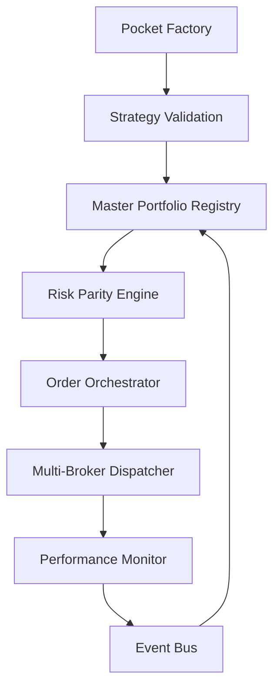

# 📋 Development Navigation

**📄 Documentation Structure:**
- **[spec.md](./spec.md)** - Original product specification and system requirements
- **[jira.md](./jira.md)** - User stories and acceptance criteria organized by epics
- **[roadmap.md](./roadmap.md)** - Version roadmap (MVP → V1 → V2) with epic distribution
- **[plan_overview.md](./plan_overview.md)** - High-level architecture vision and microservices overview  
- **[plan_phased.md](./plan_phased.md)** - Detailed implementation plan with file structure and development phases
- **[plan_detailed.md](./plan_detailed.md)** *(current)* - Complete technical specification with microservices architecture

---

# 📊 PLAN ARCHITECTURE BUBBLE - VERSION PROFESSIONNELLE

## 🎯 Vision Système Complet

**Bubble Platform** = Pocket Factory + Master Portfolio + Execution Engine



## 🏗️ Architecture Technique Professionnelle

### **Structure Microservices Modulaire - DÉTAILLÉE**

```
bubble-platform/
├── services/                                    # MICROSERVICES CORE
│   │
│   ├── auth-service/                           # 🔐 SERVICE D'AUTHENTIFICATION & UTILISATEURS
│   │   ├── app/                                # Application FastAPI principale
│   │   │   ├── main.py                         # • Point d'entrée FastAPI
│   │   │   │                                   # • INPUT: Authentication requests
│   │   │   │                                   # • OUTPUT: JWT tokens + User management
│   │   │   │                                   # • DEPS: FastAPI, SQLAlchemy, bcrypt, PyJWT
│   │   │   ├── models/                         # Modèles d'authentification
│   │   │   │   ├── __init__.py
│   │   │   │   ├── user.py                     # • Structure des utilisateurs
│   │   │   │   │                               # • INPUT: User registration/profile data
│   │   │   │   │                               # • OUTPUT: User entity
│   │   │   │   │                               # • EXEMPLE: {"id": "uuid", "email": "user@domain.com", "role": "user", "plan": "free"}
│   │   │   │   ├── session.py                  # • Gestion des sessions utilisateur
│   │   │   │   │                               # • INPUT: Login credentials
│   │   │   │   │                               # • OUTPUT: Session tokens
│   │   │   │   ├── permissions.py              # • Système de permissions
│   │   │   │   │                               # • INPUT: User role + resource
│   │   │   │   │                               # • OUTPUT: Permission granted/denied
│   │   │   │   └── tenant.py                   # • Multi-tenancy (un utilisateur = un tenant)
│   │   │   │                                   # • INPUT: User context
│   │   │   │                                   # • OUTPUT: Tenant isolation rules
│   │   │   ├── api/                            # Routes d'authentification
│   │   │   │   ├── __init__.py
│   │   │   │   ├── auth.py                     # • POST /auth/login, /auth/logout, /auth/refresh
│   │   │   │   │                               # • INPUT: {"email": "user@domain.com", "password": "secret"}
│   │   │   │   │                               # • OUTPUT: {"access_token": "jwt...", "user": {...}}
│   │   │   │   ├── users.py                    # • GET/PUT /users/profile, POST /users/register
│   │   │   │   │                               # • INPUT: User profile data
│   │   │   │   │                               # • OUTPUT: User management responses
│   │   │   │   ├── permissions.py              # • GET /users/{id}/permissions
│   │   │   │   │                               # • OUTPUT: User permissions matrix
│   │   │   │   └── admin.py                    # • Admin-only endpoints (user management)
│   │   │   │                                   # • GET/POST/DELETE /admin/users
│   │   │   ├── core/                           # Logique d'authentification
│   │   │   │   ├── __init__.py
│   │   │   │   ├── auth/                       # Mécanismes d'authentification
│   │   │   │   │   ├── __init__.py
│   │   │   │   │   ├── jwt_handler.py          # • Gestion des JWT tokens
│   │   │   │   │   │                           # • INPUT: User claims
│   │   │   │   │   │                           # • OUTPUT: Signed JWT tokens
│   │   │   │   │   ├── password.py             # • Hashing et vérification des mots de passe
│   │   │   │   │   │                           # • INPUT: Plain password
│   │   │   │   │   │                           # • OUTPUT: Bcrypt hashed password
│   │   │   │   │   ├── oauth.py                # • OAuth providers (Google, GitHub)
│   │   │   │   │   │                           # • INPUT: OAuth callback
│   │   │   │   │   │                           # • OUTPUT: User authenticated
│   │   │   │   │   └── two_factor.py           # • 2FA (TOTP)
│   │   │   │   │                               # • INPUT: TOTP code
│   │   │   │   │                               # • OUTPUT: 2FA verification
│   │   │   │   ├── permissions/                # Système de permissions
│   │   │   │   │   ├── __init__.py
│   │   │   │   │   ├── rbac.py                 # • Role-Based Access Control
│   │   │   │   │   │                           # • INPUT: User role + requested action
│   │   │   │   │   │                           # • OUTPUT: Access granted/denied
│   │   │   │   │   ├── decorators.py           # • Décorateurs pour protéger les endpoints
│   │   │   │   │   │                           # • USAGE: @require_permission("portfolio:read")
│   │   │   │   │   └── policies.py             # • Définition des politiques d'accès
│   │   │   │   │                               # • EXEMPLE: {"admin": ["*"], "user": ["portfolio:*"], "viewer": ["portfolio:read"]}
│   │   │   │   └── tenancy/                    # Multi-tenancy
│   │   │   │       ├── __init__.py
│   │   │   │       ├── isolation.py            # • Isolation des données par utilisateur
│   │   │   │       │                           # • INPUT: User context + database query
│   │   │   │       │                           # • OUTPUT: Query avec filtre user_id
│   │   │   │       └── context.py              # • Context utilisateur pour les requêtes
│   │   │   │                                   # • INPUT: JWT token
│   │   │   │                                   # • OUTPUT: User context object
│   │   │   ├── services/                       # Services d'authentification
│   │   │   │   ├── __init__.py
│   │   │   │   ├── user_service.py             # • CRUD operations utilisateurs
│   │   │   │   │                               # • INPUT: User data
│   │   │   │   │                               # • OUTPUT: User operations
│   │   │   │   ├── auth_service.py             # • Service d'authentification principal
│   │   │   │   │                               # • INPUT: Credentials
│   │   │   │   │                               # • OUTPUT: Authentication result
│   │   │   │   └── notification_service.py     # • Notifications auth (welcome, password reset)
│   │   │   │                                   # • INPUT: Auth events
│   │   │   │                                   # • OUTPUT: User notifications
│   │   │   ├── config/                         # Configuration auth
│   │   │   │   ├── __init__.py
│   │   │   │   ├── settings.py                 # • Configuration JWT, OAuth, etc.
│   │   │   │   │                               # • EXEMPLE: JWT_SECRET, TOKEN_EXPIRE_HOURS
│   │   │   │   └── permissions.py              # • Configuration des permissions par défaut
│   │   │   │                                   # • EXEMPLE: DEFAULT_USER_PERMISSIONS
│   │   │   └── utils/                          # Utilitaires auth
│   │   │       ├── __init__.py
│   │   │       ├── validators.py               # • Validation email, password strength
│   │   │       └── exceptions.py               # • Exceptions d'authentification
│   │   ├── requirements.txt                    # • Dépendances: PyJWT, bcrypt, python-multipart
│   │   ├── Dockerfile
│   │   └── tests/
│   │       ├── unit/
│   │       │   ├── test_auth.py                # • Tests d'authentification
│   │       │   ├── test_permissions.py         # • Tests de permissions
│   │       │   └── test_tenancy.py             # • Tests multi-tenancy
│   │       └── integration/
│   │           ├── test_auth_flow.py           # • Tests de flux d'authentification
│   │           └── test_user_management.py     # • Tests de gestion utilisateurs
│   │
│   ├── billing-service/                        # 💳 SERVICE DE FACTURATION & ABONNEMENTS
│   │   ├── app/                                # Application FastAPI principale
│   │   │   ├── main.py                         # • Point d'entrée FastAPI
│   │   │   │                                   # • INPUT: Billing operations requests
│   │   │   │                                   # • OUTPUT: Subscription & payment management
│   │   │   │                                   # • DEPS: FastAPI, stripe, sqlalchemy
│   │   │   ├── models/                         # Modèles de facturation
│   │   │   │   ├── __init__.py
│   │   │   │   ├── subscription.py             # • Structure des abonnements
│   │   │   │   │                               # • INPUT: User + plan selection
│   │   │   │   │                               # • OUTPUT: Subscription entity
│   │   │   │   │                               # • EXEMPLE: {"id": "uuid", "user_id": "uuid", "plan": "pro", "status": "active", "stripe_subscription_id": "sub_xxx"}
│   │   │   │   ├── plan.py                     # • Plans tarifaires
│   │   │   │   │                               # • INPUT: Plan configuration
│   │   │   │   │                               # • OUTPUT: Plan structure
│   │   │   │   │                               # • EXEMPLE: {"id": "pro", "name": "Pro Plan", "price": 29.99, "features": [...], "quotas": {...}}
│   │   │   │   ├── payment.py                  # • Historique des paiements
│   │   │   │   │                               # • INPUT: Payment transaction data
│   │   │   │   │                               # • OUTPUT: Payment record
│   │   │   │   ├── invoice.py                  # • Factures et reçus
│   │   │   │   │                               # • INPUT: Billing period data
│   │   │   │   │                               # • OUTPUT: Invoice entity
│   │   │   │   └── usage.py                    # • Suivi d'usage pour billing
│   │   │   │                                   # • INPUT: User activity metrics
│   │   │   │                                   # • OUTPUT: Usage tracking
│   │   │   ├── api/                            # Routes de facturation
│   │   │   │   ├── __init__.py
│   │   │   │   ├── subscriptions.py            # • POST/GET/PUT /subscriptions
│   │   │   │   │                               # • INPUT: {"plan_id": "pro", "payment_method": "pm_xxx"}
│   │   │   │   │                               # • OUTPUT: {"subscription_id": "uuid", "status": "active", "next_billing": "2024-02-01"}
│   │   │   │   ├── payments.py                 # • POST /payments, GET /payments/history
│   │   │   │   │                               # • INPUT: Payment intent data
│   │   │   │   │                               # • OUTPUT: Payment confirmation
│   │   │   │   ├── plans.py                    # • GET /plans, GET /plans/{id}
│   │   │   │   │                               # • OUTPUT: Available subscription plans
│   │   │   │   ├── invoices.py                 # • GET /invoices, GET /invoices/{id}/pdf
│   │   │   │   │                               # • OUTPUT: Invoice data and PDF generation
│   │   │   │   ├── webhooks.py                 # • POST /webhooks/stripe (Stripe events)
│   │   │   │   │                               # • INPUT: Stripe webhook payload
│   │   │   │   │                               # • OUTPUT: Webhook processing confirmation
│   │   │   │   └── usage.py                    # • GET /usage, POST /usage/track
│   │   │   │                                   # • INPUT: Usage metrics
│   │   │   │                                   # • OUTPUT: Usage reports
│   │   │   ├── core/                           # Logique de facturation
│   │   │   │   ├── __init__.py
│   │   │   │   ├── stripe/                     # Intégration Stripe
│   │   │   │   │   ├── __init__.py
│   │   │   │   │   ├── client.py               # • Client Stripe configuré
│   │   │   │   │   │                           # • INPUT: Stripe operations
│   │   │   │   │   │                           # • OUTPUT: Stripe API responses
│   │   │   │   │   ├── subscriptions.py        # • Gestion abonnements Stripe
│   │   │   │   │   │                           # • INPUT: User + plan
│   │   │   │   │   │                           # • OUTPUT: Stripe subscription created
│   │   │   │   │   ├── payments.py             # • Traitement paiements
│   │   │   │   │   │                           # • INPUT: Payment intent
│   │   │   │   │   │                           # • OUTPUT: Payment processed
│   │   │   │   │   ├── webhooks.py             # • Handlers webhooks Stripe
│   │   │   │   │   │                           # • INPUT: Stripe events
│   │   │   │   │   │                           # • OUTPUT: Business logic execution
│   │   │   │   │   └── customers.py            # • Gestion clients Stripe
│   │   │   │   │                               # • INPUT: User data
│   │   │   │   │                               # • OUTPUT: Stripe customer
│   │   │   │   ├── billing/                    # Logique de facturation
│   │   │   │   │   ├── __init__.py
│   │   │   │   │   ├── calculator.py           # • Calcul des montants
│   │   │   │   │   │                           # • INPUT: Usage + plan
│   │   │   │   │   │                           # • OUTPUT: Billing amount
│   │   │   │   │   ├── prorator.py             # • Proratisation
│   │   │   │   │   │                           # • INPUT: Plan change + timing
│   │   │   │   │   │                           # • OUTPUT: Prorated amount
│   │   │   │   │   ├── tax_calculator.py       # • Calcul des taxes
│   │   │   │   │   │                           # • INPUT: Amount + user location
│   │   │   │   │   │                           # • OUTPUT: Tax amount
│   │   │   │   │   └── discounts.py            # • Gestion des remises
│   │   │   │   │                               # • INPUT: Discount codes
│   │   │   │   │                               # • OUTPUT: Discount applied
│   │   │   │   ├── quotas/                     # Gestion des quotas
│   │   │   │   │   ├── __init__.py
│   │   │   │   │   ├── enforcer.py             # • Application des limites
│   │   │   │   │   │                           # • INPUT: User action + current usage
│   │   │   │   │   │                           # • OUTPUT: Action allowed/denied
│   │   │   │   │   ├── tracker.py              # • Suivi de l'usage
│   │   │   │   │   │                           # • INPUT: User activity
│   │   │   │   │   │                           # • OUTPUT: Usage metrics updated
│   │   │   │   │   └── reset.py                # • Reset périodique des quotas
│   │   │   │   │                               # • INPUT: Reset schedule
│   │   │   │   │                               # • OUTPUT: Quotas reset
│   │   │   │   └── notifications/              # Notifications de facturation
│   │   │   │       ├── __init__.py
│   │   │   │       ├── payment_failed.py       # • Notification échec paiement
│   │   │   │       ├── subscription_ended.py   # • Notification fin d'abonnement
│   │   │   │       ├── invoice_ready.py        # • Notification facture prête
│   │   │   │       └── usage_warning.py        # • Notification limite d'usage
│   │   │   ├── services/                       # Services de facturation
│   │   │   │   ├── __init__.py
│   │   │   │   ├── subscription_service.py     # • CRUD abonnements
│   │   │   │   │                               # • INPUT: Subscription operations
│   │   │   │   │                               # • OUTPUT: Subscription management
│   │   │   │   ├── payment_service.py          # • Service de paiement principal
│   │   │   │   │                               # • INPUT: Payment requests
│   │   │   │   │                               # • OUTPUT: Payment processing
│   │   │   │   ├── invoice_service.py          # • Génération de factures
│   │   │   │   │                               # • INPUT: Billing period
│   │   │   │   │                               # • OUTPUT: Invoice generated
│   │   │   │   ├── quota_service.py            # • Interface avec Auth Service pour quotas
│   │   │   │   │                               # • INPUT: User quota requests
│   │   │   │   │                               # • OUTPUT: Quota updates
│   │   │   │   └── analytics_service.py        # • Analytics de revenue
│   │   │   │                                   # • INPUT: Billing data
│   │   │   │                                   # • OUTPUT: Revenue analytics
│   │   │   ├── config/                         # Configuration billing
│   │   │   │   ├── __init__.py
│   │   │   │   ├── settings.py                 # • Configuration Stripe, plans, etc.
│   │   │   │   │                               # • EXEMPLE: STRIPE_SECRET_KEY, WEBHOOK_SECRET
│   │   │   │   ├── plans.py                    # • Définition des plans tarifaires
│   │   │   │   │                               # • EXEMPLE: Plans Free, Pro, Enterprise avec features
│   │   │   │   └── quotas.py                   # • Configuration des quotas par plan
│   │   │   │                                   # • EXEMPLE: {"free": {"strategies": 3}, "pro": {"strategies": 50}}
│   │   │   └── utils/                          # Utilitaires billing
│   │   │       ├── __init__.py
│   │   │       ├── formatters.py               # • Formatage des montants
│   │   │       ├── validators.py               # • Validation des données de paiement
│   │   │       └── exceptions.py               # • Exceptions de facturation
│   │   ├── requirements.txt                    # • Dépendances: stripe, reportlab (PDF)
│   │   ├── Dockerfile
│   │   └── tests/
│   │       ├── unit/
│   │       │   ├── test_stripe_integration.py  # • Tests intégration Stripe
│   │       │   ├── test_billing_logic.py       # • Tests logique de facturation
│   │       │   ├── test_quotas.py              # • Tests gestion quotas
│   │       │   └── test_webhooks.py            # • Tests webhooks Stripe
│   │       └── integration/
│   │           ├── test_subscription_flow.py   # • Tests flux d'abonnement complet
│   │           ├── test_payment_flow.py        # • Tests flux de paiement
│   │           └── test_upgrade_downgrade.py   # • Tests changements de plan
│   │
│   ├── pocket-factory-service/                 # 🏭 SERVICE DE CRÉATION DE STRATÉGIES
│   │   ├── app/                                # Application FastAPI principale
│   │   │   ├── main.py                         # • Point d'entrée FastAPI
│   │   │   │                                   # • INPUT: HTTP requests
│   │   │   │                                   # • OUTPUT: Strategy APIs
│   │   │   │                                   # • DEPS: FastAPI, uvicorn
│   │   │   ├── models/                         # Modèles de données Pydantic
│   │   │   │   ├── __init__.py
│   │   │   │   ├── universe.py                 # 🚀 TEMPORAL UNIVERSE STRUCTURE (Sprint 2.5 Enhanced)
│   │   │   │   │                               # • INPUT: config.TRADING_SYMBOLS + temporal snapshots
│   │   │   │   │                               # • OUTPUT: Universe(id, symbols, correlations) + UniverseSnapshot entities
│   │   │   │   │                               # • EXEMPLE: {"id": "uuid", "symbols": ["SPY", "QQQ"], "snapshots": [{"date": "2024-01", "composition": [...]}]}
│   │   │   │   ├── universe_snapshot.py        # 🚀 NEW: TEMPORAL UNIVERSE SNAPSHOTS
│   │   │   │   │                               # • INPUT: Universe composition at specific date + metadata
│   │   │   │   │                               # • OUTPUT: UniverseSnapshot(date, symbols, screening_criteria, turnover_rate)
│   │   │   │   │                               # • PURPOSE: Survivorship bias elimination + historical accuracy
│   │   │   │   ├── strategy.py                 # • Structure des stratégies
│   │   │   │   │                               # • INPUT: IndicatorConfig + Universe
│   │   │   │   │                               # • OUTPUT: Strategy(id, params, status)
│   │   │   │   │                               # • EXEMPLE: {"id": "uuid", "indicator_config": {"rsi_period": 14}, "status": "validated"}
│   │   │   │   ├── indicators.py               # • Configuration des indicateurs techniques
│   │   │   │   │                               # • INPUT: User parameters
│   │   │   │   │                               # • OUTPUT: IndicatorConfig validated
│   │   │   │   │                               # • EXEMPLE: {"rsi": {"period": 14}, "macd": {"fast": 12, "slow": 26}}
│   │   │   │   └── backtest.py                 # 🚀 TEMPORAL BACKTEST RESULTS (Enhanced)
│   │   │   │                                   # • INPUT: Strategy + Complete Dataset + Universe Timeline
│   │   │   │                                   # • OUTPUT: TemporalBacktestResults + Attribution Analysis
│   │   │   │                                   # • NEW: Survivorship bias elimination, universe evolution tracking, attribution decomposition
│   │   │   │                                   # • EXEMPLE: {"sharpe_ratio": 1.2, "max_drawdown": -0.15, "total_return": 0.23}
│   │   │   ├── api/                            # Routes API REST
│   │   │   │   ├── __init__.py
│   │   │   │   ├── universe.py                 # 🚀 TEMPORAL UNIVERSE APIs (Sprint 2.5 Enhanced)
│   │   │   │   │                               # • POST /universes, GET /universes/{id}, GET /universes/{id}/timeline
│   │   │   │   │                               # • INPUT: {"symbols": ["SPY", "QQQ"], "name": "US Large Cap", "screening_criteria": {...}}
│   │   │   │   │                               # • OUTPUT: {"universe_id": "uuid", "correlation_score": 0.8, "snapshot_count": 24}
│   │   │   │   │                               # • NEW ENDPOINTS: /snapshots/{date}, /composition/{date}, /evolution-analysis
│   │   │   │   ├── strategies.py               # • POST /strategies, GET /strategies/{id}
│   │   │   │   │                               # • INPUT: {"universe_id": "uuid", "indicator_config": {...}}
│   │   │   │   │                               # • OUTPUT: {"strategy_id": "uuid", "backtest_status": "running"}
│   │   │   │   ├── indicators.py               # • GET /indicators/default, POST /indicators/optimize
│   │   │   │   │                               # • INPUT: {"strategy_id": "uuid", "optimization_target": "sharpe"}
│   │   │   │   │                               # • OUTPUT: {"optimized_params": {...}, "improvement": 0.15}
│   │   │   │   └── backtests.py                # 🚀 TEMPORAL BACKTEST APIs (Revolutionary Enhancement)
│   │   │   │                                   # • GET /backtests/{id}, POST /backtests/run, POST /backtests/temporal
│   │   │   │                                   # • INPUT: {"strategy_id": "uuid", "start_date": "2020-01-01", "use_complete_dataset": true}
│   │   │   │                                   # • OUTPUT: {"backtest_id": "uuid", "performance": {...}, "attribution": {}, "survivorship_bias_impact": -0.03}
│   │   │   │                                   # • NEW: Complete Dataset Approach, attribution analysis, universe evolution overlay
│   │   │   ├── core/                           # Logique métier principale
│   │   │   │   ├── __init__.py
│   │   │   │   ├── indicators/                 # 🔄 RÉUTILISE indicators.py existant
│   │   │   │   │   ├── __init__.py
│   │   │   │   │   ├── factory.py              # • Factory pattern pour création d'indicateurs
│   │   │   │   │   │                           # • INPUT: indicator_name + params
│   │   │   │   │   │                           # • OUTPUT: Indicator instance
│   │   │   │   │   │                           # • DEPS: indicators.py (ton code existant)
│   │   │   │   │   ├── technical.py            # • RSI, MACD, Stochastic (depuis ton indicators.py)
│   │   │   │   │   │                           # • INPUT: OHLCV DataFrame
│   │   │   │   │   │                           # • OUTPUT: Signal Series (-1, 0, 1)
│   │   │   │   │   │                           # • EXEMPLE: calculate_rsi(data, period=14) → Series([0,0,1,-1,0...])
│   │   │   │   │   ├── composite.py            # • Composite indicator (depuis ton generate_signals)
│   │   │   │   │   │                           # • INPUT: Multiple indicators + weights
│   │   │   │   │   │                           # • OUTPUT: Combined signal
│   │   │   │   │   │                           # • DEPS: ton calculate_composite_indicator()
│   │   │   │   │   ├── alternative_data.py     # • Indicateurs basés sur données alternatives
│   │   │   │   │   │                           # • INPUT: Reddit sentiment, Twitter buzz, News scores
│   │   │   │   │   │                           # • OUTPUT: Alternative data signals
│   │   │   │   │   │                           # • EXEMPLE: reddit_sentiment_ma(window=7), twitter_buzz_spike()
│   │   │   │   │   ├── sentiment_indicators.py # • Indicateurs de sentiment spécialisés
│   │   │   │   │   │                           # • INPUT: Social data scores + price data
│   │   │   │   │   │                           # • OUTPUT: Hybrid sentiment-price signals
│   │   │   │   │   │                           # • EXEMPLE: sentiment_divergence(), social_momentum()
│   │   │   │   │   ├── custom_scoring.py       # • Scoring personnalisé multi-sources
│   │   │   │   │   │                           # • INPUT: Custom datasets + scoring rules
│   │   │   │   │   │                           # • OUTPUT: Proprietary scoring indicators
│   │   │   │   │   │                           # • EXEMPLE: popularity_score(), trend_strength()
│   │   │   │   │   └── optimization.py         # • Optimisation des paramètres
│   │   │   │   │                               # • INPUT: Historical data + objective function
│   │   │   │   │                               # • OUTPUT: Optimized parameters
│   │   │   │   │                               # • DEPS: ton optimization.py existant
│   │   │   │   ├── universe/                   # ⚡ GESTION DES UNIVERS DYNAMIQUES - SCREENING AVANCÉ
│   │   │   │   │   ├── __init__.py
│   │   │   │   │   ├── screeners/              # 🔍 Moteurs de screening multi-critères  
│   │   │   │   │   │   ├── __init__.py
│   │   │   │   │   │   ├── base_screener.py    # • Interface abstraite screener
│   │   │   │   │   │   │                       # • INPUT: Screening criteria + date
│   │   │   │   │   │   │                       # • OUTPUT: Filtered universe list
│   │   │   │   │   │   ├── fundamental_screener.py # 🎯 SCREENING FONDAMENTAL AVANCÉ
│   │   │   │   │   │   │                       # • INPUT: ROIC > sector median, P/E ratios, growth rates
│   │   │   │   │   │   │                       # • OUTPUT: Fundamentally filtered stocks
│   │   │   │   │   │   │                       # • EXEMPLE: screen_roic_leaders(date="2024-01", min_percentile=50)
│   │   │   │   │   │   │                       # • SOURCES: Financial APIs, analyst estimates
│   │   │   │   │   │   ├── quality_screener.py # • Screening qualité financière
│   │   │   │   │   │   │                       # • INPUT: Debt/Equity < 0.5, ROE > 15%, consistent margins
│   │   │   │   │   │   │                       # • OUTPUT: High-quality companies
│   │   │   │   │   │   │                       # • EXEMPLE: screen_quality_companies(min_roe=0.15, max_debt_ratio=0.5)
│   │   │   │   │   │   ├── momentum_screener.py # • Screening momentum & technical
│   │   │   │   │   │   │                       # • INPUT: Price momentum, earnings revisions, relative strength
│   │   │   │   │   │   │                       # • OUTPUT: High momentum stocks
│   │   │   │   │   │   │                       # • EXEMPLE: screen_momentum(lookback_months=6, min_return=0.1)
│   │   │   │   │   │   ├── value_screener.py   # • Screening value
│   │   │   │   │   │   │                       # • INPUT: P/E, P/B, EV/EBITDA relative to sector
│   │   │   │   │   │   │                       # • OUTPUT: Undervalued stocks
│   │   │   │   │   │   │                       # • EXEMPLE: screen_value_stocks(pe_percentile=25, pb_percentile=30)
│   │   │   │   │   │   ├── growth_screener.py  # • Screening croissance
│   │   │   │   │   │   │                       # • INPUT: Revenue growth, earnings growth, analyst upgrades
│   │   │   │   │   │   │                       # • OUTPUT: High growth potential stocks
│   │   │   │   │   │   │                       # • EXEMPLE: screen_growth_stocks(min_revenue_growth=0.15)
│   │   │   │   │   │   ├── liquidity_screener.py # • Screening liquidité & taille
│   │   │   │   │   │   │                       # • INPUT: Volume, market cap, bid-ask spread
│   │   │   │   │   │   │                       # • OUTPUT: Liquid, tradeable stocks
│   │   │   │   │   │   │                       # • EXEMPLE: screen_liquid_stocks(min_mcap=1e9, min_volume=1e6)
│   │   │   │   │   │   ├── sector_screener.py  # • Screening sectoriel  
│   │   │   │   │   │   │                       # • INPUT: Sector allocation limits, sector momentum
│   │   │   │   │   │   │                       # • OUTPUT: Sector-diversified universe
│   │   │   │   │   │   │                       # • EXEMPLE: screen_sector_leaders(sectors=["Technology", "Healthcare"])
│   │   │   │   │   │   ├── esg_screener.py     # • Screening ESG/sustainability
│   │   │   │   │   │   │                       # • INPUT: ESG scores, carbon footprint, controversies
│   │   │   │   │   │   │                       # • OUTPUT: ESG-compliant stocks
│   │   │   │   │   │   │                       # • EXEMPLE: screen_esg_leaders(min_esg_score=70, exclude_fossil=True)
│   │   │   │   │   │   ├── alternative_data_screener.py # • Screening données alternatives
│   │   │   │   │   │   │                       # • INPUT: Social sentiment, insider trading, satellite data
│   │   │   │   │   │   │                       # • OUTPUT: Alternative signal-based universe
│   │   │   │   │   │   │                       # • EXEMPLE: screen_social_momentum(reddit_sentiment>0.6, twitter_buzz>threshold)
│   │   │   │   │   │   ├── composite_screener.py # 🎯 SCREENER MULTI-CRITÈRES AVANCÉ
│   │   │   │   │   │   │                       # • INPUT: Combination of multiple screening rules + weights
│   │   │   │   │   │   │                       # • OUTPUT: Composite scored & ranked universe
│   │   │   │   │   │   │                       # • EXEMPLE: screen_composite(rules=[quality_30%, momentum_40%, value_30%])
│   │   │   │   │   │   └── custom_screener.py  # • Screener personnalisé utilisateur
│   │   │   │   │   │                           # • INPUT: User-defined criteria + scoring logic
│   │   │   │   │   │                           # • OUTPUT: Custom proprietary universe
│   │   │   │   │   ├── evolution/              # 📅 ÉVOLUTION TEMPORELLE DES UNIVERS
│   │   │   │   │   │   ├── __init__.py
│   │   │   │   │   │   ├── scheduler.py        # ✅ Planification mises à jour univers [READY FOR IMPLEMENTATION]
│   │   │   │   │   │   │                       # • INPUT: Update frequency (monthly, quarterly, weekly)
│   │   │   │   │   │   │                       # • OUTPUT: Scheduled universe refreshes
│   │   │   │   │   │   │                       # • EXEMPLE: schedule_universe_update(frequency="monthly", day=1)
│   │   │   │   │   │   │                       # • IMPLEMENTATION NOTE: Sprint 2.5 Phase 2 - Core scheduling logic
│   │   │   │   │   │   ├── tracker.py          # ✅ Suivi des changements d'univers [READY FOR IMPLEMENTATION]
│   │   │   │   │   │   │                       # • INPUT: Universe snapshots over time
│   │   │   │   │   │   │                       # • OUTPUT: Addition/removal tracking + turnover metrics
│   │   │   │   │   │   │                       # • EXEMPLE: track_universe_changes(old_universe, new_universe)
│   │   │   │   │   │   │                       # • IMPLEMENTATION NOTE: Sprint 2.5 Phase 2 - Snapshot comparison logic
│   │   │   │   │   │   ├── transition_manager.py # ✅ Gestion des transitions intelligente [READY FOR IMPLEMENTATION]
│   │   │   │   │   │   │                       # • INPUT: Old universe vs new universe + transition rules
│   │   │   │   │   │   │                       # • OUTPUT: Gradual transition strategy
│   │   │   │   │   │   │                       # • EXEMPLE: manage_transition(phase_out_period=30days, min_holding=7days)
│   │   │   │   │   │   │                       # • IMPLEMENTATION NOTE: Sprint 2.5 Phase 2 - Transition cost optimization
│   │   │   │   │   │   ├── impact_analyzer.py  # ✅ Analyse d'impact des changements [READY FOR IMPLEMENTATION]
│   │   │   │   │   │   │                       # • INPUT: Universe changes + portfolio positions
│   │   │   │   │   │   │                       # • OUTPUT: Impact analysis & cost estimation
│   │   │   │   │   │   │                       # • EXEMPLE: analyze_rebalance_impact(turnover=0.3, transaction_costs=0.002)
│   │   │   │   │   │   │                       # • IMPLEMENTATION NOTE: Sprint 2.5 Phase 2 - Transaction cost modeling
│   │   │   │   │   │   └── performance_attribution.py # ✅ Attribution des changements [READY FOR IMPLEMENTATION]
│   │   │   │   │   │                           # • INPUT: Universe changes + strategy performance
│   │   │   │   │   │                           # • OUTPUT: Performance attribution to universe vs strategy
│   │   │   │   │   │                           # • EXEMPLE: attribute_performance(universe_effect=+2%, strategy_effect=+1%)
│   │   │   │   │   │                           # • IMPLEMENTATION NOTE: Sprint 2.5 Phase 4 - Performance decomposition analysis
│   │   │   │   │   ├── data_sources/           # 💾 SOURCES DE DONNÉES POUR SCREENING
│   │   │   │   │   │   ├── __init__.py
│   │   │   │   │   │   ├── fundamental_data.py # • Provider données fondamentales
│   │   │   │   │   │   │                       # • INPUT: Financial APIs (FactSet, Refinitiv, Alpha Vantage)
│   │   │   │   │   │   │                       # • OUTPUT: ROIC, P/E, growth rates, margins by sector
│   │   │   │   │   │   │                       # • SOURCES: SEC filings, earnings reports, analyst estimates
│   │   │   │   │   │   ├── analyst_estimates.py # • Prévisions d'analystes consensus
│   │   │   │   │   │   │                       # • INPUT: Consensus estimate APIs
│   │   │   │   │   │   │                       # • OUTPUT: Forward ROIC, EPS growth, revenue forecasts
│   │   │   │   │   │   │                       # • EXEMPLE: get_consensus_roic_forecast(symbol="AAPL", period="FY1")
│   │   │   │   │   │   ├── sector_classification.py # 🏭 CLASSIFICATION SECTORIELLE AVANCÉE
│   │   │   │   │   │   │                       # • INPUT: GICS, ICB, Morningstar sector mappings
│   │   │   │   │   │   │                       # • OUTPUT: Sector mappings + median metrics by sector
│   │   │   │   │   │   │                       # • EXEMPLE: get_sector_median_roic(sector="Technology", date="2024-01")
│   │   │   │   │   │   ├── market_cap_data.py  # • Données de capitalisation & liquidité
│   │   │   │   │   │   │                       # • INPUT: Market cap, float, average volume
│   │   │   │   │   │   │                       # • OUTPUT: Size classifications & liquidity metrics
│   │   │   │   │   │   ├── technical_data.py   # • Données techniques pour screening
│   │   │   │   │   │   │                       # • INPUT: Price, volume, momentum indicators
│   │   │   │   │   │   │                       # • OUTPUT: Technical screening factors
│   │   │   │   │   │   ├── alternative_data.py # • Données alternatives pour screening
│   │   │   │   │   │   │                       # • INPUT: Social sentiment, satellite data, credit spreads
│   │   │   │   │   │   │                       # • OUTPUT: Alternative screening factors
│   │   │   │   │   │   └── esg_data.py         # • Données ESG
│   │   │   │   │   │                           # • INPUT: ESG providers (MSCI, Sustainalytics, Refinitiv)
│   │   │   │   │   │                           # • OUTPUT: ESG scores, carbon metrics, controversies
│   │   │   │   │   ├── builder.py              # 🏗️ CONSTRUCTION D'UNIVERS DYNAMIQUE
│   │   │   │   │   │                           # • INPUT: Screening criteria + target date + constraints
│   │   │   │   │   │                           # • OUTPUT: Time-stamped filtered universe
│   │   │   │   │   │                           # • EXEMPLE: build_universe(criteria=roic_screen, date="2024-01-01", max_stocks=50)
│   │   │   │   │   ├── validator.py            # ✅ VALIDATION DES UNIVERS DYNAMIQUES
│   │   │   │   │   │                           # • INPUT: Generated universe + quality constraints
│   │   │   │   │   │                           # • OUTPUT: Quality checks, warnings & compliance
│   │   │   │   │   │                           # • EXEMPLE: validate_universe_quality(min_diversification=0.8, max_sector_weight=0.3)
│   │   │   │   │   └── analyzer.py             # 📈 ANALYSE DE DIVERSIFICATION DYNAMIQUE
│   │   │   │   │                               # • INPUT: Time-varying universe + correlation matrix
│   │   │   │   │                               # • OUTPUT: Diversification evolution metrics
│   │   │   │   │                               # • EXEMPLE: analyze_correlation_stability(lookback_window=252days)
│   │   │   │   └── backtest/                   # Moteur de backtest
│   │   │   │       ├── __init__.py
│   │   │   │       ├── engines/                # 🚀 MOTEURS DE BACKTEST POUR UNIVERS DYNAMIQUES
│   │   │   │       │   ├── __init__.py
│   │   │   │       │   ├── temporal_backtest_engine.py # 🚀 REVOLUTIONARY TEMPORAL BACKTESTING ENGINE [Sprint 2.5 IMPLEMENTED]
│   │   │   │       │   │                       # • INPUT: Strategy + Complete Dataset + Universe Snapshots Timeline
│   │   │   │       │   │                       # • OUTPUT: Survivorship-bias-free backtest with attribution analysis
│   │   │   │       │   │                       # • INNOVATION: Complete Dataset Approach (5x performance improvement)
│   │   │   │       │   │                       # • FEATURES: 
│   │   │   │       │   │                       #   - Bulk data processing for ALL historical universe members
│   │   │   │       │   │                       #   - Ultra-fast temporal filtering from pre-computed complete dataset
│   │   │   │       │   │                       #   - Attribution analysis: Strategy alpha vs Universe evolution effects
│   │   │   │       │   │                       #   - Realistic transaction costs including universe turnover
│   │   │   │       │   │                       #   - Performance comparison: Temporal vs Static results (bias quantification)
│   │   │   │       │   ├── dynamic_universe_engine.py # ✅ Legacy Dynamic Engine (Enhanced with Temporal Integration)
│   │   │   │       │   │                       # • INPUT: Strategy + Time-varying universe definitions + Temporal snapshots
│   │   │   │       │   │                       # • OUTPUT: Backtest with universe evolution tracking + Temporal accuracy
│   │   │   │       │   │                       # • ENHANCEMENT: Now uses UniverseSnapshot system for historical accuracy
│   │   │   │       │   ├── basic_engine.py     # 🔄 RÉUTILISE portfolio.py existant + ADAPTATION UNIVERS DYNAMIQUE
│   │   │   │       │   │                       # • INPUT: Strategy + Static OR Dynamic universe
│   │   │   │       │   │                       # • OUTPUT: Portfolio performance (enhanced with universe tracking)
│   │   │   │       │   │                       # • UPGRADE: Ton code existant + universe change handling
│   │   │   │       │   ├── vectorbt_engine.py  # • Moteur VectorBT + univers dynamique
│   │   │   │       │   │                       # • INPUT: Strategy parameters + universe evolution
│   │   │   │       │   │                       # • OUTPUT: VectorBT optimized backtest with universe tracking
│   │   │   │       │   ├── quantconnect_engine.py # • QuantConnect + universe screening
│   │   │   │       │   │                       # • INPUT: Strategy code + screening logic
│   │   │   │       │   │                       # • OUTPUT: QuantConnect backtest with dynamic universe
│   │   │   │       │   ├── zipline_engine.py   # • Zipline + univers évolutif
│   │   │   │       │   │                       # • INPUT: Strategy algorithm + universe scheduler
│   │   │   │       │   │                       # • OUTPUT: Zipline backtest with universe rebalancing
│   │   │   │       │   ├── custom_engine.py    # • Ton moteur custom + screening avancé
│   │   │   │       │   │                       # • INPUT: Advanced parameters + proprietary screening
│   │   │   │       │   │                       # • OUTPUT: Custom engine with universe intelligence
│   │   │   │       │   └── base_engine.py      # • Interface abstraite AVEC SUPPORT UNIVERS DYNAMIQUE
│   │   │   │       │                           # • TEMPLATE: Universe-aware backtest interface
│   │   │   │       ├── metrics.py              # • Calcul des métriques de performance
│   │   │   │       │                           # • INPUT: Trade history + returns
│   │   │   │       │                           # • OUTPUT: Sharpe, Sortino, MaxDD, etc.
│   │   │   │       │                           # • EXEMPLE: {"sharpe": 1.2, "calmar": 0.8, "sortino": 1.5}
│   │   │   │       └── simulator.py            # • Simulation de trading
│   │   │   │                                   # • INPUT: Signals + Market data
│   │   │   │                                   # • OUTPUT: Trade history + PnL
│   │   │   ├── services/                       # Services utilitaires
│   │   │   │   ├── __init__.py
│   │   │   │   ├── data_service.py             # • Récupération de données market
│   │   │   │   │                               # • INPUT: Symbol list + timeframe
│   │   │   │   │                               # • OUTPUT: OHLCV data
│   │   │   │   │                               # • DEPS: Data Service API calls
│   │   │   │   ├── cache_service.py            # • Cache des résultats de backtest
│   │   │   │   │                               # • INPUT: Backtest parameters hash
│   │   │   │   │                               # • OUTPUT: Cached results or None
│   │   │   │   │                               # • DEPS: Redis
│   │   │   │   └── validation_service.py       # • Validation des configurations
│   │   │   │                                   # • INPUT: Strategy config
│   │   │   │                                   # • OUTPUT: Validation errors or success
│   │   │   ├── config/                         # Configuration du service
│   │   │   │   ├── __init__.py
│   │   │   │   ├── settings.py                 # • Variables d'environnement
│   │   │   │   │                               # • EXEMPLE: DATABASE_URL, REDIS_URL, API_KEYS
│   │   │   │   └── parameters.py               # 🔄 RÉUTILISE get_default_params() existant
│   │   │   │                                   # • INPUT: Asset type
│   │   │   │                                   # • OUTPUT: Default indicator parameters
│   │   │   └── utils/                          # Utilitaires
│   │   │       ├── __init__.py
│   │   │       ├── helpers.py                  # • Fonctions utilitaires
│   │   │       └── exceptions.py               # • Exceptions custom
│   │   ├── requirements.txt                    # • Dépendances Python
│   │   │                                       # • fastapi, pandas, numpy, ta-lib, redis, postgresql
│   │   ├── Dockerfile                          # • Configuration Docker
│   │   └── tests/                              # Tests unitaires et d'intégration
│   │       ├── unit/
│   │       │   ├── test_indicators.py          # • Tests des indicateurs techniques
│   │       │   ├── test_backtest.py            # • Tests du moteur de backtest
│   │       │   └── test_universe.py            # • Tests de validation d'univers
│   │       └── integration/
│   │           ├── test_api.py                 # • Tests des endpoints API
│   │           └── test_workflows.py           # • Tests des workflows complets
│   │
│   ├── master-portfolio-service/               # 🏛️ SERVICE DE GESTION GLOBALE DU PORTFOLIO
│   │   ├── app/
│   │   │   ├── main.py                         # • Point d'entrée FastAPI
│   │   │   │                                   # • INPUT: HTTP requests
│   │   │   │                                   # • OUTPUT: Portfolio management APIs
│   │   │   ├── models/
│   │   │   │   ├── __init__.py
│   │   │   │   ├── portfolio.py                # • Structure du portfolio maître
│   │   │   │   │                               # • INPUT: Strategy list + allocations
│   │   │   │   │                               # • OUTPUT: MasterPortfolio object
│   │   │   │   │                               # • EXEMPLE: {"id": "uuid", "strategies": [...], "total_value": 100000}
│   │   │   │   ├── allocation.py               # • Modèle d'allocation de capital
│   │   │   │   │                               # • INPUT: Strategy performance data
│   │   │   │   │                               # • OUTPUT: Allocation weights
│   │   │   │   │                               # • EXEMPLE: {"strategy_1": 0.25, "strategy_2": 0.35, "cash": 0.40}
│   │   │   │   ├── rebalancing.py              # • Configuration de rééquilibrage
│   │   │   │   │                               # • INPUT: Rebalance triggers + thresholds
│   │   │   │   │                               # • OUTPUT: Rebalancing schedule
│   │   │   │   └── risk.py                     # • Modèles de risque
│   │   │   │                                   # • INPUT: Portfolio exposures
│   │   │   │                                   # • OUTPUT: Risk metrics
│   │   │   ├── api/
│   │   │   │   ├── __init__.py
│   │   │   │   ├── portfolios.py               # • CRUD operations sur portfolios
│   │   │   │   │                               # • GET /portfolios, POST /portfolios
│   │   │   │   │                               # • INPUT: {"name": "My Portfolio", "strategies": [...]}
│   │   │   │   │                               # • OUTPUT: {"portfolio_id": "uuid", "status": "created"}
│   │   │   │   ├── allocations.py              # • Gestion des allocations
│   │   │   │   │                               # • GET /portfolios/{id}/allocation
│   │   │   │   │                               # • OUTPUT: {"current_weights": {...}, "target_weights": {...}}
│   │   │   │   ├── rebalancing.py              # • Déclenchement des rééquilibrages
│   │   │   │   │                               # • POST /portfolios/{id}/rebalance
│   │   │   │   │                               # • INPUT: {"force": true, "dry_run": false}
│   │   │   │   │                               # • OUTPUT: {"orders": [...], "estimated_cost": 150.50}
│   │   │   │   ├── performance.py              # • Métriques de performance
│   │   │   │   │                               # • GET /portfolios/{id}/performance
│   │   │   │   │                               # • OUTPUT: {"returns": [...], "sharpe": 1.2, "drawdown": -0.08}
│   │   │   │   └── risk.py                     # • Monitoring du risque
│   │   │   │                                   # • GET /portfolios/{id}/risk
│   │   │   │                                   # • OUTPUT: {"var_95": 0.02, "expected_shortfall": 0.03}
│   │   │   ├── core/
│   │   │   │   ├── __init__.py
│   │   │   │   ├── allocators/                 # Stratégies d'allocation
│   │   │   │   │   ├── __init__.py
│   │   │   │   │   ├── base.py                 # • Interface abstraite pour allocateurs
│   │   │   │   │   ├── risk_parity.py          # 🔄 RÉUTILISE risk_parity_allocator.py existant
│   │   │   │   │   │                           # • INPUT: Strategy returns covariance matrix
│   │   │   │   │   │                           # • OUTPUT: Risk parity weights
│   │   │   │   │   │                           # • DEPS: ton calculate_risk_parity_allocation()
│   │   │   │   │   ├── equal_weight.py         # • Allocation équipondérée
│   │   │   │   │   │                           # • INPUT: Number of strategies
│   │   │   │   │   │                           # • OUTPUT: Equal weights (1/N)
│   │   │   │   │   ├── momentum.py             # • Allocation basée sur momentum
│   │   │   │   │   │                           # • INPUT: Recent performance
│   │   │   │   │   │                           # • OUTPUT: Momentum-based weights
│   │   │   │   │   ├── minimum_variance.py     # • Allocation minimum variance
│   │   │   │   │   │                           # • INPUT: Covariance matrix
│   │   │   │   │   │                           # • OUTPUT: Min variance weights
│   │   │   │   │   ├── black_litterman.py      # • Allocation Black-Litterman
│   │   │   │   │   │                           # • INPUT: Market views + uncertainty
│   │   │   │   │   │                           # • OUTPUT: View-adjusted weights
│   │   │   │   │   ├── machine_learning.py     # • Allocation ML-based
│   │   │   │   │   │                           # • INPUT: Features + returns history
│   │   │   │   │   │                           # • OUTPUT: ML-predicted weights
│   │   │   │   │   ├── factor_based.py         # • Allocation factor-based
│   │   │   │   │   │                           # • INPUT: Factor exposures + returns
│   │   │   │   │   │                           # • OUTPUT: Factor-optimized weights
│   │   │   │   │   ├── mean_reversion.py       # • Allocation mean reversion
│   │   │   │   │   │                           # • INPUT: Price deviations from mean
│   │   │   │   │   │                           # • OUTPUT: Mean-reversion weights
│   │   │   │   │   ├── sentiment_weighted.py   # • Allocation basée sur sentiment
│   │   │   │   │   │                           # • INPUT: Alternative data scores
│   │   │   │   │   │                           # • OUTPUT: Sentiment-adjusted weights
│   │   │   │   │   └── multi_objective.py      # • Allocation multi-objectifs
│   │   │   │   │                               # • INPUT: Multiple objectives (return, risk, ESG)
│   │   │   │   │                               # • OUTPUT: Pareto-optimized weights
│   │   │   │   ├── rebalancing/                # Logique de rééquilibrage
│   │   │   │   │   ├── __init__.py
│   │   │   │   │   ├── scheduler.py            # • Planification des rééquilibrages
│   │   │   │   │   │                           # • INPUT: Frequency (daily, weekly, monthly)
│   │   │   │   │   │                           # • OUTPUT: Next rebalance date
│   │   │   │   │   ├── calculator.py           # • Calcul des ordres de rééquilibrage
│   │   │   │   │   │                           # • INPUT: Current vs target allocations
│   │   │   │   │   │                           # • OUTPUT: Order instructions
│   │   │   │   │   ├── trigger.py              # • Déclencheurs de rééquilibrage
│   │   │   │   │   │                           # • INPUT: Portfolio drift threshold
│   │   │   │   │   │                           # • OUTPUT: Rebalance trigger signal
│   │   │   │   │   └── optimizer.py            # • Optimisation des ordres
│   │   │   │   │                               # • INPUT: Order list + transaction costs
│   │   │   │   │                               # • OUTPUT: Optimized execution sequence
│   │   │   │   ├── risk/                       # Gestion du risque
│   │   │   │   │   ├── __init__.py
│   │   │   │   │   ├── monitor.py              # • Monitoring des risques en temps réel
│   │   │   │   │   │                           # • INPUT: Portfolio positions + market data
│   │   │   │   │   │                           # • OUTPUT: Risk alerts
│   │   │   │   │   ├── metrics.py              # • Calcul des métriques de risque
│   │   │   │   │   │                           # • INPUT: Returns history
│   │   │   │   │   │                           # • OUTPUT: VaR, ES, correlation metrics
│   │   │   │   │   ├── limits.py               # • Gestion des limites d'exposition
│   │   │   │   │   │                           # • INPUT: Portfolio weights
│   │   │   │   │   │                           # • OUTPUT: Constraint violations
│   │   │   │   │   └── attribution.py          # • Attribution de performance
│   │   │   │   │                               # • INPUT: Strategy returns + weights
│   │   │   │   │                               # • OUTPUT: Performance attribution
│   │   │   │   └── performance/                # Calcul de performance
│   │   │   │       ├── __init__.py
│   │   │   │       ├── calculator.py           # • Calcul des returns du portfolio
│   │   │   │       │                           # • INPUT: Strategy returns + allocations
│   │   │   │       │                           # • OUTPUT: Portfolio returns
│   │   │   │       ├── analytics.py            # • Analytics avancées
│   │   │   │       │                           # • INPUT: Portfolio history
│   │   │   │       │                           # • OUTPUT: Advanced metrics
│   │   │   │       └── benchmarking.py         # • Comparaison avec benchmarks
│   │   │   │                                   # • INPUT: Portfolio returns + benchmark
│   │   │   │                                   # • OUTPUT: Relative performance
│   │   │   ├── services/
│   │   │   │   ├── __init__.py
│   │   │   │   ├── strategy_service.py         # • Interface avec Pocket Factory Service
│   │   │   │   │                               # • INPUT: Strategy IDs
│   │   │   │   │                               # • OUTPUT: Strategy performance data
│   │   │   │   ├── execution_service.py        # • Interface avec Execution Service
│   │   │   │   │                               # • INPUT: Order instructions
│   │   │   │   │                               # • OUTPUT: Execution confirmations
│   │   │   │   ├── data_service.py             # • Interface avec Data Service
│   │   │   │   │                               # • INPUT: Market data requests
│   │   │   │   │                               # • OUTPUT: Real-time market data
│   │   │   │   └── notification_service.py     # • Interface avec Notification Service
│   │   │   │                                   # • INPUT: Alert conditions
│   │   │   │                                   # • OUTPUT: Alert notifications
│   │   │   ├── config/
│   │   │   │   ├── __init__.py
│   │   │   │   ├── settings.py                 # • Configuration du service
│   │   │   │   └── constraints.py              # • Contraintes de portfolio
│   │   │   │                                   # • EXEMPLE: {"max_single_allocation": 0.4, "min_cash": 0.05}
│   │   │   └── utils/
│   │   │       ├── __init__.py
│   │   │       ├── math_utils.py               # • Utilitaires mathématiques
│   │   │       └── validation.py               # • Validation des inputs
│   │   ├── requirements.txt
│   │   ├── Dockerfile
│   │   └── tests/
│   │       ├── unit/
│   │       │   ├── test_allocators.py          # • Tests des allocateurs
│   │       │   ├── test_rebalancing.py         # • Tests de rééquilibrage
│   │       │   └── test_risk.py                # • Tests de gestion des risques
│   │       └── integration/
│   │           ├── test_portfolio_api.py       # • Tests API portfolio
│   │           └── test_rebalancing_flow.py    # • Tests de flux de rééquilibrage
│   │