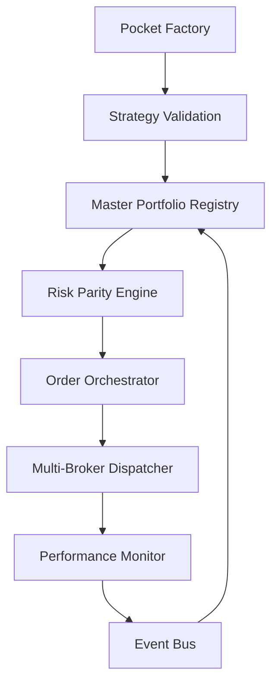

# 📋 Development Navigation

**📄 Documentation Structure:**
- **[spec.md](./spec.md)** - Original product specification and system requirements
- **[jira.md](./jira.md)** - User stories and acceptance criteria organized by epics
- **[roadmap.md](./roadmap.md)** - Version roadmap (MVP → V1 → V2) with epic distribution
- **[plan_overview.md](./plan_overview.md)** - High-level architecture vision and microservices overview  
- **[plan_phased.md](./plan_phased.md)** - Detailed implementation plan with file structure and development phases
- **[plan_detailed.md](./plan_detailed.md)** *(current)* - Complete technical specification with microservices architecture

---

# 📊 PLAN ARCHITECTURE BUBBLE - VERSION PROFESSIONNELLE

## 🎯 Vision Système Complet

**Bubble Platform** = Pocket Factory + Master Portfolio + Execution Engine



## 🏗️ Architecture Technique Professionnelle

### **Structure Microservices Modulaire - DÉTAILLÉE**

```
bubble-platform/

│   ├── execution-service/                      # ⚡ SERVICE D'EXÉCUTION MULTI-BROKER
│   │   ├── app/
│   │   │   ├── main.py                         # • Point d'entrée FastAPI
│   │   │   ├── models/
│   │   │   │   ├── __init__.py
│   │   │   │   ├── order.py                    # • Structure des ordres
│   │   │   │   │                               # • INPUT: Order parameters
│   │   │   │   │                               # • OUTPUT: Order object
│   │   │   │   │                               # • EXEMPLE: {"symbol": "SPY", "qty": 100, "side": "buy", "broker": "alpaca"}
│   │   │   │   ├── position.py                 # • Structure des positions
│   │   │   │   │                               # • INPUT: Broker position data
│   │   │   │   │                               # • OUTPUT: Unified position
│   │   │   │   ├── execution.py                # • Résultats d'exécution
│   │   │   │   │                               # • INPUT: Order execution data
│   │   │   │   │                               # • OUTPUT: Execution report
│   │   │   │   └── broker.py                   # • Configuration des brokers
│   │   │   │                                   # • INPUT: Broker credentials
│   │   │   │                                   # • OUTPUT: Broker connection
│   │   │   ├── api/
│   │   │   │   ├── __init__.py
│   │   │   │   ├── orders.py                   # • Gestion des ordres
│   │   │   │   │                               # • POST /orders, GET /orders/{id}
│   │   │   │   │                               # • INPUT: {"orders": [...], "execution_mode": "live"}
│   │   │   │   │                               # • OUTPUT: {"execution_id": "uuid", "status": "submitted"}
│   │   │   │   ├── positions.py                # • Consultation des positions
│   │   │   │   │                               # • GET /positions, GET /positions/consolidated
│   │   │   │   │                               # • OUTPUT: {"positions": [...], "total_value": 150000}
│   │   │   │   ├── executions.py               # • Historique d'exécution
│   │   │   │   │                               # • GET /executions, GET /executions/{id}
│   │   │   │   │                               # • OUTPUT: {"executions": [...], "summary": {...}}
│   │   │   │   ├── brokers.py                  # • Gestion des brokers
│   │   │   │   │                               # • GET /brokers/status, POST /brokers/test
│   │   │   │   │                               # • OUTPUT: {"alpaca": "connected", "ib": "disconnected"}
│   │   │   │   └── accounts.py                 # • Information des comptes
│   │   │   │                                   # • GET /accounts/summary
│   │   │   │                                   # • OUTPUT: {"total_equity": 200000, "cash": 15000}
│   │   │   ├── core/
│   │   │   │   ├── __init__.py
│   │   │   │   ├── brokers/                    # Gestion multi-broker
│   │   │   │   │   ├── __init__.py
│   │   │   │   │   ├── unified.py              # 🔄 RÉUTILISE unified_broker_manager.py existant
│   │   │   │   │   │                           # • INPUT: Order + routing rules
│   │   │   │   │   │                           # • OUTPUT: Executed order
│   │   │   │   │   │                           # • DEPS: ton UnifiedBrokerManager
│   │   │   │   │   ├── alpaca.py               # • Interface Alpaca (depuis ton code)
│   │   │   │   │   │                           # • INPUT: Stock/ETF orders
│   │   │   │   │   │                           # • OUTPUT: Alpaca execution result
│   │   │   │   │   ├── interactive_brokers.py  # • Interface IB (depuis ton code)
│   │   │   │   │   │                           # • INPUT: Complex orders
│   │   │   │   │   │                           # • OUTPUT: IB execution result
│   │   │   │   │   ├── cryptocom.py            # • Interface Crypto.com (depuis ton code)
│   │   │   │   │   │                           # • INPUT: Crypto orders
│   │   │   │   │   │                           # • OUTPUT: Crypto execution result
│   │   │   │   │   └── base.py                 # • Interface abstraite broker
│   │   │   │   │                               # • Template pour nouveaux brokers
│   │   │   │   ├── routing/                    # Routage des ordres
│   │   │   │   │   ├── __init__.py
│   │   │   │   │   ├── classifier.py           # • Classification des assets
│   │   │   │   │   │                           # • INPUT: Symbol (ex: "SPY", "BTCUSD")
│   │   │   │   │   │                           # • OUTPUT: Asset type + recommended broker
│   │   │   │   │   │                           # • DEPS: ton _classify_asset_by_symbol()
│   │   │   │   │   ├── router.py               # • Routage basé sur pocket
│   │   │   │   │   │                           # • INPUT: Pocket filename
│   │   │   │   │   │                           # • OUTPUT: Broker assignment
│   │   │   │   │   │                           # • DEPS: config.get_broker_for_pocket()
│   │   │   │   │   └── balancer.py             # • Load balancing entre brokers
│   │   │   │   │                               # • INPUT: Order load
│   │   │   │   │                               # • OUTPUT: Optimal broker distribution
│   │   │   │   ├── execution/                  # Moteur d'exécution
│   │   │   │   │   ├── __init__.py
│   │   │   │   │   ├── engine.py               # • Moteur principal d'exécution
│   │   │   │   │   │                           # • INPUT: Order list + execution params
│   │   │   │   │   │                           # • OUTPUT: Execution results
│   │   │   │   │   ├── order_manager.py        # • Gestion du cycle de vie des ordres
│   │   │   │   │   │                           # • INPUT: Order submissions
│   │   │   │   │   │                           # • OUTPUT: Order status updates
│   │   │   │   │   ├── position_tracker.py     # • Suivi des positions en temps réel
│   │   │   │   │   │                           # • INPUT: Trade confirmations
│   │   │   │   │   │                           # • OUTPUT: Updated positions
│   │   │   │   │   └── reconciliation.py       # • Réconciliation entre brokers
│   │   │   │   │                               # • INPUT: Broker positions
│   │   │   │   │                               # • OUTPUT: Reconciliation report
│   │   │   │   └── risk/                       # Contrôle des risques
│   │   │   │       ├── __init__.py
│   │   │   │       ├── pre_trade.py            # • Vérifications pré-trade
│   │   │   │       │                           # • INPUT: Order details
│   │   │   │       │                           # • OUTPUT: Risk approval/rejection
│   │   │   │       ├── position_limits.py      # • Limites de position
│   │   │   │       │                           # • INPUT: Current positions + new order
│   │   │   │       │                           # • OUTPUT: Limit compliance check
│   │   │   │       └── exposure_monitor.py     # • Monitoring d'exposition
│   │   │   │                                   # • INPUT: Portfolio exposures
│   │   │   │                                   # • OUTPUT: Exposure alerts
│   │   │   ├── services/
│   │   │   │   ├── __init__.py
│   │   │   │   ├── order_service.py            # 🔄 RÉUTILISE order_calculator.py existant
│   │   │   │   │                               # • INPUT: Portfolio rebalancing needs
│   │   │   │   │                               # • OUTPUT: Calculated orders
│   │   │   │   │                               # • DEPS: ton calculate_order_table()
│   │   │   │   ├── position_service.py         # • Service de gestion des positions
│   │   │   │   │                               # • INPUT: Broker position feeds
│   │   │   │   │                               # • OUTPUT: Unified position view
│   │   │   │   ├── market_data_service.py      # • Interface vers Data Service
│   │   │   │   │                               # • INPUT: Symbol price requests
│   │   │   │   │                               # • OUTPUT: Real-time prices
│   │   │   │   └── notification_service.py     # • Notifications d'exécution
│   │   │   │                                   # • INPUT: Execution events
│   │   │   │                                   # • OUTPUT: Execution notifications
│   │   │   ├── config/
│   │   │   │   ├── __init__.py
│   │   │   │   ├── settings.py                 # • Configuration du service
│   │   │   │   ├── brokers.py                  # • Configuration des brokers
│   │   │   │   │                               # • EXEMPLE: {"alpaca": {"api_key": "...", "base_url": "..."}}
│   │   │   │   └── routing.py                  # • Règles de routage
│   │   │   │                                   # • EXEMPLE: {"crypto": "cryptocom", "stocks": "alpaca", "options": "ib"}
│   │   │   └── utils/
│   │   │       ├── __init__.py
│   │   │       ├── order_utils.py              # • Utilitaires pour ordres
│   │   │       └── broker_utils.py             # • Utilitaires broker
│   │   ├── requirements.txt
│   │   ├── Dockerfile
│   │   └── tests/
│   │       ├── unit/
│   │       │   ├── test_brokers.py             # • Tests des interfaces broker
│   │       │   ├── test_routing.py             # • Tests de routage
│   │       │   └── test_execution.py           # • Tests d'exécution
│   │       └── integration/
│   │           ├── test_order_flow.py          # • Tests de flux d'ordres
│   │           └── test_multi_broker.py        # • Tests multi-broker
│   │
│   ├── data-service/                           # 📡 SERVICE DE DONNÉES MARKET 🚀 ENHANCED WITH TEMPORAL + OPENBB
│   │   ├── app/
│   │   │   ├── main.py                         # • Point d'entrée FastAPI (Multi-provider + Complete Dataset support)
│   │   │   ├── models/
│   │   │   │   ├── __init__.py
│   │   │   │   ├── market_data.py              # • Structure des données market
│   │   │   │   │                               # • INPUT: Raw market data
│   │   │   │   │                               # • OUTPUT: Standardized OHLCV
│   │   │   │   │                               # • EXEMPLE: {"symbol": "SPY", "timestamp": "...", "open": 450.12, ...}
│   │   │   │   ├── cache.py                    # • Modèles de cache
│   │   │   │   │                               # • INPUT: Cache configuration
│   │   │   │   │                               # • OUTPUT: Cache metadata
│   │   │   │   └── subscription.py             # • Modèles d'abonnement
│   │   │   │                                   # • INPUT: Subscription requests
│   │   │   │                                   # • OUTPUT: Subscription management
│   │   │   ├── api/
│   │   │   │   ├── __init__.py
│   │   │   │   ├── market_data.py              # 🚀 TEMPORAL-AWARE MARKET DATA ENDPOINTS
│   │   │   │   │                               # • GET /market-data/{symbol}, /market-data/fundamentals
│   │   │   │   │                               # • 🆕 GET /market-data/temporal/{universe_id}/{date} - Point-in-time universe data
│   │   │   │   │                               # • 🆕 POST /market-data/complete-dataset - Complete Dataset creation
│   │   │   │   │                               # • INPUT: Symbol + timeframe + date range + universe context
│   │   │   │   │                               # • OUTPUT: OHLCV data array + temporal metadata
│   │   │   │   ├── real_time.py                # • Données temps réel
│   │   │   │   │                               # • WebSocket /ws/market-data
│   │   │   │   │                               # • INPUT: Symbol subscriptions
│   │   │   │   │                               # • OUTPUT: Live price updates
│   │   │   │   ├── cache.py                    # • Gestion du cache
│   │   │   │   │                               # • GET /cache/stats, DELETE /cache/{key}
│   │   │   │   │                               # • OUTPUT: Cache statistics and management
│   │   │   │   └── health.py                   # • Health checks
│   │   │   │                                   # • GET /health
│   │   │   │                                   # • OUTPUT: Service health status
│   │   │   ├── core/
│   │   │   │   ├── __init__.py
│   │   │   │   ├── providers/                  # Fournisseurs de données
│   │   │   │   │   ├── __init__.py
│   │   │   │   │   ├── openbb.py               # 🚀 PRIMARY: OpenBB Terminal Provider (Sprint 3 Enhanced)
│   │   │   │   │   │                           # • INPUT: Symbol + data type + temporal parameters
│   │   │   │   │   │                           # • OUTPUT: Professional-grade institutional data
│   │   │   │   │   │                           # • ENHANCED FEATURES:
│   │   │   │   │   │                           #   - Fundamental data (P/E, ROE, debt ratios, sector comparisons)
│   │   │   │   │   │                           #   - Economic indicators (GDP, inflation, unemployment, economic calendar)
│   │   │   │   │   │                           #   - News sentiment analysis with scoring algorithms
│   │   │   │   │   │                           #   - Analyst estimates and insider trading data
│   │   │   │   │   │                           #   - Complete Dataset bulk processing optimization
│   │   │   │   │   │                           # • API: Unified interface for multiple sources
│   │   │   │   │   ├── yahoo.py                # 🔄 RÉUTILISE fetch.py existant
│   │   │   │   │   │                           # • INPUT: Symbol + date range
│   │   │   │   │   │                           # • OUTPUT: Yahoo Finance data
│   │   │   │   │   │                           # • DEPS: ton code de fetch.py
│   │   │   │   │   ├── alpha_vantage.py        # • Fournisseur Alpha Vantage
│   │   │   │   │   │                           # • INPUT: API key + symbol
│   │   │   │   │   │                           # • OUTPUT: Alpha Vantage data
│   │   │   │   │   ├── polygon.py              # • Fournisseur Polygon.io
│   │   │   │   │   │                           # • INPUT: Symbol + subscription
│   │   │   │   │   │                           # • OUTPUT: Real-time data stream
│   │   │   │   │   ├── quandl.py               # • Fournisseur Quandl
│   │   │   │   │   │                           # • INPUT: Dataset codes
│   │   │   │   │   │                           # • OUTPUT: Economic data
│   │   │   │   │   ├── reddit_scraper.py       # • Alternative data - Reddit scraping
│   │   │   │   │   │                           # • INPUT: Subreddits, keywords, timeframe
│   │   │   │   │   │                           # • OUTPUT: Social sentiment scores by symbol
│   │   │   │   │   │                           # • EXEMPLE: {"SPY": {"sentiment": 0.7, "mentions": 145, "trending": true}}
│   │   │   │   │   ├── twitter_sentiment.py    # • Alternative data - Twitter sentiment
│   │   │   │   │   │                           # • INPUT: Twitter API, financial hashtags
│   │   │   │   │   │                           # • OUTPUT: Real-time sentiment indicators
│   │   │   │   │   ├── news_sentiment.py       # • Alternative data - News sentiment
│   │   │   │   │   │                           # • INPUT: News APIs, NLP processing
│   │   │   │   │   │                           # • OUTPUT: News-based sentiment scores
│   │   │   │   │   ├── custom_datasets.py      # • Custom datasets provider
│   │   │   │   │   │                           # • INPUT: User-defined data sources
│   │   │   │   │   │                           # • OUTPUT: Custom scoring/ranking data
│   │   │   │   │   │                           # • EXEMPLE: Proprietary research, internal signals
│   │   │   │   │   ├── complete_dataset_manager.py # 🚀 NEW: Complete Dataset Management
│   │   │   │   │   │                           # • INPUT: Universe timeline + all historical members
│   │   │   │   │   │                           # • OUTPUT: Bulk processed complete dataset
│   │   │   │   │   │                           # • PURPOSE: 5x performance improvement for temporal backtesting
│   │   │   │   │   │                           # • FEATURES: Bulk data fetching, pre-processing, caching optimization
│   │   │   │   │   └── base.py                 # 🚀 ENHANCED: Interface abstraite provider with temporal support
│   │   │   │   │                               # • Template pour nouveaux providers + temporal methods
│   │   │   │   ├── cache/                      # 🚀 ENHANCED: Système de cache intelligent + Temporal datasets
│   │   │   │   │   ├── __init__.py
│   │   │   │   │   ├── redis.py                # 🚀 ENHANCED: Cache Redis + Complete Dataset storage
│   │   │   │   │   │                           # • Temporal dataset caching for ultra-fast backtesting
│   │   │   │   │   │                           # • Point-in-time data integrity preservation
│   │   │   │   │   ├── temporal_cache.py       # 🆕 NEW: Temporal Dataset Caching System
│   │   │   │   │   │                           # • INPUT: Complete datasets for universe timelines
│   │   │   │   │   │                           # • OUTPUT: Ultra-fast temporal data access
│   │   │   │   │   │                           # • PURPOSE: Enable 5x performance improvement
│   │   │   │   │   │                           # • INPUT: Key-value pairs + TTL
│   │   │   │   │   │                           # • OUTPUT: Cached data retrieval
│   │   │   │   │   ├── strategies.py           # • Stratégies de cache
│   │   │   │   │   │                           # • INPUT: Data type + market hours
│   │   │   │   │   │                           # • OUTPUT: Optimal TTL strategy
│   │   │   │   │   │                           # • EXEMPLE: Market data → 5min pendant marché, 1h après fermeture
│   │   │   │   │   ├── invalidation.py         # • Invalidation intelligente
│   │   │   │   │   │                           # • INPUT: Market events
│   │   │   │   │   │                           # • OUTPUT: Cache invalidation triggers
│   │   │   │   │   └── warming.py              # • Pre-warming du cache
│   │   │   │   │                               # • INPUT: Popular symbols
│   │   │   │   │                               # • OUTPUT: Proactive cache population
│   │   │   │   ├── aggregation/                # Agrégation des données
│   │   │   │   │   ├── __init__.py
│   │   │   │   │   ├── ohlcv.py                # • Agrégation OHLCV
│   │   │   │   │   │                           # • INPUT: High-frequency data
│   │   │   │   │   │                           # • OUTPUT: Timeframe-specific OHLCV
│   │   │   │   │   ├── volume.py               # • Agrégation de volume
│   │   │   │   │   │                           # • INPUT: Trade data
│   │   │   │   │   │                           # • OUTPUT: Volume profiles
│   │   │   │   │   └── indicators.py           # • Pre-calcul d'indicateurs
│   │   │   │   │                               # • INPUT: OHLCV data
│   │   │   │   │                               # • OUTPUT: Pre-computed indicators
│   │   │   │   ├── validation/                 # Validation et nettoyage
│   │   │   │   │   ├── __init__.py
│   │   │   │   │   ├── checker.py              # • Validation de qualité
│   │   │   │   │   │                           # • INPUT: Raw market data
│   │   │   │   │   │                           # • OUTPUT: Quality score + issues
│   │   │   │   │   ├── cleaner.py              # • Nettoyage des données
│   │   │   │   │   │                           # • INPUT: Dirty market data
│   │   │   │   │   │                           # • OUTPUT: Clean market data
│   │   │   │   │   └── outlier_detection.py    # • Détection d'outliers
│   │   │   │   │                               # • INPUT: Time series data
│   │   │   │   │                               # • OUTPUT: Outlier flags
│   │   │   │   └── streaming/                  # Données en temps réel
│   │   │   │       ├── __init__.py
│   │   │   │       ├── websocket_manager.py    # • Gestion WebSocket
│   │   │   │       │                           # • INPUT: Client subscriptions
│   │   │   │       │                           # • OUTPUT: Real-time data streams
│   │   │   │       ├── subscription_manager.py # • Gestion des abonnements
│   │   │   │       │                           # • INPUT: Subscribe/unsubscribe requests
│   │   │   │       │                           # • OUTPUT: Subscription state
│   │   │   │       └── buffer.py               # • Buffer de données streaming
│   │   │   │                                   # • INPUT: High-frequency updates
│   │   │   │                                   # • OUTPUT: Buffered data batches
│   │   │   ├── services/
│   │   │   │   ├── __init__.py
│   │   │   │   ├── fetcher.py                  # • Service de récupération
│   │   │   │   │                               # • INPUT: Data requests
│   │   │   │   │                               # • OUTPUT: Fetched market data
│   │   │   │   ├── normalizer.py               # • Normalisation des données
│   │   │   │   │                               # • INPUT: Multi-format data
│   │   │   │   │                               # • OUTPUT: Standardized format
│   │   │   │   ├── scheduler.py                # • Planification de tâches
│   │   │   │   │                               # • INPUT: Schedule configuration
│   │   │   │   │                               # • OUTPUT: Scheduled data updates
│   │   │   │   └── quality_monitor.py          # • Monitoring de qualité
│   │   │   │                                   # • INPUT: Data streams
│   │   │   │                                   # • OUTPUT: Quality metrics
│   │   │   ├── config/
│   │   │   │   ├── __init__.py
│   │   │   │   ├── settings.py                 # • Configuration du service
│   │   │   │   ├── providers.py                # 🚀 ENHANCED: Multi-provider configuration with OpenBB primary
│   │   │   │   │                               # • TRIPLE-PROVIDER ARCHITECTURE: OpenBB → Yahoo → Alpha Vantage
│   │   │   │   │                               # • EXEMPLE: {"openbb": {"pro_features": true}, "yahoo": {"rate_limit": 2000}, "alpha_vantage": {"api_key": "..."}}
│   │   │   │   │                               # • FAILOVER: Automatic provider switching with quality validation
│   │   │   │   └── symbols.py                  # 🔄 RÉUTILISE config.TRADING_SYMBOLS
│   │   │   │                                   # • INPUT: Symbol configurations
│   │   │   │                                   # • OUTPUT: Symbol metadata
│   │   │   └── utils/
│   │   │       ├── __init__.py
│   │   │       ├── time_utils.py               # • Utilitaires de temps
│   │   │       ├── data_utils.py               # • Utilitaires de données
│   │   │       └── rate_limiter.py             # • Rate limiting pour APIs
│   │   ├── requirements.txt
│   │   ├── Dockerfile
│   │   └── tests/
│   │       ├── unit/
│   │       │   ├── test_providers.py           # • Tests des providers
│   │       │   ├── test_cache.py               # • Tests du cache
│   │       │   └── test_validation.py          # • Tests de validation
│   │       └── integration/
│   │           ├── test_data_flow.py           # • Tests de flux de données
│   │           └── test_real_time.py           # • Tests temps réel
│   │
│   ├── notification-service/                   # 🔔 SERVICE DE NOTIFICATIONS & ALERTES
│   │   ├── app/
│   │   │   ├── main.py                         # • Point d'entrée FastAPI
│   │   │   ├── models/
│   │   │   │   ├── __init__.py
│   │   │   │   ├── alert.py                    # • Structure des alertes
│   │   │   │   │                               # • INPUT: Alert configuration
│   │   │   │   │                               # • OUTPUT: Alert object
│   │   │   │   │                               # • EXEMPLE: {"rule": "drawdown", "threshold": -0.15, "severity": "high"}
│   │   │   │   ├── notification.py             # • Structure des notifications
│   │   │   │   │                               # • INPUT: Alert trigger
│   │   │   │   │                               # • OUTPUT: Notification message
│   │   │   │   ├── channel.py                  # • Configuration des canaux
│   │   │   │   │                               # • INPUT: Channel settings
│   │   │   │   │                               # • OUTPUT: Channel configuration
│   │   │   │   │                               # • EXEMPLE: {"type": "telegram", "chat_id": "123", "enabled": true}
│   │   │   │   └── subscription.py             # • Abonnements utilisateur
│   │   │   │                                   # • INPUT: User preferences
│   │   │   │                                   # • OUTPUT: Subscription settings
│   │   │   ├── api/
│   │   │   │   ├── __init__.py
│   │   │   │   ├── alerts.py                   # • Gestion des alertes
│   │   │   │   │                               # • GET/POST /alerts, PUT /alerts/{id}
│   │   │   │   │                               # • INPUT: Alert rules configuration
│   │   │   │   │                               # • OUTPUT: Alert management responses
│   │   │   │   ├── notifications.py            # • Historique des notifications
│   │   │   │   │                               # • GET /notifications, GET /notifications/{id}
│   │   │   │   │                               # • OUTPUT: Notification history
│   │   │   │   ├── channels.py                 # • Configuration des canaux
│   │   │   │   │                               # • GET/POST /channels, PUT /channels/{id}
│   │   │   │   │                               # • INPUT: Channel configuration
│   │   │   │   │                               # • OUTPUT: Channel management
│   │   │   │   └── subscriptions.py            # • Gestion des abonnements
│   │   │   │                                   # • POST /subscribe, DELETE /unsubscribe
│   │   │   │                                   # • INPUT: Subscription preferences
│   │   │   │                                   # • OUTPUT: Subscription confirmations
│   │   │   ├── core/
│   │   │   │   ├── __init__.py
│   │   │   │   ├── channels/                   # Canaux de notification
│   │   │   │   │   ├── __init__.py
│   │   │   │   │   ├── telegram.py             # • Interface Telegram Bot
│   │   │   │   │   │                           # • INPUT: Message + chat_id
│   │   │   │   │   │                           # • OUTPUT: Telegram message sent
│   │   │   │   │   │                           # • DEPS: telegram-bot API
│   │   │   │   │   ├── email.py                # • Interface Email SMTP
│   │   │   │   │   │                           # • INPUT: Email content + recipients
│   │   │   │   │   │                           # • OUTPUT: Email sent confirmation
│   │   │   │   │   ├── slack.py                # • Interface Slack webhook
│   │   │   │   │   │                           # • INPUT: Slack message + webhook
│   │   │   │   │   │                           # • OUTPUT: Slack notification sent
│   │   │   │   │   ├── sms.py                  # • Interface SMS (Twilio)
│   │   │   │   │   │                           # • INPUT: SMS content + phone numbers
│   │   │   │   │   │                           # • OUTPUT: SMS sent confirmation
│   │   │   │   │   └── base.py                 # • Interface abstraite channel
│   │   │   │   │                               # • Template pour nouveaux canaux
│   │   │   │   ├── rules/                      # Règles d'alerte
│   │   │   │   │   ├── __init__.py
│   │   │   │   │   ├── performance.py          # • Règles de performance
│   │   │   │   │   │                           # • INPUT: Portfolio metrics
│   │   │   │   │   │                           # • OUTPUT: Performance alert triggers
│   │   │   │   │   │                           # • EXEMPLE: Daily loss > 5%, Sharpe < 0.5
│   │   │   │   │   ├── risk.py                 # • Règles de risque
│   │   │   │   │   │                           # • INPUT: Risk metrics
│   │   │   │   │   │                           # • OUTPUT: Risk alert triggers
│   │   │   │   │   │                           # • EXEMPLE: Max drawdown > 20%, VaR breach
│   │   │   │   │   ├── execution.py            # • Règles d'exécution
│   │   │   │   │   │                           # • INPUT: Order execution events
│   │   │   │   │   │                           # • OUTPUT: Execution alert triggers
│   │   │   │   │   │                           # • EXEMPLE: Order failure, broker disconnection
│   │   │   │   │   ├── system.py               # • Règles système
│   │   │   │   │   │                           # • INPUT: System health metrics
│   │   │   │   │   │                           # • OUTPUT: System alert triggers
│   │   │   │   │   │                           # • EXEMPLE: Service down, high latency
│   │   │   │   │   └── base.py                 # • Interface abstraite rule
│   │   │   │   │                               # • Template pour nouvelles règles
│   │   │   │   ├── engines/                    # Moteurs d'alerte
│   │   │   │   │   ├── __init__.py
│   │   │   │   │   ├── alert_engine.py         # • Moteur principal d'alerte
│   │   │   │   │   │                           # • INPUT: Events + rules
│   │   │   │   │   │                           # • OUTPUT: Alert decisions
│   │   │   │   │   ├── threshold_engine.py     # • Moteur de seuils
│   │   │   │   │   │                           # • INPUT: Metrics + thresholds
│   │   │   │   │   │                           # • OUTPUT: Threshold breaches
│   │   │   │   │   ├── escalation_engine.py    # • Moteur d'escalade
│   │   │   │   │   │                           # • INPUT: Alert severity + time
│   │   │   │   │   │                           # • OUTPUT: Escalation decisions
│   │   │   │   │   └── cooldown_engine.py      # • Moteur de cooldown
│   │   │   │   │                               # • INPUT: Alert history
│   │   │   │   │                               # • OUTPUT: Cooldown state
│   │   │   │   ├── templates/                  # Templates de messages
│   │   │   │   │   ├── __init__.py
│   │   │   │   │   ├── alerts.py               # • Templates d'alerte
│   │   │   │   │   │                           # • INPUT: Alert data
│   │   │   │   │   │                           # • OUTPUT: Formatted alert message
│   │   │   │   │   ├── reports.py              # • Templates de rapports
│   │   │   │   │   │                           # • INPUT: Portfolio data
│   │   │   │   │   │                           # • OUTPUT: Daily/weekly/monthly reports
│   │   │   │   │   ├── emails.py               # • Templates email HTML
│   │   │   │   │   │                           # • INPUT: Report data
│   │   │   │   │   │                           # • OUTPUT: HTML email content
│   │   │   │   │   └── notifications.py        # • Templates de notifications
│   │   │   │   │                               # • INPUT: Notification data
│   │   │   │   │                               # • OUTPUT: Channel-specific format
│   │   │   │   └── processors/                 # Processeurs d'événements
│   │   │   │       ├── __init__.py
│   │   │   │       ├── event_processor.py      # • Processeur d'événements principal
│   │   │   │       │                           # • INPUT: System events
│   │   │   │       │                           # • OUTPUT: Processed notifications
│   │   │   │       ├── batch_processor.py      # • Processeur de batch
│   │   │   │       │                           # • INPUT: Batch of events
│   │   │   │       │                           # • OUTPUT: Aggregated notifications
│   │   │   │       └── real_time_processor.py  # • Processeur temps réel
│   │   │   │                                   # • INPUT: Real-time events
│   │   │   │                                   # • OUTPUT: Immediate notifications
│   │   │   ├── services/
│   │   │   │   ├── __init__.py
│   │   │   │   ├── dispatcher.py               # • Service de distribution
│   │   │   │   │                               # • INPUT: Notifications + channel preferences
│   │   │   │   │                               # • OUTPUT: Multi-channel delivery
│   │   │   │   ├── scheduler.py                # • Service de planification
│   │   │   │   │                               # • INPUT: Scheduled notification rules
│   │   │   │   │                               # • OUTPUT: Scheduled notifications
│   │   │   │   ├── analytics.py                # • Analytics des notifications
│   │   │   │   │                               # • INPUT: Notification history
│   │   │   │   │                               # • OUTPUT: Delivery analytics
│   │   │   │   └── subscription_manager.py     # • Gestionnaire d'abonnements
│   │   │   │                                   # • INPUT: User subscription changes
│   │   │   │                                   # • OUTPUT: Updated subscription state
│   │   │   ├── config/
│   │   │   │   ├── __init__.py
│   │   │   │   ├── settings.py                 # • Configuration du service
│   │   │   │   ├── channels.py                 # • Configuration des canaux
│   │   │   │   │                               # • EXEMPLE: {"telegram": {"bot_token": "..."}, "smtp": {"server": "..."}}
│   │   │   │   └── rules.py                    # • Configuration des règles par défaut
│   │   │   │                                   # • EXEMPLE: {"performance": {"daily_loss": 0.05}, "risk": {"max_drawdown": 0.20}}
│   │   │   └── utils/
│   │   │       ├── __init__.py
│   │   │       ├── formatting.py               # • Utilitaires de formatage
│   │   │       ├── rate_limiting.py            # • Rate limiting pour notifications
│   │   │       └── encryption.py               # • Chiffrement des données sensibles
│   │   ├── requirements.txt
│   │   ├── Dockerfile
│   │   └── tests/
│   │       ├── unit/
│   │       │   ├── test_channels.py            # • Tests des canaux
│   │       │   ├── test_rules.py               # • Tests des règles
│   │       │   └── test_templates.py           # • Tests des templates
│   │       └── integration/
│   │           ├── test_notification_flow.py   # • Tests de flux complet
│   │           └── test_alerting.py            # • Tests d'alerte
│   │
│   └── ai-agent-service/                       # 🤖 SERVICE D'INTERFACE CONVERSATIONNELLE IA - ANTHROPIC CLAUDE
│       ├── app/                                # Application FastAPI principale
│       │   ├── main.py                         # • Point d'entrée FastAPI
│       │   │                                   # • INPUT: HTTP requests + WebSocket connections
│       │   │                                   # • OUTPUT: Claude Agent API + WebSocket chat
│       │   │                                   # • DEPS: FastAPI, anthropic, websockets, redis
│       │   ├── models/                         # Modèles de données agent
│       │   │   ├── __init__.py
│       │   │   ├── conversation.py             # • Structure des conversations
│       │   │   │                               # • INPUT: User messages + agent responses
│       │   │   │                               # • OUTPUT: Conversation object with history
│       │   │   │                               # • EXEMPLE: {"id": "uuid", "user_id": "uuid", "messages": [...], "context": {...}}
│       │   │   ├── message.py                  # • Structure des messages
│       │   │   │                               # • INPUT: Text content + metadata
│       │   │   │                               # • OUTPUT: Message entity with role + timestamps
│       │   │   │                               # • EXEMPLE: {"role": "user", "content": "Create portfolio", "timestamp": "...", "tools_used": [...]}
│       │   │   ├── tool_call.py                # • Structure des appels d'outils
│       │   │   │                               # • INPUT: Tool invocation data
│       │   │   │                               # • OUTPUT: ToolCall object
│       │   │   │                               # • EXEMPLE: {"tool_name": "create_universe", "input": {...}, "result": {...}, "status": "completed"}
│       │   │   ├── context.py                  # • Contexte de conversation
│       │   │   │                               # • INPUT: User state + conversation history
│       │   │   │                               # • OUTPUT: Context object for prompt enhancement
│       │   │   │                               # • EXEMPLE: {"current_portfolio": {...}, "preferences": {...}, "recent_actions": [...]}
│       │   │   └── visualization.py            # • Structure des visualisations
│       │   │                                   # • INPUT: Chart data + configuration
│       │   │                                   # • OUTPUT: Visualization object
│       │   │                                   # • EXEMPLE: {"type": "line_chart", "data": [...], "config": {...}, "rendered_url": "..."}
│       │   ├── api/                            # Routes API agent
│       │   │   ├── __init__.py
│       │   │   ├── chat.py                     # • Interface chat principale
│       │   │   │                               # • POST /chat/message - Envoi de message avec tool calling
│       │   │   │                               # • INPUT: {"message": "Backtest momentum strategy", "conversation_id": "uuid"}
│       │   │   │                               # • OUTPUT: {"response": "...", "tools_used": [...], "visualizations": [...]}
│       │   │   ├── conversations.py            # • Gestion des conversations
│       │   │   │                               # • GET/POST /conversations, GET /conversations/{id}/history
│       │   │   │                               # • INPUT: Conversation management requests
│       │   │   │                               # • OUTPUT: Conversation data + message history
│       │   │   ├── tools.py                    # • Configuration des outils disponibles
│       │   │   │                               # • GET /tools/available, GET /tools/{tool_name}/schema
│       │   │   │                               # • OUTPUT: Tool definitions + JSON schemas
│       │   │   ├── websocket.py                # • Interface WebSocket temps réel
│       │   │   │                               # • WebSocket /ws/chat/{conversation_id} - Chat temps réel
│       │   │   │                               # • INPUT: Real-time messages + tool calls
│       │   │   │                               # • OUTPUT: Streaming responses + tool execution updates
│       │   │   ├── context.py                  # • Gestion du contexte utilisateur
│       │   │   │                               # • GET/PUT /context - Contexte conversation
│       │   │   │                               # • INPUT: User context updates
│       │   │   │                               # • OUTPUT: Enhanced conversation context
│       │   │   └── visualizations.py           # • Génération de visualisations
│       │   │                                   # • POST /visualizations/generate - Chart generation
│       │   │                                   # • INPUT: Chart specifications + data
│       │   │                                   # • OUTPUT: Generated chart URLs + metadata
│       │   ├── core/                           # Logique métier agent
│       │   │   ├── __init__.py
│       │   │   ├── claude/                     # 🧠 INTÉGRATION CLAUDE API AVEC TOOL CALLING AVANCÉ
│       │   │   │   ├── __init__.py
│       │   │   │   ├── client.py               # • Client Claude API configuré
│       │   │   │   │                           # • INPUT: API key + model configuration
│       │   │   │   │                           # • OUTPUT: Configured Claude client
│       │   │   │   │                           # • DEPS: anthropic SDK, tool definitions
│       │   │   │   ├── tool_calling.py         # 🛠️ MOTEUR TOOL CALLING SUIVANT BEST PRACTICES ANTHROPIC
│       │   │   │   │                           # • INPUT: User message + available tools
│       │   │   │   │                           # • OUTPUT: Tool execution results + agent response
│       │   │   │   │                           # • FEATURES: Parallel tool calling, error handling, result aggregation
│       │   │   │   │                           # • EXEMPLE: process_tools_request(message="Rebalance portfolio", tools=[...])
│       │   │   │   ├── prompt_engineering.py   # • Optimisation des prompts
│       │   │   │   │                           # • INPUT: User intent + context + tool schemas
│       │   │   │   │                           # • OUTPUT: Optimized system prompt + user prompt
│       │   │   │   │                           # • FEATURES: Context injection, tool descriptions, extended thinking
│       │   │   │   ├── response_processing.py  # • Traitement des réponses Claude
│       │   │   │   │                           # • INPUT: Raw Claude response with tool_use blocks
│       │   │   │   │                           # • OUTPUT: Structured response + tool execution plan
│       │   │   │   ├── context_management.py   # • Gestion du contexte conversation
│       │   │   │   │                           # • INPUT: Conversation history + user state
│       │   │   │   │                           # • OUTPUT: Optimized context for Claude API
│       │   │   │   │                           # • FEATURES: Token optimization, context windowing, relevance scoring
│       │   │   │   ├── safety_layer.py         # 🔒 COUCHE DE SÉCURITÉ POUR ACTIONS CRITIQUES
│       │   │   │   │                           # • INPUT: Tool calls requiring confirmation
│       │   │   │   │                           # • OUTPUT: Safety checks + user confirmation requests
│       │   │   │   │                           # • FEATURES: Critical action detection, confirmation dialogs, rollback capability
│       │   │   │   └── error_handling.py       # • Gestion d'erreurs robuste
│       │   │   │                               # • INPUT: API errors + tool execution failures
│       │   │   │                               # • OUTPUT: User-friendly error messages + recovery suggestions
│       │   │   ├── tools/                      # 🛠️ ARSENAL D'OUTILS PLATFORM-SPECIFIC - ARCHITECTURE MODULAIRE
│       │   │   │   ├── __init__.py
│       │   │   │   ├── registry.py             # • Registre centralisé des outils
│       │   │   │   │                           # • INPUT: Tool registrations + permissions
│       │   │   │   │                           # • OUTPUT: Available tools by user role
│       │   │   │   │                           # • FEATURES: Dynamic tool loading, permission filtering, versioning
│       │   │   │   ├── base.py                 # • Interface abstraite pour outils
│       │   │   │   │                           # • TEMPLATE: Standard tool interface + error handling
│       │   │   │   │                           # • FEATURES: Input validation, output formatting, logging
│       │   │   │   ├── universe_tools.py       # 🌌 OUTILS GESTION D'UNIVERS
│       │   │   │   │                           # • Tool: create_universe(symbols, name, screening_criteria)
│       │   │   │   │                           # • Tool: screen_universe(criteria, date, max_stocks)
│       │   │   │   │                           # • Tool: analyze_universe_correlation(universe_id)
│       │   │   │   │                           # • Tool: compare_universes(universe_ids)
│       │   │   │   │                           # • EXEMPLE: screen_universe({"roic_threshold": "sector_median", "min_market_cap": 1e9})
│       │   │   │   ├── strategy_tools.py       # 📈 OUTILS CRÉATION & GESTION STRATÉGIES
│       │   │   │   │                           # • Tool: create_strategy(universe_id, indicator_config, name)
│       │   │   │   │                           # • Tool: optimize_strategy(strategy_id, optimization_target)
│       │   │   │   │                           # • Tool: run_backtest(strategy_id, start_date, end_date, benchmark)
│       │   │   │   │                           # • Tool: compare_strategies(strategy_ids, metrics)
│       │   │   │   │                           # • EXEMPLE: run_backtest("uuid", "2020-01-01", "2024-01-01", "SPY")
│       │   │   │   ├── portfolio_tools.py      # 🏛️ OUTILS GESTION PORTFOLIO MAÎTRE
│       │   │   │   │                           # • Tool: create_master_portfolio(strategy_ids, allocation_method)
│       │   │   │   │                           # • Tool: rebalance_portfolio(portfolio_id, force=False, dry_run=True)
│       │   │   │   │                           # • Tool: analyze_portfolio_risk(portfolio_id, risk_metrics)
│       │   │   │   │                           # • Tool: calculate_allocation_weights(portfolio_id, method)
│       │   │   │   │                           # • EXEMPLE: rebalance_portfolio("uuid", force=False, dry_run=True)
│       │   │   │   ├── execution_tools.py      # ⚡ OUTILS EXÉCUTION & ORDRES
│       │   │   │   │                           # • Tool: place_orders(orders, execution_mode="paper")
│       │   │   │   │                           # • Tool: check_order_status(order_ids)
│       │   │   │   │                           # • Tool: get_positions_summary(broker="all")
│       │   │   │   │                           # • Tool: calculate_order_impact(orders, market_conditions)
│       │   │   │   │                           # • EXEMPLE: place_orders([{"symbol": "SPY", "qty": 100, "side": "buy"}])
│       │   │   │   ├── data_tools.py           # 📊 OUTILS DONNÉES & ANALYSIS
│       │   │   │   │                           # • Tool: get_market_data(symbols, timeframe, start_date, end_date)
│       │   │   │   │                           # • Tool: calculate_indicators(symbol, indicators, parameters)
│       │   │   │   │                           # • Tool: get_fundamental_data(symbols, metrics)
│       │   │   │   │                           # • Tool: fetch_alternative_data(symbols, data_type)
│       │   │   │   │                           # • EXEMPLE: get_market_data(["SPY", "QQQ"], "1d", "2024-01-01", "2024-12-31")
│       │   │   │   ├── visualization_tools.py  # 📈 OUTILS GÉNÉRATION GRAPHIQUES
│       │   │   │   │                           # • Tool: create_performance_chart(data, chart_type, title)
│       │   │   │   │                           # • Tool: create_allocation_chart(weights, chart_type)
│       │   │   │   │                           # • Tool: create_correlation_heatmap(correlation_matrix, labels)
│       │   │   │   │                           # • Tool: create_drawdown_chart(returns, title)
│       │   │   │   │                           # • EXEMPLE: create_performance_chart(backtest_data, "line", "Strategy Performance")
│       │   │   │   ├── analytics_tools.py      # 🔍 OUTILS ANALYTICS AVANCÉES
│       │   │   │   │                           # • Tool: calculate_performance_metrics(returns, benchmark)
│       │   │   │   │                           # • Tool: perform_attribution_analysis(portfolio_id, period)
│       │   │   │   │                           # • Tool: analyze_risk_exposure(portfolio_id, risk_factors)
│       │   │   │   │                           # • Tool: generate_performance_report(portfolio_id, period)
│       │   │   │   │                           # • EXEMPLE: calculate_performance_metrics(strategy_returns, "SPY")
│       │   │   │   ├── notification_tools.py   # 🔔 OUTILS ALERTES & NOTIFICATIONS
│       │   │   │   │                           # • Tool: create_alert(rule_type, threshold, notification_channels)
│       │   │   │   │                           # • Tool: send_notification(message, channels, priority)
│       │   │   │   │                           # • Tool: get_alert_history(user_id, date_range)
│       │   │   │   │                           # • EXEMPLE: create_alert("drawdown", -0.15, ["email", "telegram"])
│       │   │   │   ├── billing_tools.py        # 💳 OUTILS GESTION ABONNEMENT
│       │   │   │   │                           # • Tool: get_subscription_status(user_id)
│       │   │   │   │                           # • Tool: check_usage_quotas(user_id, resource_type)
│       │   │   │   │                           # • Tool: upgrade_subscription(user_id, plan_id)
│       │   │   │   │                           # • EXEMPLE: check_usage_quotas("uuid", "strategies")
│       │   │   │   └── workflow_tools.py       # 🔄 OUTILS WORKFLOWS COMPLEXES
│       │   │   │                               # • Tool: execute_strategy_creation_workflow(full_config)
│       │   │   │                               # • Tool: execute_portfolio_optimization_workflow(portfolio_id)
│       │   │   │                               # • Tool: execute_risk_management_workflow(portfolio_id)
│       │   │   │                               # • EXEMPLE: Workflows multi-étapes combinant plusieurs outils
│       │   │   ├── processors/                 # 🔄 PROCESSEURS DE RÉPONSES
│       │   │   │   ├── __init__.py
│       │   │   │   ├── message_processor.py    # • Traitement des messages entrants
│       │   │   │   │                           # • INPUT: Raw user message + context
│       │   │   │   │                           # • OUTPUT: Processed message + intent detection
│       │   │   │   │                           # • FEATURES: Intent classification, entity extraction, context enrichment
│       │   │   │   ├── tool_result_processor.py # • Traitement des résultats d'outils
│       │   │   │   │                           # • INPUT: Tool execution results
│       │   │   │   │                           # • OUTPUT: Formatted results + visualizations
│       │   │   │   │                           # • FEATURES: Data formatting, chart generation, summary creation
│       │   │   │   ├── response_formatter.py   # • Formatage des réponses finales
│       │   │   │   │                           # • INPUT: Agent response + tool results + visualizations
│       │   │   │   │                           # • OUTPUT: Multi-modal formatted response
│       │   │   │   │                           # • FEATURES: Markdown formatting, chart embedding, action buttons
│       │   │   │   ├── streaming_processor.py  # • Processeur streaming pour WebSocket
│       │   │   │   │                           # • INPUT: Streaming Claude response
│       │   │   │   │                           # • OUTPUT: Real-time formatted chunks
│       │   │   │   └── error_processor.py      # • Traitement des erreurs utilisateur
│       │   │   │                               # • INPUT: Error conditions + context
│       │   │   │                               # • OUTPUT: User-friendly error explanations + recovery suggestions
│       │   │   ├── memory/                     # 🧠 SYSTÈME DE MÉMOIRE CONVERSATIONNELLE
│       │   │   │   ├── __init__.py
│       │   │   │   ├── conversation_memory.py  # • Mémoire de conversation
│       │   │   │   │                           # • INPUT: Conversation history + context updates
│       │   │   │   │                           # • OUTPUT: Optimized memory for Claude context
│       │   │   │   │                           # • FEATURES: Token-aware windowing, relevance scoring, context compression
│       │   │   │   ├── user_preferences.py     # • Préférences utilisateur persistantes
│       │   │   │   │                           # • INPUT: User interaction patterns + explicit preferences
│       │   │   │   │                           # • OUTPUT: Personalized context enrichment
│       │   │   │   │                           # • EXEMPLE: Preferred visualization types, risk tolerance, trading style
│       │   │   │   ├── session_manager.py      # • Gestion des sessions conversation
│       │   │   │   │                           # • INPUT: Session lifecycle events
│       │   │   │   │                           # • OUTPUT: Session state management
│       │   │   │   │                           # • FEATURES: Session persistence, cleanup, context migration
│       │   │   │   └── context_optimizer.py    # • Optimiseur de contexte pour Claude
│       │   │   │                               # • INPUT: Full conversation context
│       │   │   │                               # • OUTPUT: Token-optimized context for API calls
│       │   │   │                               # • FEATURES: Smart truncation, importance weighting, compression
│       │   │   ├── security/                   # 🔒 COUCHE SÉCURITÉ AGENT
│       │   │   │   ├── __init__.py
│       │   │   │   ├── action_validator.py     # • Validation des actions critiques
│       │   │   │   │                           # • INPUT: Requested tool calls + user permissions
│       │   │   │   │                           # • OUTPUT: Action approval/rejection + confirmation requirements
│       │   │   │   │                           # • FEATURES: Critical action detection, permission checking, approval flows
│       │   │   │   ├── confirmation_manager.py # • Gestion des confirmations utilisateur
│       │   │   │   │                           # • INPUT: Critical actions requiring confirmation
│       │   │   │   │                           # • OUTPUT: Confirmation dialogs + execution gates
│       │   │   │   │                           # • EXEMPLE: "Execute $15K rebalancing? [Confirm/Cancel]"
│       │   │   │   ├── permission_checker.py   # • Vérification des permissions
│       │   │   │   │                           # • INPUT: User role + requested tool + action
│       │   │   │   │                           # • OUTPUT: Permission granted/denied
│       │   │   │   │                           # • FEATURES: RBAC integration, quota checking, tool-level permissions
│       │   │   │   ├── audit_logger.py         # • Audit trail des actions agent
│       │   │   │   │                           # • INPUT: All agent actions + tool calls
│       │   │   │   │                           # • OUTPUT: Comprehensive audit logs
│       │   │   │   │                           # • FEATURES: Action logging, user attribution, compliance tracking
│       │   │   │   └── rate_limiter.py         # • Rate limiting intelligent
│       │   │   │                               # • INPUT: User requests + API usage
│       │   │   │                               # • OUTPUT: Rate limiting decisions
│       │   │   │                               # • FEATURES: Per-user limits, burst handling, quota management
│       │   │   └── workflows/                  # 🔄 WORKFLOWS INTELLIGENTS MULTI-ÉTAPES
│       │   │       ├── __init__.py
│       │   │       ├── strategy_creation.py    # • Workflow création stratégie complète
│       │   │       │                           # • INPUT: High-level user intent
│       │   │       │                           # • OUTPUT: End-to-end strategy creation
│       │   │       │                           # • STEPS: Universe screening → Indicator optimization → Backtesting → Validation
│       │   │       ├── portfolio_management.py # • Workflow gestion portfolio
│       │   │       │                           # • INPUT: Portfolio management requests
│       │   │       │                           # • OUTPUT: Complete portfolio operations
│       │   │       │                           # • STEPS: Analysis → Optimization → Rebalancing → Execution → Monitoring
│       │   │       ├── risk_monitoring.py      # • Workflow monitoring des risques
│       │   │       │                           # • INPUT: Risk assessment triggers
│       │   │       │                           # • OUTPUT: Risk analysis + mitigation actions
│       │   │       │                           # • STEPS: Risk calculation → Alert generation → Mitigation suggestions
│       │   │       └── research_assistant.py   # • Workflow assistant de recherche
│       │   │                                   # • INPUT: Research queries
│       │   │                                   # • OUTPUT: Comprehensive research reports
│       │   │                                   # • STEPS: Data gathering → Analysis → Visualization → Report generation
│       │   ├── services/                       # Services agent
│       │   │   ├── __init__.py
│       │   │   ├── conversation_service.py     # • Service de gestion des conversations
│       │   │   │                               # • INPUT: Conversation operations
│       │   │   │                               # • OUTPUT: Conversation management
│       │   │   ├── tool_execution_service.py   # • Service d'exécution d'outils
│       │   │   │                               # • INPUT: Tool calls from Claude
│       │   │   │                               # • OUTPUT: Tool execution results
│       │   │   ├── visualization_service.py    # • Service de génération de visualisations
│       │   │   │                               # • INPUT: Chart requests + data
│       │   │   │                               # • OUTPUT: Generated visualizations
│       │   │   ├── context_service.py          # • Service de gestion du contexte
│       │   │   │                               # • INPUT: Context management requests
│       │   │   │                               # • OUTPUT: Optimized conversation context
│       │   │   └── integration_service.py      # • Service d'intégration avec autres services
│       │   │                                   # • INPUT: Cross-service operations
│       │   │                                   # • OUTPUT: Unified service interactions
│       │   ├── config/                         # Configuration agent
│       │   │   ├── __init__.py
│       │   │   ├── settings.py                 # • Configuration Claude API
│       │   │   │                               # • EXEMPLE: ANTHROPIC_API_KEY, MODEL_NAME, MAX_TOKENS
│       │   │   ├── tools.py                    # • Configuration des outils disponibles
│       │   │   │                               # • EXEMPLE: Tool permissions par rôle, tool schemas
│       │   │   ├── prompts.py                  # • Prompts système optimisés
│       │   │   │                               # • EXEMPLE: System prompts, tool descriptions, safety instructions
│       │   │   ├── permissions.py              # • Configuration des permissions agent
│       │   │   │                               # • EXEMPLE: Critical actions, confirmation requirements
│       │   │   └── visualization.py            # • Configuration des visualisations
│       │   │                                   # • EXEMPLE: Chart templates, styling, rendering options
│       │   └── utils/                          # Utilitaires agent
│       │       ├── __init__.py
│       │       ├── text_processing.py          # • Traitement de texte avancé
│       │       │                               # • EXEMPLE: Intent detection, entity extraction, sentiment analysis
│       │       ├── token_management.py         # • Gestion des tokens Claude
│       │       │                               # • EXEMPLE: Token counting, context optimization, cost management
│       │       ├── chart_generation.py         # • Génération de graphiques
│       │       │                               # • EXEMPLE: Chart creation, styling, export
│       │       ├── data_formatting.py          # • Formatage de données
│       │       │                               # • EXEMPLE: Data transformation, table formatting, export
│       │       └── validation.py               # • Validation des inputs agent
│       │                                       # • EXEMPLE: Tool parameter validation, user input sanitization
│       ├── requirements.txt                    # • Dépendances: anthropic, fastapi, websockets, redis, matplotlib
│       ├── Dockerfile
│       └── tests/
│           ├── unit/
│           │   ├── test_claude_integration.py  # • Tests intégration Claude API
│           │   ├── test_tool_calling.py        # • Tests tool calling
│           │   ├── test_tools/                 # • Tests des outils individuels
│           │   │   ├── test_universe_tools.py
│           │   │   ├── test_strategy_tools.py
│           │   │   ├── test_portfolio_tools.py
│           │   │   └── test_visualization_tools.py
│           │   ├── test_security.py            # • Tests couche sécurité
│           │   ├── test_workflows.py           # • Tests workflows
│           │   └── test_memory.py              # • Tests système mémoire
│           └── integration/
│               ├── test_agent_api.py           # • Tests API agent
│               ├── test_websocket_chat.py      # • Tests chat WebSocket
│               ├── test_tool_integration.py    # • Tests intégration outils
│               ├── test_multi_modal.py         # • Tests réponses multi-modales
│               └── test_conversation_flow.py   # • Tests flux conversation complet
│