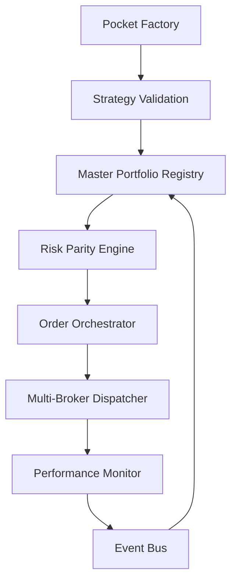

# 📋 Development Navigation

**📄 Documentation Structure:**
- **[spec.md](./spec.md)** - Original product specification and system requirements
- **[jira.md](./jira.md)** - User stories and acceptance criteria organized by epics
- **[roadmap.md](./roadmap.md)** - Version roadmap (MVP → V1 → V2) with epic distribution
- **[plan_overview.md](./plan_overview.md)** - High-level architecture vision and microservices overview  
- **[plan_phased.md](./plan_phased.md)** - Detailed implementation plan with file structure and development phases
- **[plan_detailed.md](./plan_detailed.md)** *(current)* - Complete technical specification with microservices architecture

---

# 📊 PLAN ARCHITECTURE BUBBLE - VERSION PROFESSIONNELLE

## 🎯 Vision Système Complet

**Bubble Platform** = Pocket Factory + Master Portfolio + Execution Engine



## 🏗️ Architecture Technique Professionnelle

### **Structure Microservices Modulaire - DÉTAILLÉE**

```
bubble-platform/
│
├── shared/                                      # 🔗 COMPOSANTS PARTAGÉS
│   ├── core/                                   # Logique métier réutilisée
│   │   ├── __init__.py
│   │   ├── domain/                             # Modèles du domaine métier
│   │   │   ├── __init__.py
│   │   │   ├── universe.py                     # 🚀 ENHANCED: Temporal Universe Entity (Sprint 2.5)
│   │   │   │                                   # • INPUT: Symbol list + metadata + temporal snapshots
│   │   │   │                                   # • OUTPUT: Universe domain object + UniverseSnapshot entities
│   │   │   │                                   # • TEMPORAL FEATURES: Point-in-time compositions, evolution tracking, survivorship bias elimination
│   │   │   ├── strategy.py                     # • Entité Strategy
│   │   │   │                                   # • INPUT: Indicator config + universe
│   │   │   │                                   # • OUTPUT: Strategy domain object
│   │   │   ├── portfolio.py                    # • Entité Portfolio
│   │   │   │                                   # • INPUT: Strategy allocations
│   │   │   │                                   # • OUTPUT: Portfolio domain object
│   │   │   ├── order.py                        # • Entité Order
│   │   │   │                                   # • INPUT: Trade instructions
│   │   │   │                                   # • OUTPUT: Order domain object
│   │   │   └── position.py                     # • Entité Position
│   │   │                                       # • INPUT: Asset holdings
│   │   │                                       # • OUTPUT: Position domain object
│   │   ├── interfaces/                         # Interfaces & contracts
│   │   │   ├── __init__.py
│   │   │   ├── repositories.py                 # • Repository interfaces
│   │   │   │                                   # • Interface pour persistence
│   │   │   ├── services.py                     # • Service interfaces
│   │   │   │                                   # • Interface pour services externes
│   │   │   └── events.py                       # • Event interfaces
│   │   │                                       # • Interface pour événements
│   │   ├── exceptions/                         # Exceptions métier
│   │   │   ├── __init__.py
│   │   │   ├── domain.py                       # • Exceptions du domaine
│   │   │   ├── validation.py                   # • Exceptions de validation
│   │   │   └── business.py                     # • Exceptions business
│   │   └── utils/                              # Utilitaires partagés
│   │       ├── __init__.py
│   │       ├── math.py                         # • Fonctions mathématiques
│   │       │                                   # • EXEMPLE: risk_parity_weights, sharpe_ratio
│   │       ├── finance.py                      # • Fonctions financières
│   │       │                                   # • EXEMPLE: calculate_returns, volatility
│   │       ├── date_time.py                    # • Utilitaires de date/heure
│   │       │                                   # • EXEMPLE: market_hours, business_days
│   │       └── validation.py                   # • Validation partagée
│   │                                           # • EXEMPLE: validate_symbol, validate_allocation
│   ├── events/                                 # Architecture événementielle
│   │   ├── __init__.py
│   │   ├── event_system.py                     # 🔄 RÉUTILISE pattern du plan.md existant
│   │   │                                       # • INPUT: Event definitions
│   │   │                                       # • OUTPUT: Event bus functionality
│   │   ├── types.py                            # • Types d'événements
│   │   │                                       # • EXEMPLE: STRATEGY_CREATED, ORDER_FILLED
│   │   ├── handlers.py                         # • Gestionnaires d'événements
│   │   │                                       # • INPUT: Events
│   │   │                                       # • OUTPUT: Event processing
│   │   ├── publishers.py                       # • Publication d'événements
│   │   │                                       # • INPUT: Event objects
│   │   │                                       # • OUTPUT: Published events
│   │   ├── subscribers.py                      # • Souscription aux événements
│   │   │                                       # • INPUT: Event subscriptions
│   │   │                                       # • OUTPUT: Event delivery
│   │   └── middleware.py                       # • Middleware d'événements
│   │                                           # • INPUT: Raw events
│   │                                           # • OUTPUT: Processed events
│   ├── database/                               # Modèles et migrations de BDD
│   │   ├── __init__.py
│   │   ├── models/                             # Modèles SQLAlchemy
│   │   │   ├── __init__.py
│   │   │   ├── base.py                         # • Modèle de base
│   │   │   ├── universe.py                     # 🚀 ENHANCED: Table universes + universe_snapshots
│   │   │   │                                   # • MAPPING: Plan.md schema universes + Sprint 2.5 UniverseSnapshot model
│   │   │   │                                   # • TEMPORAL TABLES: universe_snapshots with point-in-time compositions
│   │   │   ├── strategy.py                     # • Table strategies
│   │   │   │                                   # • MAPPING: Plan.md schema strategies
│   │   │   ├── portfolio.py                    # • Table master_portfolios
│   │   │   │                                   # • MAPPING: Plan.md schema master_portfolios
│   │   │   ├── order.py                        # • Table orders
│   │   │   │                                   # • MAPPING: Plan.md schema orders
│   │   │   ├── allocation.py                   # • Table pocket_allocations
│   │   │   │                                   # • MAPPING: Plan.md schema pocket_allocations
│   │   │   └── performance.py                  # • Table performance_snapshots
│   │   │                                       # • MAPPING: Plan.md schema performance_snapshots
│   │   ├── migrations/                         # Migrations Alembic
│   │   │   ├── env.py                          # • Configuration Alembic
│   │   │   ├── script.py.mako                  # • Template de migration
│   │   │   └── versions/                       # • Fichiers de migration
│   │   │       ├── 001_initial_schema.py       # • Migration initiale
│   │   │       ├── 002_add_performance.py      # • Ajout des tables de performance
│   │   │       └── 003_add_risk_metrics.py     # • Ajout des métriques de risque
│   │   ├── repositories/                       # Couche d'accès aux données
│   │   │   ├── __init__.py
│   │   │   ├── base.py                         # • Repository de base
│   │   │   ├── universe_repository.py          # • Repository Universe
│   │   │   │                                   # • INPUT: Universe domain objects
│   │   │   │                                   # • OUTPUT: Persistence operations
│   │   │   ├── strategy_repository.py          # • Repository Strategy
│   │   │   │                                   # • INPUT: Strategy domain objects
│   │   │   │                                   # • OUTPUT: Persistence operations
│   │   │   ├── portfolio_repository.py         # • Repository Portfolio
│   │   │   │                                   # • INPUT: Portfolio domain objects
│   │   │   │                                   # • OUTPUT: Persistence operations
│   │   │   └── order_repository.py             # • Repository Order
│   │   │                                       # • INPUT: Order domain objects
│   │   │                                       # • OUTPUT: Persistence operations
│   │   ├── connection.py                       # • Gestionnaire de connexion DB
│   │   │                                       # • INPUT: Database configuration
│   │   │                                       # • OUTPUT: Database connections
│   │   └── session.py                          # • Gestion des sessions DB
│   │                                           # • INPUT: Database operations
│   │                                           # • OUTPUT: Managed DB sessions
│   └── monitoring/                             # Métriques et observabilité
│       ├── __init__.py
│       ├── metrics/                            # Métriques custom
│       │   ├── __init__.py
│       │   ├── business.py                     # • Métriques business
│       │   │                                   # • EXEMPLE: strategies_created, portfolios_rebalanced
│       │   ├── performance.py                  # • Métriques de performance
│       │   │                                   # • EXEMPLE: sharpe_ratio_gauge, max_drawdown_gauge
│       │   ├── technical.py                    # • Métriques techniques
│       │   │                                   # • EXEMPLE: api_latency, cache_hit_rate
│       │   └── financial.py                    # • Métriques financières
│       │                                       # • EXEMPLE: portfolio_value_gauge, order_fill_rate
│       ├── logging/                            # Configuration des logs
│       │   ├── __init__.py
│       │   ├── formatters.py                   # • Formatage des logs
│       │   │                                   # • INPUT: Log records
│       │   │                                   # • OUTPUT: Formatted log strings
│       │   ├── handlers.py                     # • Gestionnaires de logs
│       │   │                                   # • INPUT: Log messages
│       │   │                                   # • OUTPUT: Log destinations
│       │   └── config.py                       # • Configuration logging
│       │                                       # • EXEMPLE: Log levels, output formats
│       ├── tracing/                            # Distributed tracing
│       │   ├── __init__.py
│       │   ├── opentelemetry.py                # • Configuration OpenTelemetry
│       │   │                                   # • INPUT: Trace configuration
│       │   │                                   # • OUTPUT: Distributed traces
│       │   └── decorators.py                   # • Décorateurs de tracing
│       │                                       # • USAGE: @trace_function
│       ├── health/                             # Health checks
│       │   ├── __init__.py
│       │   ├── checks.py                       # • Health check implementations
│       │   │                                   # • INPUT: Service dependencies
│       │   │                                   # • OUTPUT: Health status
│       │   └── endpoints.py                    # • Health check endpoints
│       │                                       # • EXEMPLE: /health, /ready, /live
│       └── dashboards/                         # Dashboards de monitoring
│           ├── grafana/                        # • Dashboards Grafana
│           │   ├── business_metrics.json       # • Dashboard métriques business
│           │   ├── technical_metrics.json      # • Dashboard métriques techniques
│           │   └── financial_overview.json     # • Dashboard overview financier
│           └── prometheus/                     # • Configuration Prometheus
│               ├── rules.yml                   # • Règles d'alerte Prometheus
│               └── targets.yml                 # • Targets de scraping
│
├── web/                                        # 🌐 APPLICATIONS FRONTEND
│   ├── pocket-factory-ui/                     # Interface de création de stratégies
│   │   ├── public/
│   │   │   ├── index.html                      # • Page HTML principale
│   │   │   ├── favicon.ico                     # • Icône du site
│   │   │   └── manifest.json                   # • Manifest PWA
│   │   ├── src/
│   │   │   ├── index.tsx                       # • Point d'entrée React
│   │   │   ├── App.tsx                         # • Composant principal
│   │   │   ├── components/                     # Composants UI
│   │   │   │   ├── UniverseSelector/          # 🔍 ÉTAPE 1: SCREENING & SÉLECTION D'UNIVERS DYNAMIQUE
│   │   │   │   │   ├── index.tsx              # • Composant principal - choix Static vs Dynamic
│   │   │   │   │   ├── UniverseTypeSelector.tsx # • Sélecteur type d'univers
│   │   │   │   │   │                          # • INPUT: Static ETF list vs Dynamic screening
│   │   │   │   │   │                          # • OUTPUT: Universe type selection
│   │   │   │   │   ├── StaticUniverse/        # • Univers statique (ETFs)
│   │   │   │   │   │   ├── AssetGrid.tsx      # • Grille des ETFs
│   │   │   │   │   │   │                      # • INPUT: config.TRADING_SYMBOLS
│   │   │   │   │   │   │                      # • OUTPUT: Selected ETFs array
│   │   │   │   │   │   ├── CategoryFilter.tsx # • Filtre par catégorie ETF
│   │   │   │   │   │   └── CorrelationMatrix.tsx # • Matrice corrélation ETFs
│   │   │   │   │   ├── DynamicUniverse/       # 🎯 SCREENER DYNAMIQUE AVANCÉ
│   │   │   │   │   │   ├── ScreeningBuilder.tsx # • Constructeur de critères
│   │   │   │   │   │   │                      # • INPUT: Multiple screening criteria
│   │   │   │   │   │   │                      # • OUTPUT: Composite screening configuration
│   │   │   │   │   │   ├── FundamentalScreen.tsx # • Screening fondamental
│   │   │   │   │   │   │                      # • INPUT: ROIC > sector median, P/E < percentile
│   │   │   │   │   │   │                      # • OUTPUT: Fundamental filtering criteria
│   │   │   │   │   │   ├── QualityScreen.tsx  # • Screening qualité
│   │   │   │   │   │   │                      # • INPUT: ROE, Debt/Equity, margin stability
│   │   │   │   │   │   │                      # • OUTPUT: Quality filtering criteria
│   │   │   │   │   │   ├── MomentumScreen.tsx # • Screening momentum
│   │   │   │   │   │   │                      # • INPUT: Price momentum, earnings revisions
│   │   │   │   │   │   │                      # • OUTPUT: Momentum filtering criteria
│   │   │   │   │   │   ├── ValueScreen.tsx    # • Screening value
│   │   │   │   │   │   │                      # • INPUT: P/E, P/B relative to sector
│   │   │   │   │   │   │                      # • OUTPUT: Value filtering criteria
│   │   │   │   │   │   ├── LiquidityScreen.tsx # • Screening liquidité
│   │   │   │   │   │   │                      # • INPUT: Market cap, volume, bid-ask spread
│   │   │   │   │   │   │                      # • OUTPUT: Liquidity filtering criteria
│   │   │   │   │   │   ├── SectorScreen.tsx   # • Screening sectoriel
│   │   │   │   │   │   │                      # • INPUT: Sector constraints, diversification
│   │   │   │   │   │   │                      # • OUTPUT: Sector filtering criteria
│   │   │   │   │   │   ├── ESGScreen.tsx      # • Screening ESG
│   │   │   │   │   │   │                      # • INPUT: ESG scores, sustainability
│   │   │   │   │   │   │                      # • OUTPUT: ESG filtering criteria
│   │   │   │   │   │   ├── ScreenPreview.tsx  # • Aperçu du screening temps réel
│   │   │   │   │   │   │                      # • INPUT: All screening criteria + current date
│   │   │   │   │   │   │                      # • OUTPUT: Live filtered universe preview + count + metrics
│   │   │   │   │   │   ├── ScreenResults/     # 📊 RÉSULTATS DÉTAILLÉS DU SCREENING
│   │   │   │   │   │   │   ├── index.tsx      # • Composant principal résultats
│   │   │   │   │   │   │   ├── PeriodSelector.tsx # • Sélecteur de période
│   │   │   │   │   │   │   │                  # • INPUT: Date range picker
│   │   │   │   │   │   │   │                  # • OUTPUT: Selected analysis period
│   │   │   │   │   │   │   ├── UniverseTable.tsx # 📋 TABLE DES ACTIONS RETENUES
│   │   │   │   │   │   │   │                  # • INPUT: Screened stocks + period + criteria scores
│   │   │   │   │   │   │   │                  # • OUTPUT: Detailed stock table with metrics
│   │   │   │   │   │   │   │                  # • COLONNES: Symbol, Name, Sector, ROIC, Sector Median, Score, Entry Date, Exit Date
│   │   │   │   │   │   │   ├── PeriodMetrics.tsx # 📈 MÉTRIQUES PAR PÉRIODE
│   │   │   │   │   │   │   │                  # • INPUT: Period start/end + universe composition
│   │   │   │   │   │   │   │                  # • OUTPUT: Period-specific metrics dashboard
│   │   │   │   │   │   │   │                  # • MÉTRIQUES: Universe size, turnover %, sector distribution, avg ROIC
│   │   │   │   │   │   │   ├── TurnoverAnalysis.tsx # 🔄 ANALYSE TURNOVER
│   │   │   │   │   │   │   │                  # • INPUT: Universe changes between periods
│   │   │   │   │   │   │   │                  # • OUTPUT: Turnover breakdown + cost estimation
│   │   │   │   │   │   │   │                  # • FEATURES: Additions, removals, stability metrics
│   │   │   │   │   │   │   ├── SectorBreakdown.tsx # 🏭 RÉPARTITION SECTORIELLE
│   │   │   │   │   │   │   │                  # • INPUT: Universe composition by sector
│   │   │   │   │   │   │   │                  # • OUTPUT: Pie chart + table of sector weights
│   │   │   │   │   │   │   ├── CriteriaImpact.tsx # ⚖️ IMPACT DES CRITÈRES
│   │   │   │   │   │   │   │                  # • INPUT: Individual screening criteria contribution
│   │   │   │   │   │   │   │                  # • OUTPUT: Criteria effectiveness analysis
│   │   │   │   │   │   │   │                  # • EXEMPLE: ROIC filter removed 60%, Quality added 12%
│   │   │   │   │   │   │   ├── PerformancePreview.tsx # 📊 APERÇU PERFORMANCE
│   │   │   │   │   │   │   │                  # • INPUT: Universe composition + historical returns
│   │   │   │   │   │   │   │                  # • OUTPUT: Expected portfolio metrics preview
│   │   │   │   │   │   │   │                  # • MÉTRIQUES: Expected return, volatility, Sharpe estimate
│   │   │   │   │   │   │   ├── TimelineView.tsx # 📅 VUE CHRONOLOGIQUE
│   │   │   │   │   │   │   │                  # • INPUT: Historical universe snapshots
│   │   │   │   │   │   │   │                  # • OUTPUT: Timeline with universe evolution
│   │   │   │   │   │   │   │                  # • FEATURES: Zoom periods, highlight major changes
│   │   │   │   │   │   │   └── ExportTools.tsx # 💾 OUTILS D'EXPORT
│   │   │   │   │   │   │                      # • INPUT: Screening results + selected period
│   │   │   │   │   │   │                      # • OUTPUT: CSV/Excel export + API endpoints
│   │   │   │   │   │   ├── UniverseEvolution.tsx # • Évolution de l'univers (synthèse)
│   │   │   │   │   │   │                      # • INPUT: Historical universe snapshots
│   │   │   │   │   │   │                      # • OUTPUT: High-level turnover visualization + timeline
│   │   │   │   │   │   ├── SchedulingConfig.tsx # • Configuration planning MAJ
│   │   │   │   │   │   │                      # • INPUT: Update frequency (monthly, quarterly)
│   │   │   │   │   │   │                      # • OUTPUT: Universe refresh schedule
│   │   │   │   │   │   └── ScreeningOptimizer.tsx # 🎯 OPTIMISEUR DE CRITÈRES
│   │   │   │   │   │                          # • INPUT: Historical performance + screening criteria
│   │   │   │   │   │                          # • OUTPUT: Optimized screening parameters
│   │   │   │   │   │                          # • FEATURES: Backtest different criteria, suggest improvements
│   │   │   │   │   ├── UniverseComparison.tsx # • Comparaison d'univers
│   │   │   │   │   │                          # • INPUT: Multiple universe configurations
│   │   │   │   │   │                          # • OUTPUT: Side-by-side comparison
│   │   │   │   │   └── UniverseBacktest.tsx   # • Backtest de l'univers seul
│   │   │   │   │                              # • INPUT: Universe definition + time period
│   │   │   │   │                              # • OUTPUT: Universe-only performance metrics
│   │   │   │   ├── IndicatorConfig/           # 🔧 ÉTAPE 2: Configuration indicateurs
│   │   │   │   │   ├── index.tsx              # • Composant principal
│   │   │   │   │   ├── ParameterSliders.tsx   # • Sliders de paramètres
│   │   │   │   │   │                          # • INPUT: Default parameters
│   │   │   │   │   │                          # • OUTPUT: Custom parameters
│   │   │   │   │   ├── SignalPreview.tsx      # • Aperçu des signaux
│   │   │   │   │   │                          # • INPUT: Indicator configuration
│   │   │   │   │   │                          # • OUTPUT: Signal visualization
│   │   │   │   │   ├── OptimizationPanel.tsx  # • Panel d'optimisation
│   │   │   │   │   │                          # • INPUT: Optimization target
│   │   │   │   │   │                          # • OUTPUT: Optimized parameters
│   │   │   │   │   ├── WeightAdjuster.tsx     # • Ajustement des poids
│   │   │   │   │   │                          # • INPUT: Indicator weights
│   │   │   │   │   │                          # • OUTPUT: Balanced weights
│   │   │   │   │   └── IndicatorChart.tsx     # • Graphique d'indicateur
│   │   │   │   │                              # • INPUT: Indicator data
│   │   │   │   │                              # • OUTPUT: Technical chart
│   │   │   │   ├── BacktestResults/           # 📈 ÉTAPE 3: Backtest et validation
│   │   │   │   │   ├── index.tsx              # • Composant principal
│   │   │   │   │   ├── PerformanceChart.tsx   # • Graphique de performance
│   │   │   │   │   │                          # • INPUT: Backtest results
│   │   │   │   │   │                          # • OUTPUT: Performance line chart
│   │   │   │   │   ├── MetricsTable.tsx       # • Table des métriques
│   │   │   │   │   │                          # • INPUT: Performance metrics
│   │   │   │   │   │                          # • OUTPUT: Metrics display table
│   │   │   │   │   ├── TradesList.tsx         # • Liste des trades
│   │   │   │   │   │                          # • INPUT: Trade history
│   │   │   │   │   │                          # • OUTPUT: Trade history table
│   │   │   │   │   ├── DrawdownChart.tsx      # • Graphique de drawdown
│   │   │   │   │   │                          # • INPUT: Drawdown data
│   │   │   │   │   │                          # • OUTPUT: Drawdown visualization
│   │   │   │   │   ├── ValidationPanel.tsx    # • Panel de validation
│   │   │   │   │   │                          # • INPUT: Strategy criteria
│   │   │   │   │   │                          # • OUTPUT: Validation status
│   │   │   │   │   └── ExportOptions.tsx      # • Options d'export
│   │   │   │   │                              # • INPUT: Backtest data
│   │   │   │   │                              # • OUTPUT: Export functions
│   │   │   │   ├── StrategyBuilder/           # Navigation et état global
│   │   │   │   │   ├── index.tsx              # • Composant principal
│   │   │   │   │   ├── StepIndicator.tsx      # • Indicateur d'étapes
│   │   │   │   │   │                          # • INPUT: Current step
│   │   │   │   │   │                          # • OUTPUT: Progress indicator
│   │   │   │   │   ├── NavigationButtons.tsx  # • Boutons de navigation
│   │   │   │   │   │                          # • INPUT: Step state
│   │   │   │   │   │                          # • OUTPUT: Navigation controls
│   │   │   │   │   └── ProgressSaver.tsx      # • Sauvegarde automatique
│   │   │   │   │                              # • INPUT: Strategy state
│   │   │   │   │                              # • OUTPUT: Auto-save functionality
│   │   │   │   ├── AIChat/                    # 🤖 INTERFACE CHAT IA - INTÉGRATION CLAUDE AGENT
│   │   │   │   │   ├── index.tsx              # • Composant principal chat
│   │   │   │   │   ├── ChatInterface.tsx      # • Interface chat complète
│   │   │   │   │   │                          # • INPUT: User messages + conversation context
│   │   │   │   │   │                          # • OUTPUT: Multi-modal AI responses + tool execution results
│   │   │   │   │   │                          # • FEATURES: WebSocket real-time, tool calling, chart rendering
│   │   │   │   │   ├── MessageBubble.tsx      # • Bulle de message
│   │   │   │   │   │                          # • INPUT: Message content + metadata
│   │   │   │   │   │                          # • OUTPUT: Styled message display
│   │   │   │   │   │                          # • FEATURES: Role-based styling, timestamp, tool indicators
│   │   │   │   │   ├── ChatInput.tsx          # • Zone de saisie message
│   │   │   │   │   │                          # • INPUT: User typing + send actions
│   │   │   │   │   │                          # • OUTPUT: Message submission + typing indicators
│   │   │   │   │   │                          # • FEATURES: Auto-complete, multi-line, file attachment
│   │   │   │   │   ├── ToolExecution/         # 🛠️ COMPOSANTS EXÉCUTION D'OUTILS
│   │   │   │   │   │   ├── ToolCallDisplay.tsx # • Affichage appel d'outil
│   │   │   │   │   │   │                      # • INPUT: Tool call data + execution status
│   │   │   │   │   │   │                      # • OUTPUT: Tool call visualization
│   │   │   │   │   │   │                      # • FEATURES: Progress indicators, parameters display, results
│   │   │   │   │   │   ├── ToolResults.tsx    # • Affichage résultats outils
│   │   │   │   │   │   │                      # • INPUT: Tool execution results
│   │   │   │   │   │   │                      # • OUTPUT: Formatted results display
│   │   │   │   │   │   │                      # • FEATURES: Data tables, charts, download links
│   │   │   │   │   │   ├── ConfirmationDialog.tsx # • Dialog de confirmation actions critiques
│   │   │   │   │   │   │                      # • INPUT: Critical action details
│   │   │   │   │   │   │                      # • OUTPUT: User confirmation/rejection
│   │   │   │   │   │   │                      # • EXEMPLE: "Execute $15K rebalancing? [Confirm/Cancel]"
│   │   │   │   │   │   └── ToolProgress.tsx   # • Indicateur progression outils
│   │   │   │   │   │                          # • INPUT: Tool execution progress
│   │   │   │   │   │                          # • OUTPUT: Real-time progress visualization
│   │   │   │   │   ├── Visualizations/        # 📊 COMPOSANTS VISUALISATION INTÉGRÉS
│   │   │   │   │   │   ├── ChartRenderer.tsx  # • Rendu de graphiques générés
│   │   │   │   │   │   │                      # • INPUT: Chart data from AI agent tools
│   │   │   │   │   │   │                      # • OUTPUT: Interactive chart display
│   │   │   │   │   │   │                      # • FEATURES: Zoom, export, full-screen
│   │   │   │   │   │   ├── TableRenderer.tsx  # • Rendu de tableaux de données
│   │   │   │   │   │   │                      # • INPUT: Tabular data from tools
│   │   │   │   │   │   │                      # • OUTPUT: Sortable data table
│   │   │   │   │   │   │                      # • FEATURES: Sort, filter, export, pagination
│   │   │   │   │   │   ├── MetricsDisplay.tsx # • Affichage métriques formatées
│   │   │   │   │   │   │                      # • INPUT: Performance/risk metrics
│   │   │   │   │   │   │                      # • OUTPUT: Styled metrics cards
│   │   │   │   │   │   └── ReportRenderer.tsx # • Rendu rapports générés
│   │   │   │   │   │                          # • INPUT: Generated reports from AI
│   │   │   │   │   │                          # • OUTPUT: Formatted report display
│   │   │   │   │   ├── ConversationHistory/   # 📜 HISTORIQUE & CONTEXTE CONVERSATION
│   │   │   │   │   │   ├── HistoryPanel.tsx   # • Panel historique conversation
│   │   │   │   │   │   │                      # • INPUT: Conversation message history
│   │   │   │   │   │   │                      # • OUTPUT: Scrollable history display
│   │   │   │   │   │   ├── ConversationList.tsx # • Liste des conversations
│   │   │   │   │   │   │                      # • INPUT: User conversations
│   │   │   │   │   │   │                      # • OUTPUT: Conversation selection interface
│   │   │   │   │   │   ├── SearchHistory.tsx  # • Recherche dans l'historique
│   │   │   │   │   │   │                      # • INPUT: Search queries
│   │   │   │   │   │   │                      # • OUTPUT: Filtered conversation results
│   │   │   │   │   │   └── ContextViewer.tsx  # • Visualiseur de contexte
│   │   │   │   │   │                          # • INPUT: Conversation context
│   │   │   │   │   │                          # • OUTPUT: Context information display
│   │   │   │   │   ├── InterfaceModes/        # 🔄 MODES D'INTERFACE
│   │   │   │   │   │   ├── FullscreenChat.tsx # • Mode chat plein écran
│   │   │   │   │   │   │                      # • INPUT: Chat as primary interface
│   │   │   │   │   │   │                      # • OUTPUT: Full-screen conversation UI
│   │   │   │   │   │   ├── OverlayChat.tsx    # • Mode chat overlay
│   │   │   │   │   │   │                      # • INPUT: Chat over traditional UI
│   │   │   │   │   │   │                      # • OUTPUT: Overlay chat interface
│   │   │   │   │   │   ├── SidebarChat.tsx    # • Mode chat sidebar
│   │   │   │   │   │   │                      # • INPUT: Chat in sidebar panel
│   │   │   │   │   │   │                      # • OUTPUT: Sidebar chat interface
│   │   │   │   │   │   └── ModeToggle.tsx     # • Sélecteur mode interface
│   │   │   │   │   │                          # • INPUT: User mode preference
│   │   │   │   │   │                          # • OUTPUT: Interface mode switching
│   │   │   │   │   ├── QuickActions/          # ⚡ ACTIONS RAPIDES & SUGGESTIONS
│   │   │   │   │   │   ├── SuggestedActions.tsx # • Actions suggérées contextuelles
│   │   │   │   │   │   │                      # • INPUT: Current context + user patterns
│   │   │   │   │   │   │                      # • OUTPUT: Contextual action suggestions
│   │   │   │   │   │   │                      # • EXEMPLE: "Rebalance portfolio", "Check performance"
│   │   │   │   │   │   ├── QuickCommands.tsx  # • Commandes rapides prédéfinies
│   │   │   │   │   │   │                      # • INPUT: Predefined command templates
│   │   │   │   │   │   │                      # • OUTPUT: One-click command execution
│   │   │   │   │   │   ├── TemplateMessages.tsx # • Messages template
│   │   │   │   │   │   │                      # • INPUT: Common query templates
│   │   │   │   │   │   │                      # • OUTPUT: Template message insertion
│   │   │   │   │   │   └── ShortcutPanel.tsx  # • Panel raccourcis clavier
│   │   │   │   │   │                          # • INPUT: Keyboard shortcuts
│   │   │   │   │   │                          # • OUTPUT: Shortcuts help display
│   │   │   │   │   └── Settings/              # ⚙️ PARAMÈTRES CHAT IA
│   │   │   │   │       ├── ChatPreferences.tsx # • Préférences conversation
│   │   │   │   │       │                      # • INPUT: User chat preferences
│   │   │   │   │       │                      # • OUTPUT: Preference configuration
│   │   │   │   │       │                      # • EXEMPLE: Response length, visualization style
│   │   │   │   │       ├── AgentSettings.tsx  # • Paramètres agent
│   │   │   │   │       │                      # • INPUT: Agent behavior settings
│   │   │   │   │       │                      # • OUTPUT: Agent configuration
│   │   │   │   │       ├── ConfirmationSettings.tsx # • Paramètres confirmations
│   │   │   │   │       │                      # • INPUT: Confirmation preferences
│   │   │   │   │       │                      # • OUTPUT: Confirmation rules setup
│   │   │   │   │       └── PrivacySettings.tsx # • Paramètres confidentialité
│   │   │   │   │                              # • INPUT: Privacy preferences
│   │   │   │   │                              # • OUTPUT: Privacy configuration
│   │   │   │   └── shared/                    # Composants partagés
│   │   │   │       ├── LoadingSpinner.tsx     # • Spinner de chargement
│   │   │   │       ├── ErrorBoundary.tsx      # • Gestion d'erreurs
│   │   │   │       ├── Modal.tsx              # • Composant modal
│   │   │   │       ├── Button.tsx             # • Bouton standardisé
│   │   │   │       └── Chart.tsx              # • Composant graphique de base
│   │   │   ├── hooks/                         # Hooks React personnalisés
│   │   │   │   ├── useUniverseData.ts         # • Hook pour données d'univers
│   │   │   │   │                              # • INPUT: API calls
│   │   │   │   │                              # • OUTPUT: Universe state management
│   │   │   │   ├── useBacktest.ts             # • Hook pour backtest
│   │   │   │   │                              # • INPUT: Strategy configuration
│   │   │   │   │                              # • OUTPUT: Backtest state + results
│   │   │   │   ├── useOptimization.ts         # • Hook pour optimisation
│   │   │   │   │                              # • INPUT: Optimization parameters
│   │   │   │   │                              # • OUTPUT: Optimization state + results
│   │   │   │   ├── useRealTimeData.ts         # • Hook pour données temps réel
│   │   │   │   │                              # • INPUT: WebSocket connections
│   │   │   │   │                              # • OUTPUT: Real-time data streams
│   │   │   │   ├── useStrategyState.ts        # • Hook pour état de stratégie
│   │   │   │   │                              # • INPUT: Strategy configuration
│   │   │   │   │                              # • OUTPUT: Strategy state management
│   │   │   │   ├── useAIChat.ts               # • Hook pour chat IA principal
│   │   │   │   │                              # • INPUT: Chat interactions + WebSocket
│   │   │   │   │                              # • OUTPUT: AI chat state + tool execution results
│   │   │   │   │                              # • FEATURES: Message handling, tool calling, real-time updates
│   │   │   │   ├── useConversation.ts         # • Hook pour gestion conversation
│   │   │   │   │                              # • INPUT: Conversation operations
│   │   │   │   │                              # • OUTPUT: Conversation state + history management
│   │   │   │   ├── useToolExecution.ts        # • Hook pour exécution d'outils
│   │   │   │   │                              # • INPUT: Tool calls + parameters
│   │   │   │   │                              # • OUTPUT: Tool execution state + results
│   │   │   │   ├── useChatVisualization.ts    # • Hook pour visualisations chat
│   │   │   │   │                              # • INPUT: Chart data from AI agent
│   │   │   │   │                              # • OUTPUT: Chart rendering state + interactions
│   │   │   │   └── useAgentContext.ts         # • Hook pour contexte agent
│   │   │                                      # • INPUT: User context + preferences
│   │   │                                      # • OUTPUT: Agent context management
│   │   │   ├── services/                      # Services API et communication
│   │   │   │   ├── api.ts                     # • Client API REST
│   │   │   │   │                              # • INPUT: HTTP requests
│   │   │   │   │                              # • OUTPUT: API responses
│   │   │   │   ├── websocket.ts               # • Client WebSocket
│   │   │   │   │                              # • INPUT: WebSocket subscriptions
│   │   │   │   │                              # • OUTPUT: Real-time updates
│   │   │   │   ├── strategyService.ts         # • Service Strategy API
│   │   │   │   │                              # • INPUT: Strategy operations
│   │   │   │   │                              # • OUTPUT: Strategy API calls
│   │   │   │   ├── dataService.ts             # • Service Data API
│   │   │   │   │                              # • INPUT: Data requests
│   │   │   │   │                              # • OUTPUT: Market data
│   │   │   │   ├── aiChatService.ts           # • Service AI Chat API
│   │   │   │   │                              # • INPUT: Chat messages + conversation operations
│   │   │   │   │                              # • OUTPUT: AI responses + tool execution results
│   │   │   │   │                              # • FEATURES: Claude API integration, tool calling, WebSocket management
│   │   │   │   ├── conversationService.ts     # • Service gestion conversations
│   │   │   │   │                              # • INPUT: Conversation CRUD operations
│   │   │   │   │                              # • OUTPUT: Conversation management API calls
│   │   │   │   ├── toolService.ts             # • Service exécution d'outils
│   │   │   │   │                              # • INPUT: Tool execution requests
│   │   │   │   │                              # • OUTPUT: Tool results + status updates
│   │   │   │   └── visualizationService.ts    # • Service génération visualisations
│   │   │   │                                  # • INPUT: Chart requests + data
│   │   │   │                                  # • OUTPUT: Generated chart URLs + metadata
│   │   │   ├── utils/                         # Utilitaires frontend
│   │   │   │   ├── calculations.ts            # • Calculs frontend
│   │   │   │   │                              # • INPUT: Raw data
│   │   │   │   │                              # • OUTPUT: Calculated metrics
│   │   │   │   ├── formatting.ts              # • Formatage des données
│   │   │   │   │                              # • INPUT: Numbers, dates
│   │   │   │   │                              # • OUTPUT: Formatted strings
│   │   │   │   ├── validation.ts              # • Validation frontend
│   │   │   │   │                              # • INPUT: Form data
│   │   │   │   │                              # • OUTPUT: Validation results
│   │   │   │   └── constants.ts               # • Constantes application
│   │   │   │                                  # • EXEMPLE: API endpoints, themes
│   │   │   ├── styles/                        # Styles et thèmes
│   │   │   │   ├── index.css                  # • Styles globaux
│   │   │   │   ├── variables.css              # • Variables CSS
│   │   │   │   ├── components.css             # • Styles des composants
│   │   │   │   └── themes.css                 # • Thèmes (dark/light)
│   │   │   └── types/                         # Types TypeScript
│   │   │       ├── api.ts                     # • Types API
│   │   │       ├── strategy.ts                # • Types Strategy
│   │   │       ├── universe.ts                # • Types Universe
│   │   │       ├── backtest.ts                # • Types Backtest
│   │   │       ├── chat.ts                    # • Types Chat IA
│   │   │       │                              # • EXEMPLE: Message, Conversation, ToolCall, AgentResponse
│   │   │       ├── conversation.ts            # • Types Conversation
│   │   │       │                              # • EXEMPLE: ConversationHistory, Context, UserPreferences
│   │   │       ├── tools.ts                   # • Types Outils Agent
│   │   │       │                              # • EXEMPLE: ToolDefinition, ToolResult, ToolExecution
│   │   │       └── visualization.ts           # • Types Visualisations
│   │   │                                      # • EXEMPLE: Chart, ChartConfig, RenderOptions
│   │   ├── package.json                       # • Dépendances NPM
│   │   │                                      # • react, typescript, recharts, material-ui
│   │   ├── tsconfig.json                      # • Configuration TypeScript
│   │   ├── vite.config.ts                     # • Configuration Vite
│   │   └── Dockerfile                         # • Configuration Docker
│   │
│   ├── master-portfolio-ui/                   # Interface de gestion de portfolio
│   │   ├── public/
│   │   │   ├── index.html
│   │   │   ├── favicon.ico
│   │   │   └── manifest.json
│   │   ├── src/
│   │   │   ├── index.tsx
│   │   │   ├── App.tsx
│   │   │   ├── components/
│   │   │   │   ├── PortfolioDashboard/         # 📊 Dashboard principal
│   │   │   │   │   ├── index.tsx              # • Composant principal
│   │   │   │   │   ├── OverviewCards.tsx      # • Cartes KPI principales
│   │   │   │   │   │                          # • INPUT: Portfolio metrics
│   │   │   │   │   │                          # • OUTPUT: KPI dashboard cards
│   │   │   │   │   ├── AllocationChart.tsx    # • Graphique d'allocation
│   │   │   │   │   │                          # • INPUT: Allocation weights
│   │   │   │   │   │                          # • OUTPUT: Pie/donut chart
│   │   │   │   │   ├── PerformanceGraph.tsx   # • Graphique de performance
│   │   │   │   │   │                          # • INPUT: Performance time series
│   │   │   │   │   │                          # • OUTPUT: Line chart with benchmark
│   │   │   │   │   ├── RecentActivity.tsx     # • Activité récente
│   │   │   │   │   │                          # • INPUT: Recent transactions
│   │   │   │   │   │                          # • OUTPUT: Activity feed
│   │   │   │   │   └── MarketSummary.tsx      # • Résumé du marché
│   │   │   │   │                              # • INPUT: Market data
│   │   │   │   │                              # • OUTPUT: Market overview
│   │   │   │   ├── AllocationMatrix/          # ⚖️ Matrice d'allocation
│   │   │   │   │   ├── index.tsx              # • Composant principal
│   │   │   │   │   ├── StrategyWeights.tsx    # • Poids des stratégies
│   │   │   │   │   │                          # • INPUT: Strategy allocations
│   │   │   │   │   │                          # • OUTPUT: Weight matrix display
│   │   │   │   │   ├── RiskContribution.tsx   # • Contribution au risque
│   │   │   │   │   │                          # • INPUT: Risk contribution data
│   │   │   │   │   │                          # • OUTPUT: Risk breakdown chart
│   │   │   │   │   ├── CorrelationHeatmap.tsx # • Heatmap de corrélation
│   │   │   │   │   │                          # • INPUT: Strategy correlations
│   │   │   │   │   │                          # • OUTPUT: Correlation heatmap
│   │   │   │   │   └── RebalanceHistory.tsx   # • Historique de rééquilibrage
│   │   │   │   │                              # • INPUT: Rebalance events
│   │   │   │   │                              # • OUTPUT: Rebalance timeline
│   │   │   │   ├── RebalancingControls/       # 🎛️ Contrôles de rééquilibrage
│   │   │   │   │   ├── index.tsx              # • Composant principal
│   │   │   │   │   ├── TriggerPanel.tsx       # • Panel de déclenchement
│   │   │   │   │   │                          # • INPUT: User action
│   │   │   │   │   │                          # • OUTPUT: Rebalance trigger
│   │   │   │   │   ├── ScheduleConfig.tsx     # • Configuration de planning
│   │   │   │   │   │                          # • INPUT: Schedule preferences
│   │   │   │   │   │                          # • OUTPUT: Schedule settings
│   │   │   │   │   ├── ThresholdSettings.tsx  # • Paramètres de seuils
│   │   │   │   │   │                          # • INPUT: Threshold values
│   │   │   │   │   │                          # • OUTPUT: Threshold configuration
│   │   │   │   │   ├── OrderPreview.tsx       # • Aperçu des ordres
│   │   │   │   │   │                          # • INPUT: Calculated orders
│   │   │   │   │   │                          # • OUTPUT: Order preview table
│   │   │   │   │   └── ExecutionControls.tsx  # • Contrôles d'exécution
│   │   │   │   │                              # • INPUT: Execution parameters
│   │   │   │   │                              # • OUTPUT: Execution buttons
│   │   │   │   ├── OrderExecution/            # ⚡ Exécution d'ordres
│   │   │   │   │   ├── index.tsx              # • Composant principal
│   │   │   │   │   ├── OrdersTable.tsx        # • Table des ordres
│   │   │   │   │   │                          # • INPUT: Order list
│   │   │   │   │   │                          # • OUTPUT: Order status table
│   │   │   │   │   ├── ExecutionStatus.tsx    # • Statut d'exécution
│   │   │   │   │   │                          # • INPUT: Execution progress
│   │   │   │   │   │                          # • OUTPUT: Real-time status
│   │   │   │   │   ├── PositionsOverview.tsx  # • Vue d'ensemble des positions
│   │   │   │   │   │                          # • INPUT: Cross-broker positions
│   │   │   │   │   │                          # • OUTPUT: Unified positions view
│   │   │   │   │   ├── BrokerStatus.tsx       # • Statut des brokers
│   │   │   │   │   │                          # • INPUT: Broker connections
│   │   │   │   │   │                          # • OUTPUT: Broker status cards
│   │   │   │   │   └── ExecutionHistory.tsx   # • Historique d'exécution
│   │   │   │   │                              # • INPUT: Execution history
│   │   │   │   │                              # • OUTPUT: Execution timeline
│   │   │   │   ├── PerformanceAnalytics/      # 📈 Analytics de performance
│   │   │   │   │   ├── index.tsx              # • Composant principal
│   │   │   │   │   ├── PerformanceDecomp.tsx  # • Décomposition de performance
│   │   │   │   │   │                          # • INPUT: Performance attribution
│   │   │   │   │   │                          # • OUTPUT: Attribution chart
│   │   │   │   │   ├── RiskMetrics.tsx        # • Métriques de risque
│   │   │   │   │   │                          # • INPUT: Risk calculations
│   │   │   │   │   │                          # • OUTPUT: Risk dashboard
│   │   │   │   │   ├── BenchmarkComparison.tsx # • Comparaison benchmark
│   │   │   │   │   │                          # • INPUT: Portfolio vs benchmark
│   │   │   │   │   │                          # • OUTPUT: Comparison charts
│   │   │   │   │   └── AdvancedMetrics.tsx    # • Métriques avancées
│   │   │   │   │                              # • INPUT: Advanced calculations
│   │   │   │   │                              # • OUTPUT: Advanced metrics display
│   │   │   │   ├── BillingManager/           # 💳 Gestion de facturation
│   │   │   │   │   ├── index.tsx              # • Composant principal
│   │   │   │   │   ├── SubscriptionOverview.tsx # • Vue d'ensemble abonnement
│   │   │   │   │   │                          # • INPUT: Subscription data
│   │   │   │   │   │                          # • OUTPUT: Subscription status display
│   │   │   │   │   ├── PlanSelector.tsx       # • Sélecteur de plan
│   │   │   │   │   │                          # • INPUT: Available plans
│   │   │   │   │   │                          # • OUTPUT: Plan selection interface
│   │   │   │   │   ├── PaymentMethods.tsx     # • Méthodes de paiement
│   │   │   │   │   │                          # • INPUT: Payment methods
│   │   │   │   │   │                          # • OUTPUT: Payment form/management
│   │   │   │   │   ├── UsageMetrics.tsx       # • Métriques d'utilisation
│   │   │   │   │   │                          # • INPUT: Usage tracking data
│   │   │   │   │   │                          # • OUTPUT: Usage charts/limits
│   │   │   │   │   ├── InvoiceHistory.tsx     # • Historique des factures
│   │   │   │   │   │                          # • INPUT: Invoice data
│   │   │   │   │   │                          # • OUTPUT: Invoice list/download
│   │   │   │   │   └── BillingSettings.tsx    # • Paramètres de facturation
│   │   │   │   │                              # • INPUT: Billing preferences
│   │   │   │   │                              # • OUTPUT: Billing configuration
│   │   │   │   └── shared/                    # Composants partagés
│   │   │   │       ├── Chart.tsx              # • Composant graphique
│   │   │   │       ├── DataTable.tsx          # • Table de données
│   │   │   │       ├── MetricCard.tsx         # • Carte de métrique
│   │   │   │       ├── StatusBadge.tsx        # • Badge de statut
│   │   │   │       └── FilterPanel.tsx        # • Panel de filtres
│   │   │   ├── hooks/                         # Hooks React
│   │   │   │   ├── usePortfolioData.ts        # • Hook portfolio data
│   │   │   │   │                              # • INPUT: Portfolio API calls
│   │   │   │   │                              # • OUTPUT: Portfolio state management
│   │   │   │   ├── useRealTimeUpdates.ts      # • Hook mises à jour temps réel
│   │   │   │   │                              # • INPUT: WebSocket subscriptions
│   │   │   │   │                              # • OUTPUT: Real-time data state
│   │   │   │   ├── useRebalancing.ts          # • Hook rééquilibrage
│   │   │   │   │                              # • INPUT: Rebalancing operations
│   │   │   │   │                              # • OUTPUT: Rebalancing state
│   │   │   │   ├── useOrders.ts               # • Hook ordres
│   │   │   │   │                              # • INPUT: Order operations
│   │   │   │   │                              # • OUTPUT: Order state management
│   │   │   │   ├── usePerformance.ts          # • Hook performance
│   │   │   │   │                              # • INPUT: Performance calculations
│   │   │   │   │                              # • OUTPUT: Performance state
│   │   │   │   └── useBilling.ts              # • Hook billing
│   │   │   │                                  # • INPUT: Billing operations
│   │   │   │                                  # • OUTPUT: Billing state management
│   │   │   ├── services/                      # Services API
│   │   │   │   ├── portfolio-api.ts           # • API Portfolio
│   │   │   │   │                              # • INPUT: Portfolio operations
│   │   │   │   │                              # • OUTPUT: Portfolio API calls
│   │   │   │   ├── rebalancing-api.ts         # • API Rééquilibrage
│   │   │   │   │                              # • INPUT: Rebalancing requests
│   │   │   │   │                              # • OUTPUT: Rebalancing API calls
│   │   │   │   ├── execution-api.ts           # • API Exécution
│   │   │   │   │                              # • INPUT: Execution requests
│   │   │   │   │                              # • OUTPUT: Execution API calls
│   │   │   │   ├── billing-api.ts             # • API Billing
│   │   │   │   │                              # • INPUT: Subscription operations
│   │   │   │   │                              # • OUTPUT: Billing API calls
│   │   │   │   └── realtime.ts                # • Service temps réel
│   │   │   │                                  # • INPUT: WebSocket connections
│   │   │   │                                  # • OUTPUT: Real-time data streams
│   │   │   ├── utils/                         # Utilitaires
│   │   │   │   ├── calculations.ts            # • Calculs portfolio
│   │   │   │   ├── formatting.ts              # • Formatage données
│   │   │   │   ├── charts.ts                  # • Utilitaires graphiques
│   │   │   │   └── exports.ts                 # • Export de données
│   │   │   ├── styles/                        # Styles
│   │   │   │   ├── index.css
│   │   │   │   ├── dashboard.css              # • Styles dashboard
│   │   │   │   ├── tables.css                 # • Styles tables
│   │   │   │   └── charts.css                 # • Styles graphiques
│   │   │   └── types/                         # Types TypeScript
│   │   │       ├── portfolio.ts               # • Types Portfolio
│   │   │       ├── allocation.ts              # • Types Allocation
│   │   │       ├── orders.ts                  # • Types Orders
│   │   │       ├── performance.ts             # • Types Performance
│   │   │       └── billing.ts                # • Types Billing
│   │   │                                      # • EXEMPLE: Subscription, Plan, Invoice
│   │   ├── package.json
│   │   ├── tsconfig.json
│   │   ├── vite.config.ts
│   │   └── Dockerfile
│   │
│   └── shared-components/                     # 🧩 BIBLIOTHÈQUE DE COMPOSANTS PARTAGÉS
│       ├── src/
│       │   ├── index.ts                       # • Export principal
│       │   ├── components/                    # Composants réutilisables
│       │   │   ├── ui/                        # Composants UI de base
│       │   │   │   ├── Button/
│       │   │   │   │   ├── index.tsx          # • Composant Button
│       │   │   │   │   ├── Button.tsx         # • Implémentation
│       │   │   │   │   ├── Button.stories.tsx # • Storybook stories
│       │   │   │   │   └── Button.test.tsx    # • Tests unitaires
│       │   │   │   ├── Input/
│       │   │   │   │   ├── index.tsx          # • Composant Input
│       │   │   │   │   ├── Input.tsx
│       │   │   │   │   ├── Input.stories.tsx
│       │   │   │   │   └── Input.test.tsx
│       │   │   │   ├── Modal/
│       │   │   │   │   ├── index.tsx          # • Composant Modal
│       │   │   │   │   ├── Modal.tsx
│       │   │   │   │   ├── Modal.stories.tsx
│       │   │   │   │   └── Modal.test.tsx
│       │   │   │   ├── Table/
│       │   │   │   │   ├── index.tsx          # • Composant Table
│       │   │   │   │   ├── DataTable.tsx     # • Table avec tri/filtre
│       │   │   │   │   ├── Table.stories.tsx
│       │   │   │   │   └── Table.test.tsx
│       │   │   │   └── Form/
│       │   │   │       ├── index.tsx          # • Composants de formulaire
│       │   │   │       ├── FormField.tsx
│       │   │   │       ├── FormValidation.tsx
│       │   │   │       └── Form.test.tsx
│       │   │   ├── charts/                    # Composants graphiques
│       │   │   │   ├── LineChart/
│       │   │   │   │   ├── index.tsx          # • Graphique en ligne
│       │   │   │   │   ├── LineChart.tsx      # • Implémentation Recharts
│       │   │   │   │   └── LineChart.test.tsx
│       │   │   │   ├── PieChart/
│       │   │   │   │   ├── index.tsx          # • Graphique en secteurs
│       │   │   │   │   ├── PieChart.tsx
│       │   │   │   │   └── PieChart.test.tsx
│       │   │   │   ├── BarChart/
│       │   │   │   │   ├── index.tsx          # • Graphique en barres
│       │   │   │   │   ├── BarChart.tsx
│       │   │   │   │   └── BarChart.test.tsx
│       │   │   │   ├── Heatmap/
│       │   │   │   │   ├── index.tsx          # • Heatmap de corrélation
│       │   │   │   │   ├── Heatmap.tsx
│       │   │   │   │   └── Heatmap.test.tsx
│       │   │   │   └── CandlestickChart/
│       │   │   │       ├── index.tsx          # • Graphique chandelier
│       │   │   │       ├── CandlestickChart.tsx
│       │   │   │       └── CandlestickChart.test.tsx
│       │   │   ├── finance/                   # Composants spécifiques finance
│       │   │   │   ├── MetricCard/
│       │   │   │   │   ├── index.tsx          # • Carte de métrique financière
│       │   │   │   │   ├── MetricCard.tsx     # • Affichage KPI
│       │   │   │   │   └── MetricCard.test.tsx
│       │   │   │   ├── PerformanceChart/
│       │   │   │   │   ├── index.tsx          # • Graphique de performance
│       │   │   │   │   ├── PerformanceChart.tsx
│       │   │   │   │   └── PerformanceChart.test.tsx
│       │   │   │   ├── AllocationPie/
│       │   │   │   │   ├── index.tsx          # • Pie chart d'allocation
│       │   │   │   │   ├── AllocationPie.tsx
│       │   │   │   │   └── AllocationPie.test.tsx
│       │   │   │   ├── RiskGauge/
│       │   │   │   │   ├── index.tsx          # • Jauge de risque
│       │   │   │   │   ├── RiskGauge.tsx
│       │   │   │   │   └── RiskGauge.test.tsx
│       │   │   │   ├── OrderTable/
│       │   │   │   │   ├── index.tsx          # • Table d'ordres
│       │   │   │   │   ├── OrderTable.tsx
│       │   │   │   │   └── OrderTable.test.tsx
│       │   │   │   ├── BillingComponents/     # Composants de facturation
│       │   │   │   │   ├── SubscriptionCard/
│       │   │   │   │   │   ├── index.tsx      # • Carte d'abonnement
│       │   │   │   │   │   ├── SubscriptionCard.tsx
│       │   │   │   │   │   └── SubscriptionCard.test.tsx
│       │   │   │   │   ├── PlanCard/
│       │   │   │   │   │   ├── index.tsx      # • Carte de plan tarifaire
│       │   │   │   │   │   ├── PlanCard.tsx
│       │   │   │   │   │   └── PlanCard.test.tsx
│       │   │   │   │   ├── UsageBar/
│       │   │   │   │   │   ├── index.tsx      # • Barre d'usage
│       │   │   │   │   │   ├── UsageBar.tsx
│       │   │   │   │   │   └── UsageBar.test.tsx
│       │   │   │   │   └── PaymentForm/
│       │   │   │   │       ├── index.tsx      # • Formulaire de paiement
│       │   │   │   │       ├── PaymentForm.tsx # • Intégration Stripe Elements
│       │   │   │   │       └── PaymentForm.test.tsx
│       │   │   │   └── ChatComponents/        # 🤖 COMPOSANTS CHAT IA RÉUTILISABLES
│       │   │   │       ├── MessageBubble/
│       │   │   │       │   ├── index.tsx      # • Bulle de message universelle
│       │   │   │       │   ├── MessageBubble.tsx # • Message avec support multi-modal
│       │   │   │       │   └── MessageBubble.test.tsx
│       │   │   │       ├── ChatInput/
│       │   │   │       │   ├── index.tsx      # • Zone de saisie chat
│       │   │   │       │   ├── ChatInput.tsx  # • Input avec auto-complete + attachments
│       │   │   │       │   └── ChatInput.test.tsx
│       │   │   │       ├── ToolCallRenderer/
│       │   │   │       │   ├── index.tsx      # • Rendu appels d'outils
│       │   │   │       │   ├── ToolCallRenderer.tsx # • Visualisation tool calls
│       │   │   │       │   └── ToolCallRenderer.test.tsx
│       │   │   │       ├── ConversationList/
│       │   │   │       │   ├── index.tsx      # • Liste conversations
│       │   │   │       │   ├── ConversationList.tsx # • Navigation conversations
│       │   │   │       │   └── ConversationList.test.tsx
│       │   │   │       ├── ConfirmationDialog/
│       │   │   │       │   ├── index.tsx      # • Dialog confirmation actions
│       │   │   │       │   ├── ConfirmationDialog.tsx # • Confirmation critique
│       │   │   │       │   └── ConfirmationDialog.test.tsx
│       │   │   │       └── ChatVisualization/
│       │   │   │           ├── index.tsx      # • Rendu visualisations chat
│       │   │   │           ├── ChatVisualization.tsx # • Charts intégrés chat
│       │   │   │           └── ChatVisualization.test.tsx
│       │   │   └── layout/                    # Composants de layout
│       │   │       ├── Header/
│       │   │       │   ├── index.tsx          # • Header principal
│       │   │       │   ├── Header.tsx
│       │   │       │   └── Header.test.tsx
│       │   │       ├── Sidebar/
│       │   │       │   ├── index.tsx          # • Sidebar navigation
│       │   │       │   ├── Sidebar.tsx
│       │   │       │   └── Sidebar.test.tsx
│       │   │       ├── Layout/
│       │   │       │   ├── index.tsx          # • Layout principal
│       │   │       │   ├── Layout.tsx
│       │   │       │   └── Layout.test.tsx
│       │   │       └── Navigation/
│       │   │           ├── index.tsx          # • Navigation
│       │   │           ├── Navigation.tsx
│       │   │           └── Navigation.test.tsx
│       │   ├── hooks/                         # Hooks partagés
│       │   │   ├── useApi.ts                  # • Hook API générique
│       │   │   │                              # • INPUT: API endpoints
│       │   │   │                              # • OUTPUT: API state management
│       │   │   ├── useLocalStorage.ts         # • Hook localStorage
│       │   │   │                              # • INPUT: Storage key
│       │   │   │                              # • OUTPUT: Persisted state
│       │   │   ├── useWebSocket.ts            # • Hook WebSocket
│       │   │   │                              # • INPUT: WebSocket URL
│       │   │   │                              # • OUTPUT: WebSocket connection
│       │   │   ├── useDebounce.ts             # • Hook debounce
│       │   │   │                              # • INPUT: Value + delay
│       │   │   │                              # • OUTPUT: Debounced value
│       │   │   └── useTheme.ts                # • Hook theme
│       │   │                                  # • INPUT: Theme preferences
│       │   │                                  # • OUTPUT: Theme state
│       │   ├── utils/                         # Utilitaires partagés
│       │   │   ├── api.ts                     # • Utilitaires API
│       │   │   ├── formatting.ts              # • Formatage partagé
│       │   │   ├── calculations.ts            # • Calculs partagés
│       │   │   ├── validation.ts              # • Validation partagée
│       │   │   └── constants.ts               # • Constantes partagées
│       │   ├── styles/                        # Styles partagés
│       │   │   ├── index.css                  # • Styles globaux
│       │   │   ├── variables.css              # • Variables CSS
│       │   │   ├── themes/                    # • Thèmes
│       │   │   │   ├── light.css              # • Thème clair
│       │   │   │   ├── dark.css               # • Thème sombre
│       │   │   │   └── index.ts               # • Export thèmes
│       │   │   └── components.css             # • Styles composants
│       │   └── types/                         # Types partagés
│       │       ├── api.ts                     # • Types API
│       │       ├── common.ts                  # • Types communs
│       │       ├── finance.ts                 # • Types financiers
│       │       ├── billing.ts                # • Types de facturation
│       │       │                              # • EXEMPLE: Plan, Subscription, Invoice, Usage
│       │       └── ui.ts                      # • Types UI
│       ├── package.json                       # • Bibliothèque NPM
│       ├── tsconfig.json
│       ├── rollup.config.js                   # • Build de la lib
│       ├── .storybook/                        # Configuration Storybook
│       │   ├── main.js
│       │   ├── preview.js
│       │   └── manager.js
│       └── stories/                           # Stories Storybook
│           ├── Button.stories.tsx
│           ├── Chart.stories.tsx
│           └── Layout.stories.tsx
│
└── infrastructure/                             # 🏗️ INFRASTRUCTURE & DÉPLOIEMENT
    ├── docker/                                # Configuration Docker
    │   ├── docker-compose.yml                 # • Environnement de développement
    │   │                                      # • Services: postgres, redis, services
    │   ├── docker-compose.prod.yml            # • Environnement de production
    │   │                                      # • Services + load balancing + monitoring
    │   ├── services/                          # Dockerfiles par service
    │   │   ├── pocket-factory.Dockerfile      # • Build Pocket Factory Service
    │   │   ├── master-portfolio.Dockerfile    # • Build Master Portfolio Service
    │   │   ├── execution.Dockerfile           # • Build Execution Service
    │   │   ├── data.Dockerfile                # • Build Data Service
    │   │   └── notification.Dockerfile        # • Build Notification Service
    │   ├── web/                               # Dockerfiles frontend
    │   │   ├── pocket-factory-ui.Dockerfile   # • Build Pocket Factory UI
    │   │   ├── master-portfolio-ui.Dockerfile # • Build Master Portfolio UI
    │   │   └── nginx.Dockerfile               # • Reverse proxy Nginx
    │   └── infrastructure/                    # Infrastructure services
    │       ├── postgres.Dockerfile            # • PostgreSQL avec extensions
    │       ├── redis.Dockerfile               # • Redis avec configuration
    │       ├── prometheus.Dockerfile          # • Prometheus avec config
    │       └── grafana.Dockerfile             # • Grafana avec dashboards
    ├── kubernetes/                            # Configuration Kubernetes
    │   ├── namespaces/                        # Namespaces K8s
    │   │   ├── bubble-dev.yaml               # • Namespace développement
    │   │   ├── bubble-staging.yaml           # • Namespace staging
    │   │   └── bubble-prod.yaml              # • Namespace production
    │   ├── services/                          # Services K8s
    │   │   ├── pocket-factory/
    │   │   │   ├── deployment.yaml           # • Deployment Pocket Factory
    │   │   │   ├── service.yaml              # • Service Pocket Factory
    │   │   │   ├── configmap.yaml            # • Configuration
    │   │   │   └── hpa.yaml                  # • Horizontal Pod Autoscaler
    │   │   ├── master-portfolio/
    │   │   │   ├── deployment.yaml           # • Deployment Master Portfolio
    │   │   │   ├── service.yaml              # • Service Master Portfolio
    │   │   │   ├── configmap.yaml            # • Configuration
    │   │   │   └── hpa.yaml                  # • Horizontal Pod Autoscaler
    │   │   ├── execution/
    │   │   │   ├── deployment.yaml           # • Deployment Execution
    │   │   │   ├── service.yaml              # • Service Execution
    │   │   │   ├── configmap.yaml            # • Configuration
    │   │   │   └── hpa.yaml                  # • Horizontal Pod Autoscaler
    │   │   ├── data/
    │   │   │   ├── deployment.yaml           # • Deployment Data Service
    │   │   │   ├── service.yaml              # • Service Data Service
    │   │   │   ├── configmap.yaml            # • Configuration
    │   │   │   └── hpa.yaml                  # • Horizontal Pod Autoscaler
    │   │   └── notification/
    │   │       ├── deployment.yaml           # • Deployment Notification
    │   │       ├── service.yaml              # • Service Notification
    │   │       ├── configmap.yaml            # • Configuration
    │   │       └── hpa.yaml                  # • Horizontal Pod Autoscaler
    │   ├── databases/                         # Bases de données
    │   │   ├── postgres/
    │   │   │   ├── statefulset.yaml          # • StatefulSet PostgreSQL
    │   │   │   ├── service.yaml              # • Service PostgreSQL
    │   │   │   ├── pvc.yaml                  # • PersistentVolumeClaim
    │   │   │   └── secret.yaml               # • Secrets DB
    │   │   └── redis/
    │   │       ├── deployment.yaml           # • Deployment Redis
    │   │       ├── service.yaml              # • Service Redis
    │   │       └── configmap.yaml            # • Configuration Redis
    │   ├── ingress/                           # Ingress configuration
    │   │   ├── nginx-ingress.yaml            # • Nginx Ingress Controller
    │   │   ├── bubble-ingress.yaml           # • Ingress rules Bubble
    │   │   └── tls-certs.yaml                # • Certificats TLS
    │   ├── monitoring/                        # Monitoring K8s
    │   │   ├── prometheus/
    │   │   │   ├── deployment.yaml           # • Deployment Prometheus
    │   │   │   ├── service.yaml              # • Service Prometheus
    │   │   │   ├── configmap.yaml            # • Configuration Prometheus
    │   │   │   └── rbac.yaml                 # • RBAC Prometheus
    │   │   ├── grafana/
    │   │   │   ├── deployment.yaml           # • Deployment Grafana
    │   │   │   ├── service.yaml              # • Service Grafana
    │   │   │   ├── configmap.yaml            # • Dashboards Grafana
    │   │   │   └── secret.yaml               # • Secrets Grafana
    │   │   └── jaeger/
    │   │       ├── deployment.yaml           # • Deployment Jaeger
    │   │       ├── service.yaml              # • Service Jaeger
    │   │       └── configmap.yaml            # • Configuration Jaeger
    │   └── secrets/                           # Gestion des secrets
    │       ├── database-secrets.yaml         # • Secrets base de données
    │       ├── api-keys.yaml                 # • Clés API externes
    │       ├── broker-credentials.yaml       # • Credentials brokers
    │       └── tls-certificates.yaml         # • Certificats TLS
    ├── terraform/                             # Infrastructure as Code
    │   ├── providers.tf                       # • Configuration providers
    │   ├── variables.tf                       # • Variables Terraform
    │   ├── outputs.tf                         # • Outputs Terraform
    │   ├── modules/                           # Modules Terraform
    │   │   ├── vpc/                           # • Module VPC
    │   │   │   ├── main.tf                   # • Configuration VPC
    │   │   │   ├── variables.tf              # • Variables VPC
    │   │   │   └── outputs.tf                # • Outputs VPC
    │   │   ├── eks/                           # • Module EKS (AWS)
    │   │   │   ├── main.tf                   # • Configuration EKS
    │   │   │   ├── variables.tf              # • Variables EKS
    │   │   │   └── outputs.tf                # • Outputs EKS
    │   │   ├── rds/                           # • Module RDS
    │   │   │   ├── main.tf                   # • Configuration RDS
    │   │   │   ├── variables.tf              # • Variables RDS
    │   │   │   └── outputs.tf                # • Outputs RDS
    │   │   └── elasticache/                   # • Module ElastiCache
    │   │       ├── main.tf                   # • Configuration Redis
    │   │       ├── variables.tf              # • Variables Redis
    │   │       └── outputs.tf                # • Outputs Redis
    │   ├── environments/                      # Environnements
    │   │   ├── dev/
    │   │   │   ├── main.tf                   # • Infrastructure dev
    │   │   │   ├── terraform.tfvars          # • Variables dev
    │   │   │   └── backend.tf                # • Backend state dev
    │   │   ├── staging/
    │   │   │   ├── main.tf                   # • Infrastructure staging
    │   │   │   ├── terraform.tfvars          # • Variables staging
    │   │   │   └── backend.tf                # • Backend state staging
    │   │   └── prod/
    │   │       ├── main.tf                   # • Infrastructure prod
    │   │       ├── terraform.tfvars          # • Variables prod
    │   │       └── backend.tf                # • Backend state prod
    │   └── scripts/                           # Scripts Terraform
    │       ├── deploy.sh                     # • Script de déploiement
    │       ├── destroy.sh                    # • Script de destruction
    │       └── plan.sh                       # • Script de planification
    ├── monitoring/                            # Configuration monitoring
    │   ├── prometheus/
    │   │   ├── prometheus.yml                # • Configuration Prometheus
    │   │   │                                 # • Targets: tous les services Bubble
    │   │   ├── alerts.yml                    # • Règles d'alerte
    │   │   │                                 # • Alertes: latence, erreurs, disponibilité
    │   │   └── recording_rules.yml           # • Règles d'enregistrement
    │   │                                     # • Métriques agrégées
    │   ├── grafana/
    │   │   ├── dashboards/                   # Dashboards Grafana
    │   │   │   ├── business-overview.json    # • Dashboard business global
    │   │   │   │                             # • KPIs: portfolios, strategies, performance
    │   │   │   ├── technical-overview.json   # • Dashboard technique global
    │   │   │   │                             # • Métriques: latence, erreurs, throughput
    │   │   │   ├── pocket-factory.json       # • Dashboard Pocket Factory
    │   │   │   │                             # • Métriques: strategies créées, backtests
    │   │   │   ├── master-portfolio.json     # • Dashboard Master Portfolio
    │   │   │   │                             # • Métriques: allocations, rééquilibrages
    │   │   │   ├── execution-service.json    # • Dashboard Execution
    │   │   │   │                             # • Métriques: ordres, exécutions, brokers
    │   │   │   ├── data-service.json         # • Dashboard Data Service
    │   │   │   │                             # • Métriques: cache, API calls, latence
    │   │   │   └── financial-performance.json # • Dashboard performance financière
    │   │   │                                 # • Métriques: returns, Sharpe, drawdown
    │   │   ├── datasources/                  # Sources de données
    │   │   │   ├── prometheus.yaml           # • Source Prometheus
    │   │   │   └── loki.yaml                 # • Source Loki (logs)
    │   │   └── provisioning/                 # Provisioning automatique
    │   │       ├── dashboards.yaml          # • Provisioning dashboards
    │   │       └── datasources.yaml         # • Provisioning datasources
    │   ├── loki/                             # Configuration Loki (logs)
    │   │   ├── loki.yml                      # • Configuration Loki
    │   │   └── promtail.yml                  # • Configuration Promtail
    │   ├── jaeger/                           # Configuration Jaeger (tracing)
    │   │   └── jaeger.yml                    # • Configuration Jaeger
    │   └── alertmanager/                     # Configuration Alertmanager
    │       ├── alertmanager.yml              # • Configuration alertes
    │       │                                 # • Routes: email, Slack, PagerDuty
    │       └── templates/                    # Templates d'alertes
    │           ├── email.tmpl                # • Template email
    │           └── slack.tmpl                # • Template Slack
    ├── ci-cd/                                # CI/CD pipelines
    │   ├── github-actions/                   # GitHub Actions
    │   │   ├── .github/
    │   │   │   └── workflows/
    │   │   │       ├── test.yml              # • Pipeline de tests
    │   │   │       │                         # • Tests: unit, integration, e2e
    │   │   │       ├── build.yml             # • Pipeline de build
    │   │   │       │                         # • Build: services + frontend
    │   │   │       ├── deploy-dev.yml        # • Déploiement dev
    │   │   │       │                         # • Auto-deploy sur dev
    │   │   │       ├── deploy-staging.yml    # • Déploiement staging
    │   │   │       │                         # • Deploy manuel sur staging
    │   │   │       └── deploy-prod.yml       # • Déploiement production
    │   │   │                                 # • Deploy avec approbation
    │   │   └── scripts/                      # Scripts CI/CD
    │   │       ├── build-images.sh           # • Build images Docker
    │   │       ├── run-tests.sh              # • Exécution des tests
    │   │       ├── deploy.sh                 # • Script de déploiement
    │   │       └── rollback.sh               # • Script de rollback
    │   ├── jenkins/                          # Configuration Jenkins (alternative)
    │   │   ├── Jenkinsfile                   # • Pipeline Jenkins
    │   │   └── scripts/                      # Scripts Jenkins
    │   └── argocd/                           # Configuration ArgoCD (GitOps)
    │       ├── applications/                 # Applications ArgoCD
    │       │   ├── bubble-dev.yaml           # • Application dev
    │       │   ├── bubble-staging.yaml       # • Application staging
    │       │   └── bubble-prod.yaml          # • Application prod
    │       └── projects/                     # Projets ArgoCD
    │           └── bubble-platform.yaml      # • Projet Bubble Platform
    ├── security/                             # Configuration sécurité
    │   ├── policies/                         # Politiques de sécurité
    │   │   ├── network-policies.yaml         # • Network policies K8s
    │   │   ├── pod-security-policies.yaml    # • Pod security policies
    │   │   └── rbac.yaml                     # • Contrôles d'accès RBAC
    │   ├── secrets/                          # Gestion des secrets
    │   │   ├── sealed-secrets/               # • Sealed secrets
    │   │   └── vault/                        # • HashiCorp Vault
    │   └── certificates/                     # Gestion certificats
    │       ├── cert-manager.yaml             # • Cert-manager
    │       └── issuers.yaml                  # • Certificate issuers
    ├── backup/                               # Configuration backup
    │   ├── database/                         # Backup base de données
    │   │   ├── postgres-backup.yaml         # • CronJob backup PostgreSQL
    │   │   └── restore-scripts/              # • Scripts de restauration
    │   ├── volumes/                          # Backup volumes
    │   │   └── velero/                       # • Configuration Velero
    │   └── configurations/                   # Backup configurations
    │       └── config-backup.yaml           # • Backup des configurations
    └── scripts/                              # Scripts utilitaires
        ├── setup/                            # Scripts de setup
        │   ├── install-tools.sh              # • Installation outils dev
        │   ├── setup-dev-env.sh              # • Setup environnement dev
        │   └── bootstrap-cluster.sh          # • Bootstrap cluster K8s
        ├── maintenance/                      # Scripts de maintenance
        │   ├── backup-database.sh            # • Backup base de données
        │   ├── update-certificates.sh        # • Mise à jour certificats
        │   └── health-check.sh               # • Health check global
        ├── migration/                        # Scripts de migration
        │   ├── migrate-database.sh           # • Migration base de données
        │   ├── migrate-data.sh               # • Migration données
        │   └── rollback-migration.sh         # • Rollback migration
        └── monitoring/                       # Scripts monitoring
            ├── check-services.sh             # • Vérification services
            ├── collect-logs.sh               # • Collecte logs
            └── generate-report.sh            # • Génération rapports
```

Cette architecture te permet d'**innover librement** tout en gardant un système **robuste et évolutif** !
